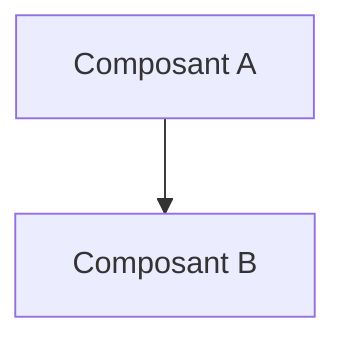

---

#### B. Extrait du Template Épuré à Transmettre au LLM (Message 1)

Transmettez ce bloc sous le nom `template_spec.md` lors de l'initialisation de la nouvelle discussion :

---
type: spec
reference: "SPC-[PORTÉE]-[PHASE]-[NOM_SNAKE]_01"
revision: 1
titre: "Titre Complet de la Spécification"
titre_court: nom_snake
description: "Résumé / Description courte (1 phrase)"
phase_code: P1
phase_nom: "Nom de la Phase"
statut: "🟢 PASSED"
portee: TRANSVERSAL
public_vise:
  - "Architectes Ontologues"
  - "Développeurs DevSecOps"
exigences:
  - id: EXG-SE-01
    domaine: SE
    titre: "Titre de l'exigence"
    description: "Critère formel vérifiable"
    test: "PyTest / SHACL"
---

# 📜 [Titre Complet de la Spécification]

## 📖 1. Résumé Exécutif & Glossaire

### 1.1 Objectif
[Décrire en 2-3 phrases le but de cette spécification et sa valeur pour le projet]

### 1.2 Glossaire Métier & Technique

| Acronyme / Concept | Définition | Contexte DKG |
| :--- | :--- | :--- |
| **Exemple** | Définition courte | Application dans le graphe |

## 🏗️ 2. Spécification & Modélisation

## 📐 3. Spécifications Formelles
### 3.1 Axiomes, Structures RDF & Inférences (ou Scénario Métier)
[Description formelle, snippets Turtle, règles SWRL/SHACL ou diagramme d'attaque]

### 3.2 Directives d'Implémentation Code & Scripts
[Modules Python associés, fonctions de génération, contraintes bas niveau]

## 📊 4. Matrice d'Exigences & Critères d'Acceptation (EXG-)
Identifiant	Domaine	Intitulé de l'Exigence	Description & Critères d'Acceptation	Mode de Test / Asset
EXG-SE-01	SE	Nom de l'exigence	Critère formel vérifiable.	Pytest / SPARQL / SHACL

## 🛡️ 5. Outillage, CI/CD & Traçabilité Pytest
Scripts de Génération / Exécution : 03-Application/[script].py

Suite de Test Associée : tests/test_[exigence].py

Artefacts Produits : [Fichier_Maître.ttl]

## 📚 6. Documents Liés & Références
[SPEC-PARENTE] : [Lien vers la spec de niveau supérieur ou dépendante]