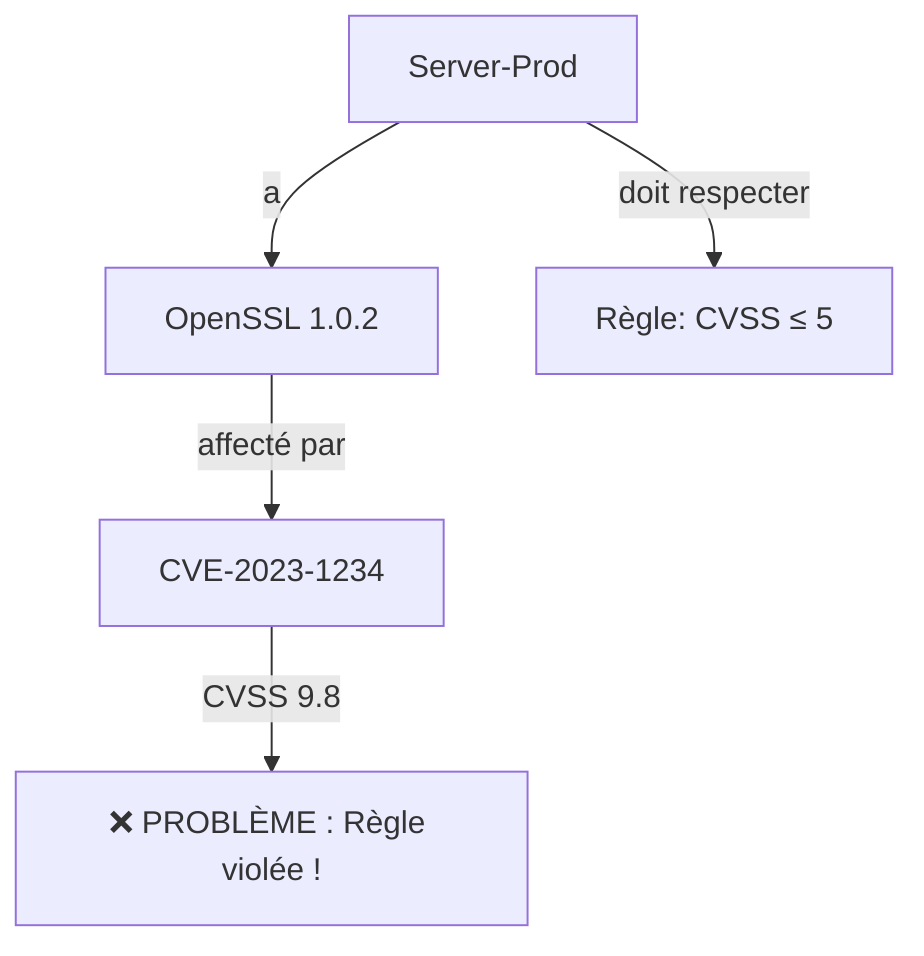
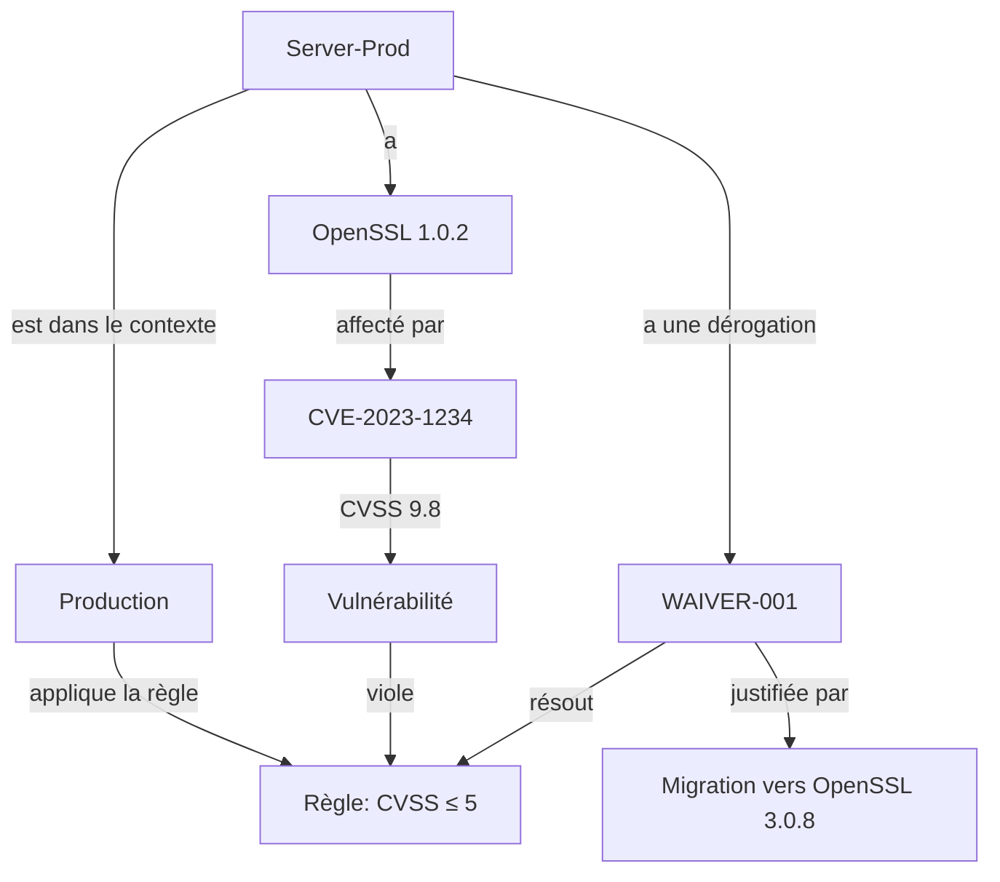

# 📖 Histoire du Use Case : Alban et la Gestion des Vulnérabilités

> *"Comment une simple règle de sécurité peut devenir un casse-tête...
> et comment une ontologie bien conçue permet de le résoudre."*

---

## 🎭 Personnages et Éléments Clés
   **Élément** | **Rôle** | **Description** | **Exemple** |
 |-------------|----------|-----------------|-------------|
 | **Alban** | Administrateur | Gère un réseau qui évolue d’un usage personnel à une entreprise. | - |
 | **PC-Alban** | Device | PC personnel avec OpenSSL 1.0.2 et Apache 2.4.57. | `id: "PC-Alban-POC"` |
 | **Router-Office** | Device | Routeur du réseau local. | `id: "Router-POC"` |
 | **OpenSSL 1.0.2** | Logiciel | Version vulnérable (CVE-2023-1234, CVSS 9.8). | - |
 | **CVE-2023-1234** | Vulnérabilité | Vulnérabilité critique dans OpenSSL 1.0.2. | `cvssScore: 9.8` |
 | **Server-Prod** | InternalDevice | Serveur ajouté en Phase 1, avec PostgreSQL 15.3. | `id: "Server-Prod"` |
 | **Client-External-001** | ExternalDevice | PC d’un client qui se connecte au réseau. | `id: "Client-External-001"` |
 | **Règle RGPD-32** | ComplianceRule | *"Tous les InternalDevice doivent avoir un CVSS ≤ 5."* | - |
 | **Contexte "Production"** | Context | Environnement critique (règles strictes). | - |
 | **Contexte "Client Externe"** | Context | Environnement moins contrôlé (tolérance plus élevée). | - |

---

## 🌱 **Phase 0 : Le POC Basique – "Un PC, Une Règle Simple"**
**Contexte** :
Alban découvre qu’**OpenSSL 1.0.2** (installé sur son PC) a une **vulnérabilité critique** (CVE-2023-1234, CVSS 9.8).
Il veut **comprendre les risques** et **savoir quoi faire**.

**Actions** :
1. Il **modélise son environnement** :
   - 1 PC (`PC-Alban-POC`) et 1 routeur (`Router-POC`).
   - 2 logiciels : OpenSSL 1.0.2 et Apache 2.4.57.
   - 1 vulnérabilité : CVE-2023-1234 (CVSS 9.8) liée à OpenSSL 1.0.2.
   - 1 règle : *"Mettre à jour OpenSSL vers 3.0.8"*.

2. Il **visualise les liens** :
   - `PC-Alban-POC` **→ hasSoftware →** `OpenSSL 1.0.2`
   - `OpenSSL 1.0.2` **→ affectedBy →** `CVE-2023-1234`
   - `CVE-2023-1234` **→ requiresAction →** *"Mettre à jour OpenSSL"*

**Résultat** :
✅ Alban comprend **immédiatement** que son PC est vulnérable.
✅ Il sait **quelle action prendre** (mettre à jour OpenSSL).

**Limites** :
❌ **Pas de différenciation** entre les devices (tout est traité de la même façon).
❌ **Pas de règles complexes** (seulement des actions correctives basiques).

**Fichiers associés** :
- [Ontologie (Phase 0)](../03-Implementation/Phase0-Cadrage/ONTOLOGIE/ontologie.ttl)
- [Inventaire](../03-Implementation/Phase0-Cadrage/donnees/public/inventory.json)
- [CVE](../03-Implementation/Phase0-Cadrage/donnees/public/cve_data.ttl)

---

## 🏢 **Phase 1 : La Micro-Entreprise – "Des Règles et des Serveurs"**
**Contexte** :
Alban **agrandit son réseau** :
- Il ajoute **2 employés** (`PC-Employee1`, `PC-Employee2`) et **1 serveur** (`Server-Prod`).
- Il installe **PostgreSQL 15.3** sur `Server-Prod`.
- Il découvre que **PostgreSQL 15.3 a une vulnérabilité** (CVE-2026-5678, CVSS 9.5).

**Nouveau défi** :
Alban veut **appliquer des règles de conformité** pour sa micro-entreprise.
Il décide :
> *"Tous les **serveurs internes** doivent avoir un **score CVSS maximal de 5** pour être conformes au RGPD."*

**Problème observé** :
- **Server-Prod** a **OpenSSL 1.0.2** (CVE-2023-1234, CVSS 9.8) **ET** PostgreSQL 15.3 (CVE-2026-5678, CVSS 9.5).
- **La règle est violée** : Server-Prod a un CVSS > 5.

**Ce qu’il fait** :
1. Il **enrichit son ontologie** pour :
   - Différencier **`InternalDevice`** (PC des employés, serveur) et **`ExternalDevice`** (futurs clients).
   - Ajouter un **statut de conformité** (`:Compliant`, `:NonCompliant`).
   - Ajouter des **règles de conformité** (ex: `:Compliance-CVSS-Low`).

2. Il **met à jour son graphe** :
   - `Server-Prod` est marqué comme **`:NonCompliant`** (CVSS 9.8 > 5).
   - Les PC des employés sont **`:Compliant`** (OpenSSL 3.0.8, CVSS bas).

**Résultat** :
✅ Alban peut **identifier les devices non conformes**.
✅ Il sait **quelles vulnérabilités corriger en priorité**.

**Nouvelle limite** :
❌ La règle *"CVSS ≤ 5 pour les serveurs"* est **trop stricte** :
   - En réalité, **certains serveurs** (ex: en test) peuvent avoir des CVSS plus élevés **temporairement**.
   - **Mais Alban ne l’a pas encore réalisé...** (à résoudre en Phase 2).

**Fichiers associés** :
- [Ontologie (Phase 1)](../03-Implementation/Phase1-Infrastructure/ONTOLOGIE/ontologie.ttl) *(à créer)*
- [Inventaire (Phase 1)](../03-Implementation/Phase1-Infrastructure/donnees/public/inventory-v2.json) *(à créer)*
- [Règles (Phase 1)](../03-Implementation/Phase1-Infrastructure/donnees/pseudo-private/rules-v2.ttl) *(à créer)*

---

## 💥 **Phase 2 : Le Client Externe – "La Contradiction Apparente (et sa Résolution)"**
**Contexte** :
Alban **signe un contrat avec un client externe** (`Client-External-001`).
- Le client **se connecte à Server-Prod** pour accéder à une application.
- Le client utilise **OpenSSL 1.0.2** (même version vulnérable que Server-Prod).
- **Problème** : `Server-Prod` et `Client-External-001` **partagent la même vulnérabilité** (CVE-2023-1234, CVSS 9.8).

**La contradiction apparente** :
 | **Règle** | **Réalité** | **Conflit** |
 |----------|-------------|-------------|
 | *"Tous les **InternalDevice** doivent avoir un CVSS ≤ 5."* | `Server-Prod` (InternalDevice) a un CVSS **9.8**. | ❌ **Violation de la règle** |
 | - | `Client-External-001` (ExternalDevice) a aussi un CVSS **9.8**. | ❌ **Mais ce n’est pas un InternalDevice !** |

**Réaction initiale d’Alban** :
> *"C’est une contradiction ! Ma règle est impossible à respecter si un client externe se connecte avec un logiciel vulnérable !"*

**Erreur d’Alban** :
Il **confond** :
- **L’application stricte de la règle** (sans nuance).
- **La réalité complexe** (clients externes ≠ serveurs internes).

**L’analyse : Pourquoi ce n’est PAS une vraie contradiction** :
En **développant le contexte**, Alban réalise que :
1. **`Server-Prod`** est un **`InternalDevice`** → **Doit respecter CVSS ≤ 5**.
2. **`Client-External-001`** est un **`ExternalDevice`** → **Ne doit pas respecter la même règle** (car hors de son contrôle).

**Solution** :
- **Différencier les contextes** :
  - **Contexte "Production"** : Règles strictes (CVSS ≤ 5 pour les `InternalDevice`).
  - **Contexte "Client Externe"** : Règles plus tolérantes (CVSS ≤ 7 pour les `ExternalDevice`).
- **Ajouter des exceptions** :
  - Si un **`InternalDevice`** a un CVSS > 5 **temporairement** (ex: migration en cours), on peut ajouter une **dérogation** (`:Waiver`) avec justification.

**Exemple concret** :
- **`Server-Prod`** (`InternalDevice`) :
  - **CVSS** : 9.8 (via OpenSSL 1.0.2).
  - **Contexte** : Production.
  - **Statut** : `:NonCompliant` **MAIS** avec une **dérogation** (`:Waiver-001`) justifiée par :
    > *"Migration vers OpenSSL 3.0.8 prévue pour le 2026-09-01. Client-External-001 dépend de cette version pendant la transition."*

- **`Client-External-001`** (`ExternalDevice`) :
  - **CVSS** : 9.8 (via OpenSSL 1.0.2).
  - **Contexte** : Client Externe.
  - **Statut** : `:Compliant` (car la règle pour les `ExternalDevice` tolère un CVSS ≤ 7).

**Résultat final** :
✅ **Plus de contradiction** : Chaque device est évalué **dans son contexte**.
✅ **Explicabilité** : Alban (et son équipe) **comprennent pourquoi** `Server-Prod` est une exception.
✅ **Évolutivité** : Si un nouveau contexte apparaît (ex: "Test"), il peut **l’ajouter sans casser l’existant**.

**Fichiers associés** :
- [Ontologie (Phase 2)](../03-Implementation/Phase2-Reglementaire/ONTOLOGIE/ontologie.ttl) *(à créer)*
- [Inventaire (Phase 2)](../03-Implementation/Phase2-Reglementaire/donnees/public/inventory-v3.json) *(à créer)*
- [Règles (Phase 2)](../03-Implementation/Phase2-Reglementaire/donnees/pseudo-private/rules-v3.ttl) *(à créer)*
- [Migration Phase1 → Phase2](../03-Implementation/Phase1-Infrastructure/migrations/to_phase2.cypher) *(à créer)*

---
## 🧩 **Morale de l’Histoire : Pourquoi l’Ontologie est Cruciale**
### 🔴 **Sans Ontologie (Approche "En Vrac")**

→ Résultat :

On ajoute une exception manuelle dans un fichier Excel.
Personne ne sait pourquoi Server-Prod est une exception.
Impossible de reproduire la logique pour un nouveau serveur.

🟢 Avec Ontologie (Votre Approche)

→ Résultat :

Tout est structuré : On sait pourquoi Server-Prod est une exception.
Reproductible : La même logique s’applique à un nouveau serveur.
Évolutif : On peut ajouter de nouveaux contextes (ex: "Test") sans tout recoder.

🎯 Leçons Apprises

L’ontologie doit évoluer pour capturer les nuances du réel.
Les contradictions sont normales : Elles révèlent des limites du modèle.
La résolution passe par :

L’enrichissement (ajout de classes/propriétés comme :Context, :Waiver).
La structuration (hiérarchies, relations).
La documentation (justifications, exceptions).

🔄 Évolution du Graphe (Résumé)

  
    
      Phase
      Nœuds
      Relations
      Nouvelles Classes
      Nouvelles Propriétés
      Objectif
    
  
  
    
      Phase 0
      4
      6
      Device, Software, Vulnerability, Action, Rule
      hasSoftware, hasVulnerability, requiresAction, cvssScore
      Présenter l’architecture de base.
    
    
      Phase 1
      8
      12
      +InternalDevice, +ExternalDevice, +ComplianceRule, +ComplianceStatus
      +hasComplianceStatus, +appliesTo
      Comprendre le sens de l’ontologie.
    
    
      Phase 2
      12
      20
      +Context, +Waiver
      +inContext, +hasWaiver, +justifiedBy
      Résoudre les contradictions via le contexte.
    
  

text
Copier

---
---
---
## 📊 **4. Améliorations du Graphe (`graphe-complet_20260818B.cypher`)**

### **❌ Problèmes Identifiés dans l’Export**
1. **Artefacts n10s** :
   - Nœuds `UNIQUE IMPORT LABEL` et `Resource` inutiles.
   - Propriétés internes (`_classLabel`, `_handleRDFTypes`, etc.).
2. **Noms de nœuds peu lisibles** :
   - `ns0__Vulnerability` au lieu de `:Vulnerability`.
   - `rdfs__label` au lieu de `label`.
3. **Duplication des nœuds** :
   - `PC-Alban-POC` apparaît 2 fois (avec des IDs différents : 18, 19).

