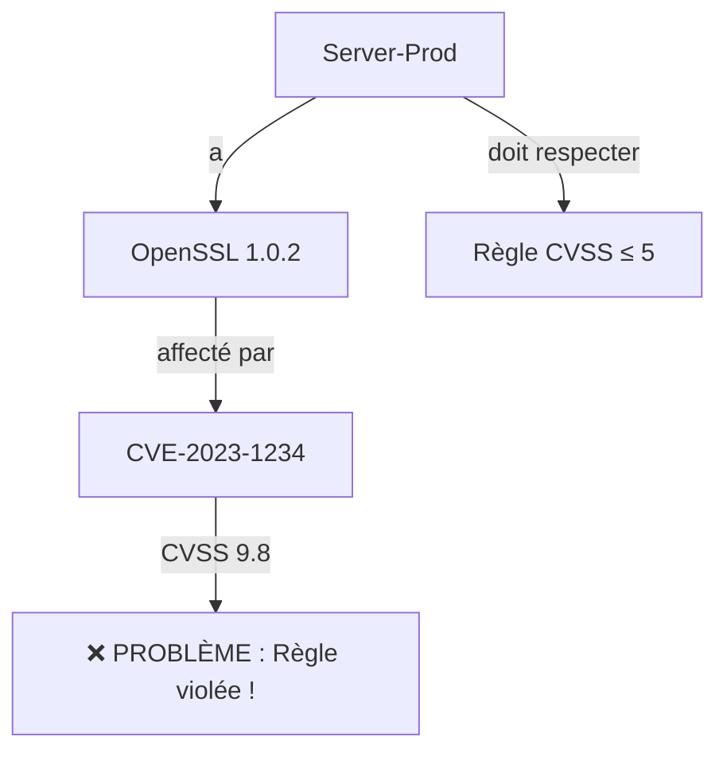
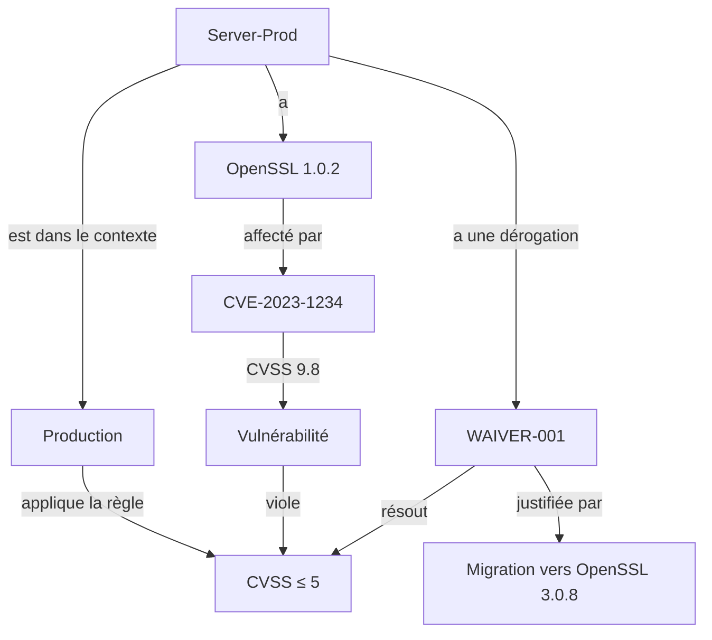
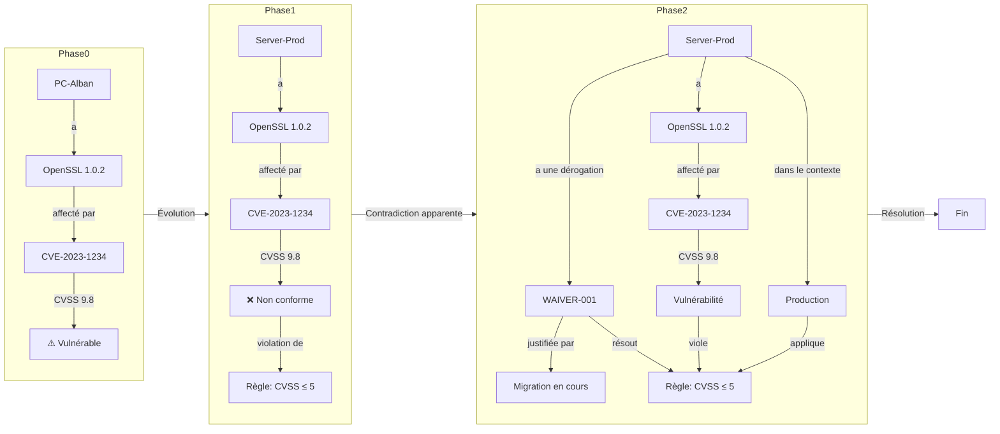

_le cas d'usage raconté comme une histoire_
## 📖 Histoire du Use Case : Alban et la Gestion des Vulnérabilités
"Comment une simple règle de sécurité peut devenir un casse-tête... et comment une ontologie bien conçue permet de le résoudre."

### 🎭 Personnages et Contexte

| Personnage/Élément        | Rôle                | Description                                                   |
| ------------------------- | ------------------- | ------------------------------------------------------------- |
| PC-Alban                  | Device              | PC personnel avec OpenSSL 1.0.2 et Apache 2.4.57.             |
| Router-Office             | Device              | Routeur du réseau local.                                      |
| OpenSSL 1.0.2             | Logiciel            | Version vulnérable (CVE-2023-1234, CVSS 9.8).                 |
| Client-External-001       | Device externe      | PC d’un client qui se connecte au réseau d’Alban.             |
| Server-Prod               | Serveur interne     | Ajouté en Phase 1, avec PostgreSQL 15.3.                      |
| Règle RGPD-32             | Règle de conformité | "Tous les serveurs internes doivent avoir un score CVSS ≤ 5." |
| Contexte "Production"     | Contexte            | Environnement critique (règles strictes).                     |
| Contexte "Client Externe" | Contexte            | Environnement moins contrôlé (tolérance plus élevée).         |
### 🌱 Phase 0 : Le POC Basique – "Un PC, Une Règle Simple"
**Contexte :**  Alban vient de découvrir qu’OpenSSL 1.0.2 (installé sur son PC) a une vulnérabilité critique (CVE-2023-1234, CVSS 9.8).
Il décide de modéliser son environnement pour mieux comprendre les risques.

#### Ce qu’il fait :
 Il crée un graphe simple avec :
- 1 PC (PC-Alban) et 1 routeur (Router-Office).
- 2 logiciels : OpenSSL 1.0.2 et Apache 2.4.57.
- 1 vulnérabilité : CVE-2023-1234 (CVSS 9.8) liée à OpenSSL 1.0.2.
- 1 règle : "Mettre à jour OpenSSL vers 3.0.8".
#### Ce qu'il visualise les liens :
PC-Alban a pour logiciel OpenSSL 1.0.2.
OpenSSL 1.0.2 est affecté par CVE-2023-1234.
CVE-2023-1234 nécessite l’action "Mettre à jour OpenSSL".

#### Résultat :
✅ Alban comprend immédiatement que son PC est vulnérable.
✅ Il sait quelle action prendre (mettre à jour OpenSSL).

#### Limites :
❌ Pas de différenciation entre les devices (tout est traité de la même façon).
❌ Pas de règles complexes (seulement des actions correctives basiques).

### 🏢 Phase 1 : La Micro-Entreprise – "Des Règles et des Serveurs"
**Contexte :**  Alban agrandit son réseau :

## 📜 **Phase 1 : Micro-Entreprise (2 Employés + 1 Serveur)

**Objectif** : **Comprendre le sens de l’ontologie** (classes, propriétés, inférences). 
**Nouveaux enjeux** : - **Différencier** les devices internes/externes. 
- **Ajouter** des règles de conformité (ex: "Tous les serveurs doivent avoir un score CVSS < 5"). 
- **Préparer** une contradiction future (Phase 2).`

evolution de l'ontologie : 
*(Évolutions par rapport à Phase 0 : +InternalDevice, +ComplianceRule, +hasComplianceStatus)*

#### Ce qu'il fait
Il ajoute 2 employés (PC-Employee1, PC-Employee2) et 1 serveur (Server-Prod).
Il installe PostgreSQL 15.3 sur Server-Prod.
Il découvre que PostgreSQL 15.3 a aussi une vulnérabilité (CVE-2026-5678, CVSS 9.5).

Nouveau défi :
Alban veut appliquer des règles de conformité pour sa micro-entreprise.
Il décide :   "Tous les serveurs internes doivent avoir un score CVSS maximal de 5 pour être conformes au RGPD."

#### Ce qu'il observe 
**Problème :**  Server-Prod a OpenSSL 1.0.2 (CVE-2023-1234, CVSS 9.8) ET PostgreSQL 15.3 (CVE-2026-5678, CVSS 9.5).
La règle est violée : Server-Prod a un CVSS > 5.

Ce qu’il fait :

Il enrichit son ontologie pour :
Différencier InternalDevice (PC des employés, serveur) et ExternalDevice (futurs clients).
Ajouter un statut de conformité (Conforme / Non conforme).
Ajouter des règles de conformité (ex: Compliance-CVSS-Low).

Il met à jour son graphe :
Server-Prod est marqué comme Non conforme (CVSS 9.8 > 5).

Les PC des employés sont Conformes (OpenSSL 3.0.8, CVSS bas).

Résultat :
✅ Alban peut identifier les devices non conformes.
✅ Il sait quelles vulnérabilités corriger en priorité.

Nouvelle limite :
❌ La règle "CVSS ≤ 5 pour les serveurs" est trop stricte :

En réalité, certains serveurs (ex: en test) peuvent avoir des CVSS plus élevés temporairement.
Mais Alban ne l’a pas encore réalisé...


### 💥 Phase 2 : Le Client Externe – "La Contradiction Apparente"


## 📜 **Phase 2 : Startup + RGPD (Contradiction et Résolution)** 
**Objectif** : **Résoudre une contradiction** en enrichissant l’ontologie avec un **contexte**. 
**Nouveaux enjeux** : - Un **client externe** (ExternalDevice) se connecte à votre serveur. 
- Ce client a une **vulnérabilité critique** (CVSS 9.8) qui affecte aussi votre serveur interne. 
- **Contradiction** : Votre règle `Compliance-CVSS-Low` (CVSS < 5) est violée.``


📌 Le Problème : Une Règle en Conflit avec la Réalité
Contexte :
Alban- signe un contrat avec un client externe (Client-External-001).

Le client se connecte à Server-Prod pour accéder à une application.
Le client utilise OpenSSL 1.0.2 (même version vulnérable que Server-Prod).
Problème : Server-Prod et Client-External-001 partagent la même vulnérabilité (CVE-2023-1234, CVSS 9.8).
La contradiction :

Règle	Réalité	Conflit
"Tous les InternalDevice doivent avoir un CVSS ≤ 5."	Server-Prod (InternalDevice) a un CVSS 9.8.	❌ Violation de la règle
-	Client-External-001 (ExternalDevice) a aussi un CVSS 9.8.	❌ Mais ce n’est pas un InternalDevice !
Réaction initiale d’Alban :

"C’est une contradiction ! Ma règle est impossible à respecter si un client externe se connecte avec un logiciel vulnérable !"

Erreur d’Alban :
Il confond :

L’application stricte de la règle (sans nuance).
La réalité complexe (clients externes ≠ serveurs internes).
🔍 L’Analyse : Pourquoi Ce N’est PAS une Vraie Contradiction
Découverte :
En développant le contexte, Alban réalise que :

Server-Prod est un InternalDevice → Doit respecter CVSS ≤ 5.
Client-External-001 est un ExternalDevice → Ne doit pas respecter la même règle (car hors de son contrôle).
Solution :

Différencier les contextes :

Contexte "Production" : Règles strictes (CVSS ≤ 5 pour les InternalDevice).
Contexte "Client Externe" : Règles plus tolérantes (CVSS ≤ 7 pour les ExternalDevice).
Ajouter des exceptions :

Si un InternalDevice a un CVSS > 5 temporairement (ex: migration en cours), on peut ajouter une dérogation (Waiver) avec justification.
Exemple concret :

Server-Prod (InternalDevice) :

CVSS : 9.8 (via OpenSSL 1.0.2).
Contexte : Production.
Statut : Non conforme MAIS avec une dérogation (justifiée par : "Migration vers OpenSSL 3.0.8 prévue pour le 2026-09-01. Client-External-001 dépend de cette version pendant la transition.").
Client-External-001 (ExternalDevice) :

CVSS : 9.8 (via OpenSSL 1.0.2).
Contexte : Client Externe.
Statut : Conforme (car la règle pour les ExternalDevice tolère un CVSS ≤ 7).
✅ La Résolution : Enrichir l’Ontologie avec des Nuances
Ce qu’Alban fait :

Ajoute des classes :

:Context (Production, Client Externe, Test).
:Waiver (Dérogation temporaire).
Ajoute des propriétés :

:inContext (lie une règle ou un device à un contexte).
:hasWaiver (lie un device à une dérogation).
Met à jour les règles :

Règle 1 : "CVSS ≤ 5 pour les InternalDevice en contexte Production."
Règle 2 : "CVSS ≤ 7 pour les ExternalDevice en contexte Client Externe."
Applique les dérogations :

Server-Prod a une dérogation pour OpenSSL 1.0.2 (justifiée par la migration).
Résultat final :
✅ Plus de contradiction : Chaque device est évalué dans son contexte.
✅ Explicabilité : Alban (et son équipe) comprennent pourquoi Server-Prod est une exception.
✅ Évolutivité : Si un nouveau contexte apparaît (ex: "Test"), il peut l’ajouter sans casser l’existant.

### 🧩 Morale de l’Histoire : Pourquoi l’Ontologie est Cruciale


| 🔴 Sans Ontologie (Approche "En Vrac")            |     |
| ------------------------------------------------- | --- |
| ```mermaid<br>   graph TD<br>      A --> B<br>``` |     |
|                                                   |     |

|
→ Résultat :

On ajoute une exception manuelle dans un fichier Excel.
Personne ne sait pourquoi Server-Prod est une exception.
Impossible de reproduire la logique pour un nouveau serveur.

---

🟢 Avec Ontologie (Votre Approche)


|→ Résultat :
- Tout est structuré : On sait pourquoi Server-Prod est une exception.
- Reproductible : La même logique s’applique à un nouveau serveur.
- Évolutif : On peut ajouter de nouveaux contextes (ex: "Test") sans tout recoder.
 
### 🎯 Leçons Apprises (À Retenir pour le POC)


| Concept                     | Sans Ontologie                                                                 | Avec Ontologie                                                                                          | Bénéfice                |
| --------------------------- | ------------------------------------------------------------------------------ | ------------------------------------------------------------------------------------------------------- | ----------------------- |
| **Contradiction apparente** | On ignore ou on ajoute une exception **sans explication**.                     | On **enrichit le modèle** pour capturer la nuance.                                                      | **Explicabilité**       |
| **Règles complexes**        | Les règles sont **isolées** et difficiles à appliquer.                         | Les règles sont **liées à un contexte**.                                                                | **Précision**           |
| **Évolution du système**    | On ajoute des données **sans schéma** → désordre.                              | On **met à jour l’ontologie** + migrations → cohérence.                                                 | **Maintenabilité**      |
| **Collaboration**           | _"Pourquoi ce serveur est-il une exception ?"_ → Réponse : _"Je ne sais pas."_ | _"Pourquoi ce serveur est-il une exception ?"_ → Réponse : _"Voir WAIVER-001, justifiée par [raison]."_ | **Transparence**        |
| **Vectorisation/NER**       | Les modèles **ignorent les nuances** (ex: "contexte").                         | Les modèles **apprennent les nuances** via l’ontologie.                                                 | **Qualité des données** |
|                             |                                                                                |                                                                                                         |                         |
	
### 📌 Résumé des 3 Phases en 1 Schéma


