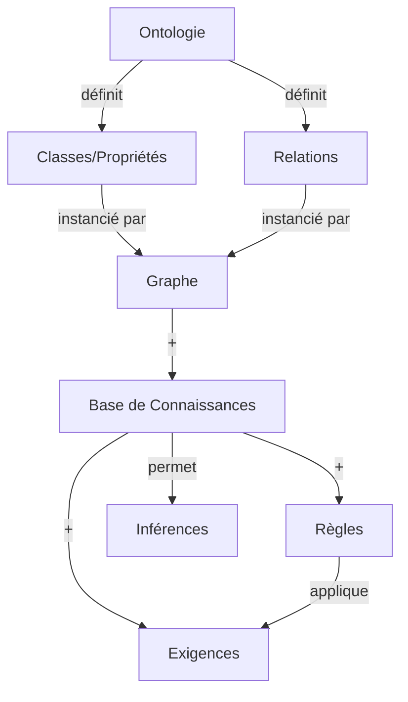

# 📚 Lexique Technique - DKG Cybersécurité

## 🔹 Concepts Fondamentaux

### Ontologie vs Graphe vs Base de Connaissances
   
| Terme                     | Définition                                                                                | Exemple                                                  | Représentation             |
| ------------------------- | ----------------------------------------------------------------------------------------- | -------------------------------------------------------- | -------------------------- |
| **Ontologie**             | Modèle formel (classes, propriétés, relations) qui définit la **sémantique** des données. | `ontologie-v1.0.ttl` avec `:Device`, `:hasSoftware`.     | Fichier TTL/OWL            |
| **Graphe**                | **Données** stockées sous forme de nœuds et relations, conformes à l’ontologie.           | `PC-Alban` → `HAS_SOFTWARE` → `OpenSSL 1.0.2`.           | Nœuds/relations dans Neo4j |
| **Base de Connaissances** | **Ontologie + Graphe + Règles + Inférences**.                                             | Votre Neo4j + `ontologie-v1.0.ttl` + règles de sécurité. | Neo4j + fichiers TTL       |
| **DKG (Dynamic KG)**      | Base de connaissances qui **évolue** dans le temps (ajout/suppression automatique).       | Mise à jour quotidienne des CVE.                         | Scripts + Neo4j            |

### Types de Données
| Type                   | Description                                        | Exemple                               | Stockage                                           |
| ---------------------- | -------------------------------------------------- | ------------------------------------- | -------------------------------------------------- |
| **Publique**           | Données accessibles à tous.                        | CVE, MITRE ATT&CK, ontologie de base. | Dépôt GitHub public                                |
| **Privée**             | Données spécifiques à votre contexte.              | Inventaire réel, règles internes.     | `.private/`                                        |
| **Ontologie Publique** | Squelette générique (classes/propriétés communes). | `:Device`, `:Vulnerability`.          | `02-Architecture/ONTOLOGIE/ontologie-publique.ttl` |
| **Ontologie Privée**   | Extensions spécifiques à votre entreprise.         | `:InternalServer`, `:ComplianceRule`. | `.private/ontologie-privee.ttl`                    |

### Règles et Exigences

| Terme                      | Définition                                                             | Exemple                                                                               | Lien avec l'Ontologie            |
| -------------------------- | ---------------------------------------------------------------------- | ------------------------------------------------------------------------------------- | -------------------------------- |
| **Règle (Rule)**           | Condition → Action (ex: "Si CVSS > 7, alerter").                       | `:Rule {id: "ALERT_HIGH_CVSS", condition: "v.cvssScore > 7", action: "CREATE Alert"}` | Nœud `:Rule`                     |
| **Exigence (Requirement)** | Contrainte formelle (ex: RGPD, NIS2).                                  | `:Requirement {id: "RGPD_32", description: "Chiffrement des données"}`                | Nœud `:Requirement`              |
| **Inférence**              | Deduction automatique de nouvelles connaissances.                      | "PC-Alban est vulnérable car il a OpenSSL 1.0.2 + CVE-2023-1234."                     | Requête Cypher ou raisonneur OWL |
| **Contexte**               | Ensemble de règles/exigences applicables à un sous-ensemble du graphe. | `:Context {id: "RGPD_Context", appliesTo: [Device1, Device2]}`.                       | Nœud `:Context`                  |

## 🔹 Relations entre Concepts

# Acronymes

| Acro | Description                                                                                                                                                   |
| ---- | ------------------------------------------------------------------------------------------------------------------------------------------------------------- |
| OWL  | Ontologie Web Language  **langage** pour définir des **ontologies** (structures de connaissances) en s’appuyant sur RDF                                    |
| RDF  | Resource Description Framework  **modèle de données** pour représenter des informations sous forme de **triplets**                                         |
| n10s | **Neo4j Semantics**.   _(plugin Neo4j)_ permettant l'intégration RDF/OWL dans Neo4j pour le stockage, la validation et l'inférence de données sémantiques. |
| APOC | **Awesome Procedures on Cypher**  _(plugin Neo4j)_ étendant ses capacités en manipulation de données, graphes et transformations complexes                 |
|    FOAG  |Friend Of A Friend - est un vocabulaire sémantique utilisé dans les graphes de connaissances pour décrire les personnes et leurs relations, facilitant ainsi l'interconnexion des données structurées.                                                                                                                                                     |
