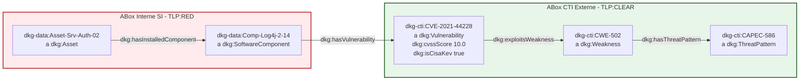

Ce document formalise la valeur d'affaires du raccordement multi-TLP entre le SI interne (`TLP:RED`) et les flux de menaces externes (`TLP:CLEAR`).

# 🎯 Memo Use Case Phase 3 — Réconciliation Multi-TLP & Ingestion CTI Externe

## 📌 1. Objectif Métier & Valeur d'Usage
Ce cas d'usage démontre la capacité du **DKG-CyberSec** à croiser des informations hautement confidentielles de l'infrastructure interne (**ABox SI `TLP:RED`**) avec des flux d'intelligence sur les menaces issus de sources ouvertes (**ABox CTI `TLP:CLEAR`**), sans compromettre la confidentialité des données et en s'appuyant sur le socle sémantique commun (**TBox `TLP:AMBER`**).

---

## 📚 2. Glossaire des Acronymes & Concepts

| Acronyme / Concept | Signification / Définition | Périmètre DKG |
| :--- | :--- | :--- |
| **ABox** | Assertion Component | Représentation des données d'instances réelles du SI et des vulnérabilités CTI. |
| **CAPEC** | Common Attack Pattern Enumeration and Classification | Schéma de caractérisation des modes d'attaque des cyber-adversaires. |
| **CISA KEV** | Known Exploited Vulnerabilities | Catalogue des vulnérabilités activement exploitées en environnement réel. |
| **CVSS** | Common Vulnerability Scoring System | Score de sévérité mesuré en type de donnée `xsd:float`. |
| **CWE** | Common Weakness Enumeration | Classification des faiblesses logicielles et architecturales sous-jacentes. |
| **DMZ** | Demilitarized Zone | Zone réseau intermédiaire exposée aux flux externes. |
| **SIEM** | Security Information and Event Management | Système centralisé de gestion des événements de sécurité. |
| **SPARQL** | SPARQL Protocol and RDF Query Language | Langage standard de requête pour les bases de données orientées graphes RDF. |
| **TBox** | Terminology Component | Modèle conceptuel définissant les classes et propriétés. |
| **TLP** | Traffic Light Protocol | Standard de classification de la sensibilité des informations de sécurité. |

---

## 🏛️ 3. Architecture d'Isolation et de Raccordement Cross-TLP

L'architecture repose sur une étanchéité stricte des répertoires et des graphes RDF tout en autorisant les liens unidirectionnels d'instances internes vers les identifiants publics CTI :



### Récapitulatif de la Matrice de Ségrégation

| Périmètre | Classification | Contenu Fonctionnel | Emplacement SSOT (`config.py`) |
| :--- | :--- | :--- | :--- |
| **TBox / RBox / SHACL** | `TLP:AMBER` | Vocabulaire, propriétés et contraintes de formes | `DIR_MASTER_TBOX` |
| **ABox SI** | `TLP:RED` | Infrastructure, serveurs, composants installés | `DIR_MASTER_ABOX` |
| **ABox CTI** | `TLP:CLEAR` | Référentiels CVE, CWE, CAPEC et scores CVSS | `DIR_CTI_CLEAR` |

---

## 🔍 4. Requête SPARQL Cross-TLP (Détection d'Exposition Critique)

Cette requête fédère le graphe interne `TLP:RED` et le graphe CTI `TLP:CLEAR` pour identifier les serveurs exposés à des vulnérabilités critiques (CVSS >= 9.0) activement exploitées (CISA KEV) :

```sparql
PREFIX dkg:     <http://dkg.cybersec.org/tbox#>
PREFIX dkg-data:<http://dkg.cybersec.org/data#>
PREFIX dkg-cti: <http://dkg.cybersec.org/cti#>
PREFIX xsd:     <http://www.w3.org/2001/XMLSchema#>

SELECT ?asset ?component ?cve ?cvssScore ?cwe ?capec WHERE {
    # 1. Périmètre Interne SI (TLP:RED)
    ?asset a dkg:Asset ;
           dkg:hasInstalledComponent ?component .
           
    # 2. Lien Cross-TLP (Interne -> Externe)
    ?component dkg:hasVulnerability ?cve .
    
    # 3. Périmètre CTI Externe (TLP:CLEAR)
    ?cve a dkg:Vulnerability ;
         dkg:cvssScore ?cvssScore .
         
    OPTIONAL {
        ?cve dkg:exploitsWeakness ?cwe .
        ?cwe dkg:hasThreatPattern ?capec .
    }
    
    # Filtres de Sévérité & d'Exploitation Active
    FILTER(?cvssScore >= 9.0)
}
ORDER BY DESC(?cvssScore)
```

---

## 🛡️ 5. Règles de Gouvernance & Traçabilité

1. **Étanchéité Strictement Unidirectionnelle :** Aucun export `TLP:CLEAR` ne doit inclure de nœud appartenant au namespace `dkg-data:` (`TLP:RED`).
2. **Normalisation du Typage RDF :** Les scores CVSS sont obligatoirement typés en `xsd:float` pour satisfaire les contraintes de forme SHACL (`dkg:CvssScorePropertyShape`).
3. **Alignement du Prédicat RBox :** La relation entre une vulnérabilité et une faiblesse utilise exclusivement la propriété normée `dkg:exploitsWeakness`.

---

## 🚀 6. Séquence d'Exécution & Recette Phase 3

```bash
# 1. Génération du graphe CTI TLP:CLEAR depuis les flux JSON d'entrée
python 03-Application/Phase3/ingest_phase3_cti.py

# 2. Auto-documentation et génération du Markdown miroir
python 03-Application/Phase3/export_phase3_cti_md.py

# 3. Exécution des tests de conformité SHACL et de parité
pytest 03-Application/Phase3/test_phase3_quality.py -v
