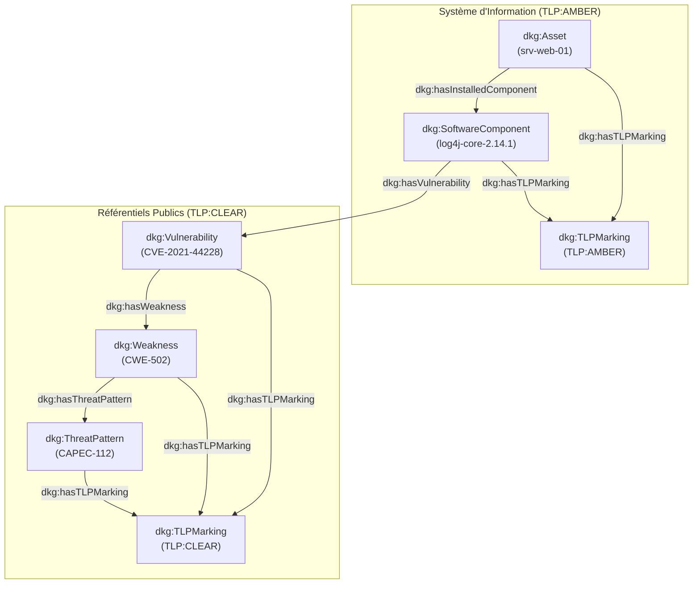
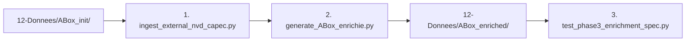
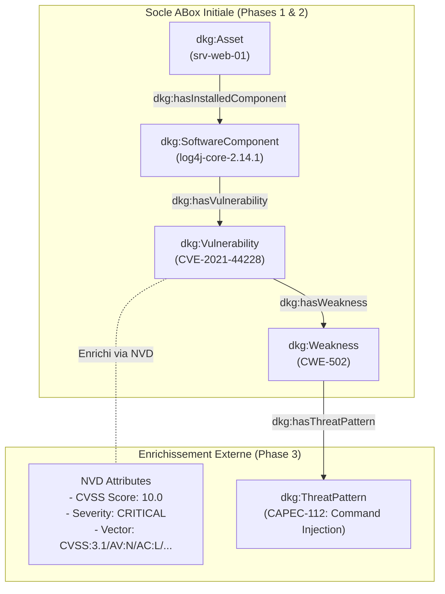

### 🔷 Phase 3 — Enrichissement Externe & Gouvernance TLP

- **Objectif** : Connecter le graphe local aux bases de connaissances mondiales publiques (`TLP:CLEAR`) et appliquer la gouvernance multi-niveaux.
    
- **Périmètre** :
    
    - Ingestion des référentiels externes publics : **NVD** (descriptions CVE, scores CVSS v3), **MITRE CWE** (faiblesses), **MITRE CAPEC** (patterns d'attaque).
        
    - Application du marquage **TLP (Traffic Light Protocol)** sur chaque nœud et relation (`TLP:RED` pour l'infrastructure interne, `TLP:CLEAR` pour l'intelligence menace externe).
        
    - Consolidation dans l'ABox Master globale (`TLP:RED`).
        
- **Répertoires** :
    
    - Cache : `12-Donnees/Caches_Externes/TLP_CLEAR_NVD_CAPEC/`
        
    - Master ABox : `12-Donnees/Master_Transversal/TLP_RED_Consolidation_ABox/`


Conformément au workflow en 5 étapes et aux directives du **`PROJECT_CONTEXT_PROMPT.md`**, voici la synthèse structurée à intégrer dans le fichier de fin de phase **`10-Projet/Phase3/Phase_Content.md`**.

Cette revue valide le lot du **Socle Graph (Phases 1 à 3)** avant d'entamer la Phase 3b.

# 📜 Phase 3 — Synthèse & REX (Bilan du Socle Graph)

> **Classification Globale** : `TLP:RED` (Contient la cartographie SI enrichie)
> 
> **Dépôt** : `10-Projet/Phase3/Phase_Content.md`

## 📌 1. Rappel des Objectifs & Concepts Développés

- Ingestion et alignement des référentiels de vulnérabilités et de menaces publics (**NVD/CVE**, **MITRE CWE**, **MITRE CAPEC**).
    
- Marquage Granulaire de Confidentialité **TLP (Traffic Light Protocol)** sur l'ensemble du graphe (Distinction `TLP:RED`, `TLP:AMBER` et `TLP:CLEAR`).
    
- Consolidation des composants en deux masters transversaux et mise à disposition de vues humaines consultables en Markdown (`.md`).
    

## 📊 2. Livrables Produit & Cartographie des Données

Les livrables de la phase respectent le découpage strict entre **Snapshots Historiques** et **Masters Transversaux** :

- **Master Transversal TBox (`TLP:AMBER`)** ➔ `12-Donnees/Master_Transversal/TLP_AMBER_Socle_TBox/`
    
    - `DKG_TBox_Master.ttl` / `.json` / `DKG_TBox_Master.md` (Ontologie canonique globale & glossaire).
        
- **Master Transversal ABox (`TLP:RED`)** ➔ `12-Donnees/Master_Transversal/TLP_RED_Consolidation_ABox/`
    
    - `DKG_ABox_Master.ttl` / `.json` / `DKG_ABox_Master.md` (Inventaire SI, vulnérabilités & diagramme Mermaid du graphe d'attaque).
        
- **Snapshot de Phase 3** ➔ `12-Donnees/Snapshots_Phases/Phase_3_ABox_enriched/`
    
    - `ABox_Cybersec_enriched.ttl` (Snapshot figé post-enrichissement).
        
- **Cache Externe Public (`TLP:CLEAR`)** ➔ `12-Donnees/Caches_Externes/TLP_CLEAR_NVD_CAPEC/`
    
    - `nvd_capec_mock_cache.json` (Mock de données externes).
        

## 🛠️ 3. Scripts d'Application Développés (`13-Application/Phase_3_Enrichment/`)

- `ingest_external_nvd_capec.py` : Module d'ingestion et de liaison sémantique des faiblesses CWE vers CAPEC.
    
- `consolidate_master_TLP_AMBER_TBox.py` : Générateur du socle TBox Master (`TLP:AMBER`) aux 3 formats (`.ttl`, `.json`, `.md`).
    
- `generate_enriche_TLP_RED_ABox.py` : Script principal de Phase 3 exécutant l'enrichissement, le marquage TLP et la consolidation ABox Master (`TLP:RED`).
    

## 💡 4. Synthèse des Acquis & REX (Retour d'Expérience)

- **Gouvernance TLP** : L'intégration sémantique du TLP (`dkg:hasTLPMarking`) directement dans le graphe permet de traiter des données de natures différentes (Infrastructure `TLP:RED` vs Référentiel public `TLP:CLEAR`) au sein d'un même modèle.
    
- **Separation Snapshot vs Master** : La séparation entre l'historique de construction (`Snapshots_Phases/`) et la source unique de vérité (`Master_Transversal/`) évite toute amnésie de projet tout en offrant un point d'entrée unique pour la future persistance (Neo4j / SPARQL).
    
- **Documentation Consultable (.md)** : La génération automatisée de documentation Markdown synchronisée avec le code Turtle garantit que le socle reste immédiatement auditable par les équipes fonctionnelles.
    

## 🚀 5. Transition vers la Phase Suivante (Phase 3b)

Le lot "Socle Ontologique" est officiellement clos et validé. Le projet entre dans le **Lot 2 (Persistance & Exploration)** avec la **Phase 3b : Importation & Ingestion Neo4j (Graph DBMS / Neosemantics `n10s`)**.


# 📌 Phase 3 : Enrichissement Externe du Knowledge Graph & Marquage TLP

> **Statut** : Cadré / En cours de développement  
> **Livrables principaux** : 
> - Snapshot Phase 3 : `12-Donnees/ABox_enriched/`
> - Master Consolidé TBox : `12-Donnees/Socle_TBox/`
> - Master Consolidé ABox : `12-Donnees/Consolidation_ABox/`  
> **Conformité** : Normes SPEC-03 (EXG-ENRICH-01 à EXG-ENRICH-05), TLP FIRST Standard v2.0 & Dépendance Phases 1 & 2

---

## 🎯 Objectifs de la Phase 3

L'objectif de cette phase est double :
1. **Enrichissement Sémantique Externe** : Rattacher les vulnérabilités et faiblesses aux référentiels publics **NVD** (CVSS v3.1, sévérité, descriptions) et **MITRE** (faiblesses CWE et patterns d'attaque `dkg:ThreatPattern` CAPEC).
2. **Gouvernance & Confidentialité (TLP)** : Appliquer un marquage strict **Traffic Light Protocol (TLP)** sur l'ensemble des entités pour distinguer les données souveraines internes (`TLP:AMBER`) des données publiques réutilisables (`TLP:CLEAR`).

---

## 🏗️ Architecture des Répertoires : Dualité Snapshots vs. Cibles Consolidées

Afin de concilier **l'auditabilité par phase** et la **simplicité d'exploitation pour les applications aval**, la Phase 3 alimente à la fois son sous-dossier d'étape et les deux registres masters du projet :

```text
12-Donnees/
├── Socle_TBox/                  <--- Master TBox Canonique (Ontologie complète avec TLP & NVD/CAPEC)
│   ├── DKG_TBox_Master.ttl
│   └── DKG_TBox_Master.md
├── Consolidation_ABox/          <--- Master ABox Canonique (Graphe consolidé prêt pour SPARQL / Phase 4)
│   ├── DKG_ABox_Master.ttl
│   └── DKG_ABox_Master.json
│
├── TBox_init/                   <--- Snapshot Historique Phase 1
├── ABox_init/                   <--- Snapshot Historique Phase 2
└── ABox_enriched/               <--- Snapshot Historique Phase 3
```

## 🛡️ Modèle TLP & Propriétés Capitalisées dans la TBox

Toutes les propriétés d'enrichissement et de confidentialité sont désormais inscrites au niveau du **Socle TBox** :

### 1. Marquage TLP (`dkg:TLPMarking`)

- `TLP:CLEAR` : Attribué aux entités issues de référentiels publics (CVE, CWE, CAPEC).
    
- `TLP:AMBER` / `TLP:AMBER+STRICT` : Attribué aux équipements internes et à l'inventaire du SI (`dkg:Asset`, `dkg:SoftwareComponent`).
    

### 2. Attributs d'Enrichissement NVD & CAPEC

- `dkg:cvssV3Vector` (`dkg:Vulnerability` ➔ `xsd:string`)
    
- `dkg:severityLabel` (`dkg:Vulnerability` ➔ `xsd:string`)
    
- `dkg:cveDescription` (`dkg:Vulnerability` ➔ `xsd:string`)
    
- `dkg:hasThreatPattern` (`dkg:Weakness` ➔ `dkg:ThreatPattern`)
    
- `dkg:hasTLPMarking` (`owl:Thing` ➔ `dkg:TLPMarking`)
    
- `dkg:lastEnrichedAt` (`owl:Thing` ➔ `xsd:dateTime`)
    

## 🛠️ Pipeline d'Exécution & Scripts (`13-Application/`)

Séquence d'exécution : **`ingest#` ➔ `generate#` ➔ `test#`**

### 1. Ingestion Référentiels Externes (`ingest_external_nvd_capec.py`)

Lit l'ABox initiale (`12-Donnees/ABox_init/`) et interroge/charge les métadonnées NVD/CAPEC depuis le cache local déterministe (`12-Donnees/External_Cache/`).

### 2. Génération & Consolidation Master (`generate_ABox_enrichie.py`)

Génère le snapshot `12-Donnees/ABox_enriched/` ET synchronise les registres masters `12-Donnees/Socle_TBox/` et `12-Donnees/Consolidation_ABox/`.

### 3. Suite de Tests Normatifs Phase 3 (`test_phase3_enrichment_spec.py`)

Valide le taux de couverture CAPEC, l'exactitude des scores CVSS NVD et la présence systématique des marquages TLP.

## 📊 Chaine d me Traçabilité et Confidentialité TLP





OLD2

---


# 📌 Phase 3 : Enrichissement Externe du Knowledge Graph (NVD, CWE, CAPEC)

> **Statut** : Cadré / En cours de développement  
> **Livrable principal** : Graphe ABox enrichi avec référentiels externes (`12-Donnees/ABox_enriched/`)  
> **Conformité** : Normes SPEC-03 (EXG-ENRICH-01 à EXG-ENRICH-04) & Dépendance Phases 1 & 2

---

## 🎯 Objectifs de la Phase 3

L'objectif de cette troisième phase est d'**enrichir sémantiquement les vulnérabilités et faiblesses** de l'ABox initiale (`12-Donnees/ABox_init/`) en les raccordant dynamiquement aux bases de connaissances publiques de cybersécurité :
* **NVD (National Vulnerability Database)** : Scores CVSS v3.1, métriques de sévérité, descriptions officielles, vecteurs d'attaque.
* **CWE (Common Weakness Enumeration)** : Titres canoniques, descriptions de faiblesses logicielle.
* **CAPEC (Common Attack Pattern Enumeration and Classification)** : Raccordement des faiblesses aux modèles d'attaque connus (`dkg:ThreatPattern`).

---

## 🏗️ Spécifications Techniques & Normatives

### 1. Sources Externe & Vocabulaires d'Alignement (`EXG-ENRICH-01`)
* **Namespace TBox Master** : `dkg: <http://dkg.cybersec.org/tbox#>`
* **Namespace ABox Master** : `dkg-inst: <http://dkg.cybersec.org/abox#>`
* **Namespaces Externe d'Alignement** :
  * NVD CVE : `http://nvd.nist.gov/vuln/detail/`
  * MITRE CWE : `http://cwe.mitre.org/data/definitions/`
  * MITRE CAPEC : `http://capec.mitre.org/data/style_sheets/`

### 2. Nouvelles Entités & Alignements (`EXG-ENRICH-02`)
* **`dkg:ThreatPattern`** : Instanciation des schémas d'attaque CAPEC (ex: `dkg-inst:CAPEC-112` pour *Query Injection*).
* **Propriétés d'Enrichissement** :
  * `dkg:hasThreatPattern` (`dkg:Weakness` ➔ `dkg:ThreatPattern`)
  * `dkg:cvssV3Vector` (`dkg:Vulnerability` ➔ `xsd:string`)
  * `dkg:cveDescription` (`dkg:Vulnerability` ➔ `xsd:string`)
  * `dkg:severityLabel` (`dkg:Vulnerability` ➔ `xsd:string` - *CRITICAL, HIGH, MEDIUM, LOW*)

### 3. Traçabilité & Provenance (`EXG-ENRICH-03` & `EXG-ENRICH-04`)
* **Déterminisme & Cache Local** : Pour garantir des tests idempotents sans dépendance réseau aux APIs tierces lors des builds CI/CD, les réponses des APIs NVD/MITRE sont mises en cache ou simulées via un jeu de données miroir déterministe (`12-Donnees/External_Cache/`).
* **Horodatage d'Enrichissement** : Chaque entité enrichie porte la métadonnée `dkg:lastEnrichedAt` (`xsd:dateTime`).

---

## 📁 Structure des Artefacts Générés (`12-Donnees/ABox_enriched/`)

```text
12-Donnees/ABox_enriched/
├── ABox_Cybersec_enriched.ttl     # Graphe ABox enrichi complet (Turtle)
├── ABox_Cybersec_enriched.json    # Transposition JSON-LD de l'ABox enrichie
└── ABox_Cybersec_enriched.md      # Rapport d'enrichissement avec métriques, taux de couverture & Mermaid

```


## 🛠️ Pipeline d'Exécution & Scripts (`13-Application/`)

Conformément à l'architecture standard du projet, le pipeline suit la séquence stricte : **`ingest#` ➔ `generate#` ➔ `test#`**


### 1. Ingestion des Référentiels (`ingest_external_nvd_capec.py`)

Récupère/filtre les métadonnées CVE, CWE et CAPEC associées aux vulnérabilités identifiées dans l'ABox initiale.

### 2. Génération de l'ABox Enrichie (`generate_ABox_enrichie.py`)

Fusionne l'ABox initiale avec le graphe d'enrichissement NVD/MITRE, calcule le vecteur d'attaque complet jusqu'au `ThreatPattern` et génère le rapport Markdown avec diagramme Mermaid.

### 3. Suite de Tests Normatifs Phase 3 (`test_phase3_enrichment_spec.py`)

Valide la complétude de la chaîne d'enrichissement (`Asset` ➔ `Component` ➔ `CVE` ➔ `CWE` ➔ `CAPEC`), le typage strict des données ajoutées et la cohérence des scores CVSS.




## 📜 Glossaire des Propriétés d'Enrichissement

| **Propriété**          | **Domaine**         | **Portée / Type**   | **Description / Exemple**                     |
| ---------------------- | ------------------- | ------------------- | --------------------------------------------- |
| `dkg:hasThreatPattern` | `dkg:Weakness`      | `dkg:ThreatPattern` | Lien vers un modèle d'attaque CAPEC           |
| `dkg:cvssV3Vector`     | `dkg:Vulnerability` | `xsd:string`        | Vector String officiel NVD v3.1               |
| `dkg:severityLabel`    | `dkg:Vulnerability` | `xsd:string`        | Niveau de sévérité (`CRITICAL`, `HIGH`, etc.) |
| `dkg:cveDescription`   | `dkg:Vulnerability` | `xsd:string`        | Description textuelle issue du NVD            |
| `dkg:lastEnrichedAt`   | `owl:Thing`         | `xsd:dateTime`      | Horodatage d'enrichissement externe           |


----
                            **OLD**

----


### 2. Cadrage de la Phase 3 : Enrichissement Externe (RBox / Linking NVD & CWE)

Après avoir défini le schéma (**TBox - Phase 1**) et instancié les équipements privés (**ABox - Phase 2**), 
Les objectifs de la **Phase 3** sont 

1. **Enrichissement Externe (RBox)** : Lier automatiquement les vulnérabilités de l'ABox aux référentiels publics de failles (NVD / CVE) et faiblesses logicielles (MITRE CWE) avec leurs métadonnées universelles (scores CVSS, descriptions).
    
2. **Gouvernance de Confidentialité (TLP)** : Structurer l'arborescence de données `12-Donnees/` par **niveaux de sensibilité TLP (Traffic Light Protocol)** afin de protéger le jargon métier, la topologie privée et les données d'inventaire, sans impacter les artefacts gelés des Phases 1 & 2 (`TBox_init`, `ABox_init`).


## 2. Périmètre Opérationnel (IN / OUT)

|**Domaine**|**IN (Inclus dans la Phase 3)**|**OUT (Exclu / Phasing Utérieur)**|
|---|---|---|
|**Sources Externes**|Feed mock local au format JSON (`nvd_cwe_mock.json`) simulant les données NVD et MITRE CWE.|Requêtes temps réel/en direct vers les API distantes NVD/MITRE (évite verrous API et dépendance réseau).|
|**Confidentialité & Sécurité**|Application de la convention de nommage `[TLP-CODE]_[Type_Graph]_[Domaine]` pour les nouveaux dossiers sous `12-Donnees/`.|Gestion d'habilitation dynamique / ACL dans un moteur SPARQL distant (GraphDB/Fuseki).|
|**Liaisons Ontologiques**|Création des relations `dkg:Vulnerability` $\rightarrow$ `dkg:classifiedUnder` $\rightarrow$ `dkg:Weakness`.|Alignement d'ontologies complexes (`owl:sameAs` dynamique).|
|**Documentation & Rendu**|Génération du graphe RDF Turtle et de la vue Markdown / Mermaid montrant la chaîne complète d'enrichissement.|Calculs complexes de score de risque global du SI (reportés en Phase 4).|

## 3. Règle de Nommage et Séparation de Confidentialité

### Convention de Nommage des Répertoires

$$\text{[TLP-CODE]}\text{\_}\text{[Type\_Graph]}\text{\_}\text{[Domaine]}$$

### Matrice de Protection

```
12-Donnees/
├── TBox_init/                          [ ❄️ GÉLÉ - Phase 1 ]
├── ABox_init/                          [ ❄️ GÉLÉ - Phase 2 ]
│
├── TLP-AMBER_TBox_Cybersec/            [ 🟡 CONFIDENTIEL INTERNE ]
│   └── TBox_Cybersec.ttl               - Lexique métier, classes custom, règles SI
│
├── TLP-RED_ABox_Cybersec/              [ 🔴 STRICTEMENT RESTREINT ]
│   ├── inventory.json                  - Adresses IP, hôtes, comptes, inventaire brut
│   └── ABox_Cybersec.ttl               - Graphe d'instances réelles du SI
│
└── TLP-CLEAR_RBox_NVD-CWE/             [ 🟢 OPEN DATA / PUBLIC ]
    ├── nvd_cwe_mock.json               - Mock d'enrichissement CVE / CWE
    ├── RBox_Cybersec.ttl               - Graphe RDF d'enrichissement externe
    └── RBox_Cybersec.md                - Topologie visuelle Mermaid de la RBox
```

## 4. Matrice des Exigences et Règles Normatives (Phase 3)

### Règles de Confidentialité et Sécurité (SEC)

- **RULE-SEC-01 (Isolation par dossier TLP)** : Toute nouvelle donnée générée ou consommée doit impérativement résider dans un dossier préfixé par son niveau TLP (`TLP-AMBER`, `TLP-RED`, `TLP-CLEAR`).
    
- **RULE-SEC-02 (Politique d'Ignore Git)** : Les fichiers contenant des topologies ou identifiants réels sous `**/TLP-RED_*/*.json` doivent pouvoir être ignorés par le versionnage sans impacter le reste du dépôt.
    
- **RULE-SEC-03 (Protection de la TBox)** : Le dictionnaire sémantique et les descriptions métier de la TBox sont classés **TLP-AMBER** pour ne pas révéler la maturité ni les règles de sécurité internes du SI à des tiers.
    

### Règles d'Enrichissement RBox (RBOX)

- **RULE-RBOX-01 (Linking NVD/CWE)** : Chaque vulnérabilité issue du mock NVD doit être associée à un score CVSS (`dkg:cvssScore`) et rattachée à au moins une catégorie CWE (`dkg:classifiedUnder`).
    
- **RULE-RBOX-02 (Non-pollution de l'ABox)** : Les descriptions publiques des CVE et la taxonomie universelle des CWE doivent être écrites exclusivement dans l'espace `TLP-CLEAR_RBox_NVD-CWE/`.
    

## 5. Livrables à Produire en Phase 3

1. **Spécification :** `11-Principes_Architecture/Specifications/SpecificationNormativeEnrichissementRBox.md`
    
2. **Données Mock Externes :** `12-Donnees/TLP-CLEAR_RBox_NVD-CWE/nvd_cwe_mock.json`
    
3. **Scripts Python (`13-Application/`) :**
    
    - `enrich_vulnerabilities_rbox.py` (Transformation JSON Mock $\rightarrow$ RDF Turtle TLP-CLEAR)
        
    - `generate_RBox_initiale.py` (Génération de la vue Markdown / Mermaid)
        
    - `test_RBox_spec.py` (Suite de tests `pytest` sur la conformité RBox et TLP)


### 3. Matrice de Mapping d'Enrichissement Cible

```
[ Asset Privé ] ──(hasInstalledComponent)──> [ SoftwareComponent ]
                                                    │
                                          (hasVulnerability)
                                                    ▼
                                          [ Vulnerability (CVE) ] ◄── (Phase 3: Enrichissement NVD)
                                                    │               - Score CVSS
                                            (classifiedUnder)       - Description publique
                                                    ▼
                                          [ Weakness (CWE) ]     ◄── (Phase 3: Taxonomie Mitre)
                                                                    - Categorie CWE (ex: CWE-79)
```


### 5.  Bilan des Actions et Livrables

| Action                    | livrable | Localisation | Commentaire |                       |
| ------------------------- | -------- | ------------ | ----------- | --------------------- |
| Création arborescence TLP | /2-/TLP# | /2-          |             | 🟢 Terminée / Validée |
|                           |          |              |             | 🟢 Terminée / Validée |
|                           |          |              |             | 🟢 Terminée / Validée |
|                           |          |              |             | 🟢 Terminée / Validée |
|                           |          |              |             | 🟢 Terminée / Validée |


###  6.  Articulation TBox ABox RBox 


C'est **précisément dans cette articulation que réside toute la puissance des Knowledge Graphs (Web Sémantique / Linked Data)**.

L'articulation entre la **TBox** (Schéma), l'**ABox** (Instances Privées) et la **RBox** (Enrichissement Externe) ne se fait pas en fusionnant manuellement les fichiers, mais par **maillage d'URIs (Identifiants Sémantiques Uniques)** et par **import OWL (`owl:imports`)**.

Voici l'explication mécanique pas à pas.

### 1. La Clé de Voûte : Le Triple Triplet RDF (Sujet $\rightarrow$ Prédicat $\rightarrow$ Objet)

Chaque sous-graphe apporte sa part de la vérité au sein d'une **même architecture d'URIs** :

| **Étape / Graphe** | **Fichier RDF Source**                      | **Triple RDF Généré**                                                                             | **Explication Sémantique**                                                                                            |
| ------------------ | ------------------------------------------- | ------------------------------------------------------------------------------------------------- | --------------------------------------------------------------------------------------------------------------------- |
| **Phase 1 (TBox)** | `TLP-AMBER_TBox_Cybersec/TBox_Cybersec.ttl` | `dkg:Vulnerability a owl:Class .``dkg:classifiedUnder a owl:ObjectProperty .`                     | **Le Vocabulaire** : On définit ce qu'est une Vulnérabilité et ce que veut dire "classé sous".                        |
| **Phase 2 (ABox)** | `TLP-RED_ABox_Cybersec/ABox_Cybersec.ttl`   | `abox:sw-nginx-1201 dkg:hasVulnerability rbox:CVE-2021-23017 .`                                   | **L'Inventaire Privé** : Mon serveur web privé possède la vulnérabilité référencée sous la clé `rbox:CVE-2021-23017`. |
| **Phase 3 (RBox)** | `TLP-CLEAR_RBox_NVD-CWE/RBox_Cybersec.ttl`  | `rbox:CVE-2021-23017 dkg:cvssScore 7.5 .``rbox:CVE-2021-23017 dkg:classifiedUnder rbox:CWE-193 .` | **L'Enrichissement Public** : La faille `CVE-2021-23017` a un score de 7.5 et correspond à l'erreur `CWE-193`.        |

### 2. Le Mécanisme de Liaison Mémoire (Pointeur d'URI)

Remarquez la magie qui s'opère :

1. L'**ABox Privée (TLP-RED)** cite l'URI `[http://dkg.cybersec.org/rbox#CVE-2021-23017](http://dkg.cybersec.org/rbox#CVE-2021-23017)` **sans savoir ce qu'elle contient dans le détail**. Elle se contente de dire : _"Mon composant NGINX est affecté par cette CVE"_.
    
2. La **RBox Publique (TLP-CLEAR)** définit l'URI `[http://dkg.cybersec.org/rbox#CVE-2021-23017](http://dkg.cybersec.org/rbox#CVE-2021-23017)` **sans savoir sur quel serveur du SI elle est installée**. Elle se contente de donner la fiche technique publique de la CVE.
    
3. **Au moment de la requête SPARQL ou du chargement dans Python (`rdflib`)**, lorsqu'on charge la TBox + l'ABox + la RBox ensemble dans la mémoire du graphe :
    
    $$\text{Les nœuds } \texttt{rbox:CVE-2021-23017} \text{ des deux fichiers se superposent exactement.}$$
    

Extrait de code

```
graph LR
    subgraph ABox ["🔒 02_ABox (TLP-RED)"]
        ASSET["🖥️ abox:srv-web-01"] -->|hasInstalledComponent| SW["📦 abox:sw-nginx-1201"]
        SW -->|hasVulnerability| CVE["⚠️ rbox:CVE-2021-23017"]
    end

    subgraph RBox ["🌐 03_RBox (TLP-CLEAR)"]
        CVE -->|cvssScore| SCORE["7.5"]
        CVE -->|classifiedUnder| CWE["🛡️ rbox:CWE-193"]
        CWE -->|rdfs:label| LBL["Off-by-one Error"]
    end

    subgraph TBox ["🟡 01_TBox (TLP-AMBER)"]
        VOCAB["Modèle de données & Règles sémantiques"]
    end

    style ABox fill:#ffebe9,stroke:#d62728;
    style RBox fill:#e6f5d0,stroke:#2ca02c;
    style TBox fill:#fff3cd,stroke:#ffc107;
```

### 3. Comment les Scripts Python Rapprochent les Graphes (Exemple Concret)

Lorsque nous voulons poser une question globale (ex: _"Quels sont mes serveurs impactés par une faille de type Off-by-one de score > 7 ?"_), le script Python charge simplement les 3 fichiers TTL dans **un seul objet `Graph`** :

Python

```
from rdflib import Graph

# 1. On instancie un graphe global en mémoire
kg_global = Graph()

# 2. On importe les 3 piliers (TBox + ABox + RBox)
kg_global.parse("12-Donnees/TLP-AMBER_TBox_Cybersec/TBox_Cybersec.ttl", format="turtle")
kg_global.parse("12-Donnees/TLP-RED_ABox_Cybersec/ABox_Cybersec.ttl", format="turtle")
kg_global.parse("12-Donnees/TLP-CLEAR_RBox_NVD-CWE/RBox_Cybersec.ttl", format="turtle")

# 3. La traversée de graphe franchit naturellement les frontières ABox <-> RBox !
query = """
SELECT ?assetLabel ?cveId ?cvss ?cweLabel WHERE {
    ?asset dkg:hasInstalledComponent ?sw .
    ?asset rdfs:label ?assetLabel .
    ?sw dkg:hasVulnerability ?cve .
    
    ?cve dkg:cvssScore ?cvss .
    ?cve dkg:classifiedUnder ?cwe .
    ?cwe rdfs:label ?cweLabel .
    
    FILTER(?cvss >= 7.0)
}
"""

for row in kg_global.query(query):
    print(f"ALERTE : {row.assetLabel} est vulnérable à {row.cve} (Score: {row.cvss}, Type: {row.cweLabel})")
```

### Pourquoi cette Architecture est Géniale pour la Cybersécurité ?

1. **Étanchéité des données** : Vous pouvez partager votre fichier `RBox_Cybersec.ttl` ou `TBox_Cybersec.ttl` à des partenaires externes ou à des chercheurs en sécurité sans **JAMAIS** exposer `ABox_Cybersec.ttl` (qui contient vos vrais serveurs et adresses IP).
    
2. **Mise à jour sans douleur** : Si la NVD met à jour le score CVSS d'une CVE, vous réexécutez seulement `enrich_vulnerabilities_rbox.py`. Votre ABox privée reste totalement intacte.