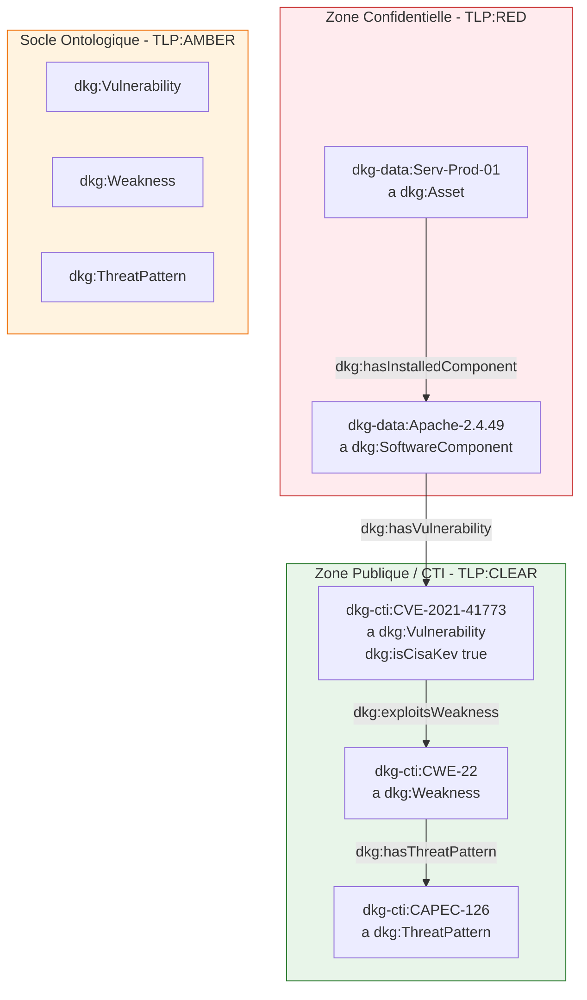

# 📑 Fiche d'Étape : Phase 3 — Ingestion CTI Externe & Superposition Cross-TLP (`TLP:CLEAR`)

> **Nom du Projet :** DKG-CyberSec  
> **Phase :** 3 (Vague 2 — Ingestion CTI Externe & Superposition)  
> **Statut :** 🟢 En cours (Étape 1 : Cadrage & Spécification)  
> **Classification TLP globale de la phase :** `TLP:CLEAR` (Superposition avec `TLP:RED` via `TLP:AMBER`)  
> **Responsable :** Équipe SOC / Architecture DKG  

---

## 🎯 1. Objectifs & Alignment Métier

### 1.1 Contexte & Enjeux Métier
Dans le cadre de l'évolution du Knowledge Graph SOC, la cartographie des actifs internes (`TLP:RED`) développée en Vague 1 doit être enrichie par des sources de menaces externes (`TLP:CLEAR` : NVD, MITRE ATT&CK, CISA KEV). 

L'objectif principal est de permettre à l'Agent IA SOC de corréler l'infrastructure sensible avec la CTI publique sans compromettre la confidentialité des actifs internes et en conservant une stricte étanchéité logique et physique.

**📌 Hypothèse de Cadrage — Conformité au Socle TBox/RBox (Phase 4)** :
_L'ingestion CTI non structurée via NER traite exclusivement les entités et relations strictement conformes au socle TBox/RBox existant (`TLP:AMBER`). Tout besoin d'extension ontologique (découverte de nouveaux concepts ou affinement de relations) est explicitement différé à la **Phase 5**, où le moteur de raisonnement et l'évolution dynamique de la TBox/RBox seront traités de manière consolidée._

### 1.2 Inscription dans le Scénario Fil Rouge ("Silent Cascade")
Le scénario d'attaque fil rouge nécessite de relier l'équipement critique interne `Serv-Prod-01` (`TLP:RED`) exécutant `Apache 2.4.49` à la vulnérabilité publique **`CVE-2021-41773`** (`TLP:CLEAR`), elle-même rattachée à la faiblesse **`CWE-22`** (Path Traversal), au motif d'attaque **`CAPEC-126`**, et identifiée comme activement exploitée dans le catalogue **CISA KEV**.

---

## ⚙️ 2. Matrice de Gouvernance & Découpage TLP (Seiton 5S)

Le découpage physique et logique des artefacts dans le respect de la démarche 5S et du Single Source of Truth (SSOT) s'établit comme suit :

| Niveau TLP | Portée Métier | Emplacement Physique (`02-Donnees/`) | Artefacts RDF & Fichiers |
| :--- | :--- | :--- | :--- |
| **`TLP:AMBER`** | Ontologie TBox & Formes SHACL combinées | `Master_Transversal/TLP_AMBER_Socle_TBox/` | `DKG_TBox_Master.ttl` |
| **`TLP:RED`** | ABox Cartographie Interne (Confidentiel) | `Master_Transversal/TLP_RED_Instances_ABox/` | `DKG_ABox_Master.ttl` |
| **`TLP:CLEAR`** | ABox CTI Externe (Référentiels publics) | `Master_Transversal/TLP_CLEAR_CTI_External/` | `DKG_ABox_CTI_External.ttl` `02_SYNTHESE_ABOX_CTI.md` |

---

## 🧬 3. Spécifications Techniques & Schéma sémantique

### 3.1 Superposition Cross-TLP (Graphe de Référence)
Les instances internes `TLP:RED` pointent vers des URIs du Namespace `TLP:CLEAR` via les propriétés définies dans la TBox `TLP:AMBER`. Aucune donnée sensible interne n'est exposée dans le graphe CTI.

### 3.2 Impact SSOT dans `03-Application/config.py`

Ajout et formalisation des constantes globales :
- `DIR_CTI
- `ABOX_CTI_PATH = DIR_CTI_CLEAR / "DKG_ABox_CTI_External.ttl"`
- C_CTI_MD_PATH = DIR_CTI_CLEAR / "02_SYNTHESE_ABOX_CTI.md"`
- `DKG_CTI = Namespace("http://dkg.cybersec.org/cti#")`

## 📋 4. Plan de Déroulement des 4 Étapes de la Phase

### 🔲 Étape 1 : Cadrage & Spécification (Cette fiche)

- [x] Spécification des schémas de superposition sémantique TLP:RED -> TLP:CLEAR.
    
- [x] Alignement avec le scénario d'attaque "Silent Cascade".
    
- [x] Validation du découpage 5S et intégration des constantes SSOT.
    

### 🔲 Étape 2 : Développement & Génération

- [ ] Mise à jour du fichier SSOT `03-Application/config.py`.
    
- [ ] Écriture du script d'ingestion/génération `03-Application/generate_phase3_cti_abox.py`.
    
- [ ] Instanciation de `CVE-2021-41773`, `CWE-22`, `CAPEC-126` et du booléen `isCisaKev`.
    

### 🔲 Étape 3 : Validation SHACL & Tests Pytest

- [ ] Rédaction du test automatisé `tests/test_phase3_cti_validation.py`.
    
- [ ] Validation de la conformité SHACL sur l'union des graphes (`TBox/SHACL` + `ABox RED` + `ABox CTI`).
    
- [ ] Vérification de l'absence de nœuds CTI orphelins (CWA).
    

### 🔲 Étape 4 : Documentation & Recette (Rituel 5S)

- [ ] Génération automatisée du rapport Markdown `02_SYNTHESE_ABOX_CTI.md`.
    
- [ ] Contrôle d'étanchéité des répertoires TLP (Seiri/Seiton).
    
- [ ] Validation du jalon et préparation du passage à la Wave 3 (Moteur de Raisonnement).

### 📋 Résumé du workflow accompli (Phase 2.5)

**1.Cadrage & Spécifications :**Documents normatifs.

Rédaction de `SPEC-03` (Framework CTI Externe) et `SPEC-UC-02` (Scénario Silent Cascade).

**2.Mise à jour TBox Master :**Édition manuelle validée.

Déclaration des propriétés CTI (`cvssScore`, `isCisaKev`, `exploitsWeakness`, `hasThreatPattern`) et de la forme SHACL `dkg:VulnerabilityShape`.

**3.Script d'Ingestion ABox CTI :**03-Application/generate_phase3_cti_abox.py.

Génération automatisée de `DKG_ABox_CTI_External.ttl` et de sa synthèse Markdown.

**4.Validation Continuelle :**Pytest & SHACL.

Création du test `test_phase3_cti_validation.py` pour valider l'intégrité globale.