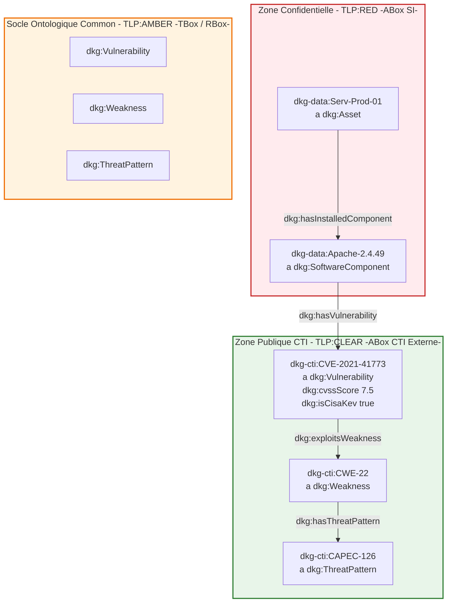

# 📑 Fiche d'Étape : Phase 3 — Ingestion CTI Externe & Superposition Cross-TLP (`TLP:CLEAR`)

> **Nom du Projet :** DKG-CyberSec  
> **Phase :** 3 (Vague 2 — Ingestion CTI Externe & Superposition Cross-TLP)  
> **Statut :** 🟢 En cours (Spécification et Alignement SSOT)  
> **Classification TLP globale :** `TLP:CLEAR` (Graphe CTI Externe) avec superposition vers `TLP:RED` via le socle `TLP:AMBER`  
> **Responsable :** Équipe SOC / Architecture DKG  

---

## 🎯 1. Objectifs & Alignement Métier

### 1.1 Contexte & Enjeux Métier
Dans le cadre de l'évolution du Knowledge Graph SOC (DKG), la cartographie de l'infrastructure interne (`TLP:RED`) construite en Vague 1 doit être enrichie de renseignements sur les menaces issues de sources ouvertes (`TLP:CLEAR` : NVD, MITRE ATT&CK, CISA KEV).

L'objectif principal est de permettre à l'Agent IA SOC de corréler la topologie du SI avec les données de vulnérabilités et de motifs d'attaque mondiaux sans compromettre la confidentialité des actifs internes et en conservant une ségrégation stricte des graphes.

**📌 Hypothèse de Cadrage — Alignment Ontologique & Découpage** :
- **Phase 3 (Vague 2)** : Ingestion structurée CTI, validation SHACL et superposition sémantique Cross-TLP (`TLP:RED` ➔ `TLP:CLEAR`).
- **Phase 4 & 5 (Vague 2)** : Traitement NER non-structuré et consolidation dynamique TBox / SKOS.
- **Phase 6 (Vague 3)** : Exécution du moteur de raisonnement (SWRL / SPARQL CONSTRUCT) et matérialisation des déductions (`dkg:HighRiskAsset`).

### 1.2 Inscription dans le Scénario Fil Rouge ("Silent Cascade")
Le scénario d'attaque fil rouge nécessite de connecter le serveur de production interne `Serv-Prod-01` (`TLP:RED`) exécutant le composant `Apache 2.4.49` à la vulnérabilité publique **`CVE-2021-41773`** (`TLP:CLEAR`), elle-même rattachée à la faiblesse **`CWE-22`** (Path Traversal), au motif d'attaque **`CAPEC-126`**, et listée dans le catalogue **CISA KEV**.

---

## 📚 2. Glossaire des Acronymes & Concepts

| Acronyme / Concept | Signification / Définition | Périmètre & Application DKG |
| :--- | :--- | :--- |
| **ABox** | Assertion Component (Graphe de Faits) | Contient les instances réelles (`TLP:RED` et `TLP:CLEAR`). |
| **CAPEC** | Common Attack Pattern Enumeration and Classification | Motifs d'attaque normés sous `dkg:ThreatPattern`. |
| **CISA KEV** | Known Exploited Vulnerabilities Catalogue | Drapeau `dkg:isCisaKev` (`xsd:boolean`) pour cibler l'exploitation active. |
| **CTI** | Cyber Threat Intelligence | Flux d'intelligence sur les menaces sous `TLP:CLEAR`. |
| **CVE** | Common Vulnerabilities and Exposures | Identifiants de vulnérabilités sous `dkg:Vulnerability`. |
| **CWE** | Common Weakness Enumeration | Faiblesses logicielles/structurelles sous `dkg:Weakness`. |
| **DKG** | Dynamic Knowledge Graph | Graphe de connaissances dynamique du SOC CyberSec. |
| **NVD** | National Vulnerability Database | Source principale des scores CVSS et descriptions CVE. |
| **RBox** | Relationship Component (Graphe de Propriétés) | Définit les hiérarchies de propriétés (`dkg:exploitsWeakness`). |
| **SHACL** | Shapes Constraint Language | Langage de validation de contraintes sur les graphes RDF. |
| **SSOT** | Single Source of Truth | Source unique de vérité centralisée dans `03-Application/config.py`. |
| **TBox** | Terminology Component (Schéma Ontologique) | Définitions des classes et propriétés sous `TLP:AMBER`. |
| **TLP** | Traffic Light Protocol | Protocole de ségrégation de l'information (`RED`, `AMBER`, `CLEAR`). |

---

## ⚙️ 3. Matrice de Gouvernance & Architecture 5S (Seiton)

Le découpage physique et logique respecte le principe SSOT formalisé dans `03-Application/config.py` :

| Niveau TLP | Portée Métier | Variable SSOT (Chemin) | Artefacts RDF & Documentation |
| :--- | :--- | :--- | :--- |
| **`TLP:AMBER`** | Socle TBox / RBox & Shapes SHACL | `DIR_MASTER_TBOX` | `TBOX_MASTER_PATH` `SHACL_MASTER_PATH` |
| **`TLP:RED`** | ABox Cartographie Interne SI | `DIR_MASTER_ABOX` | `ABOX_MASTER_PATH` `ABOX_MASTER_MD_PATH` |
| **`TLP:CLEAR`** | Entrées CTI Brutes (JSON) | `DIR_INPUTS_P3` | `INPUT_CTI_JSON_PATH` |
| **`TLP:CLEAR`** | ABox CTI Externe Générée | `DIR_CTI_CLEAR` | `ABOX_CTI_PATH` `ABOX_CTI_MD_PATH` |
| **`TLP:RED`** | Graphe Inféré (Phase 6) | `DIR_INFERED_RED` | `ABOX_INFERED_PATH` |

---

## 🧬 4. Diagramme de Architecture & Superposition Sémantique

Le schéma Mermaid ci-dessous illustre la séparation étanche des trois zones TLP et les points d'ancrage Cross-TLP :

---

## 📋 5. Plan de Déroulement de la Phase 3

### 🔲 Étape 1 : Cadre & Alignement SSOT
- [x] Correction des nommages de constantes dans `config.py` (`DIR_CTI_CLEAR`, `ABOX_CTI_PATH`, `ABOX_CTI_MD_PATH`).
- [x] Enregistrement officiel du Namespace RDF `DKG_CTI` (`http://dkg.cybersec.org/cti#`).
- [x] Standardisation du prédicat RBox canonique `dkg:exploitsWeakness`.

### 🔲 Étape 2 : Génération ABox CTI (`TLP:CLEAR`)
- [ ] Lecture du flux d'entrée `INPUT_CTI_JSON_PATH` (`external_nvd_capec_feed.json`).
- [ ] Exécution du script d'ingestion/génération de l'ABox CTI (`ABOX_CTI_PATH`).
- [ ] Normalisation des types de données (`xsd:float` pour `cvssScore`, `xsd:boolean` pour `isCisaKev`).

### 🔲 Étape 3 : Validation SHACL & Tests PyTest
- [ ] Validation SHACL sous CWA sur le graphe d'union (`TBox` + `ABox RED` + `ABox CTI`).
- [ ] Vérification de l'absence de violations SHACL ou de nœuds orphelins.
- [ ] Exécution de la suite de tests automatisés `test_phase3_quality.py`.

### 🔲 Étape 4 : Auto-Documentation & Clôture 5S
- [ ] Génération automatisée de la documentation miroir Markdown `ABOX_CTI_MD_PATH`.
- [ ] Validation de la parité et de la traçabilité dans `DIR_SNAPSHOT_P3`.
- [ ] Préparation du passage à la Phase 4 (Ingestion CTI Non-Structurée / NER).