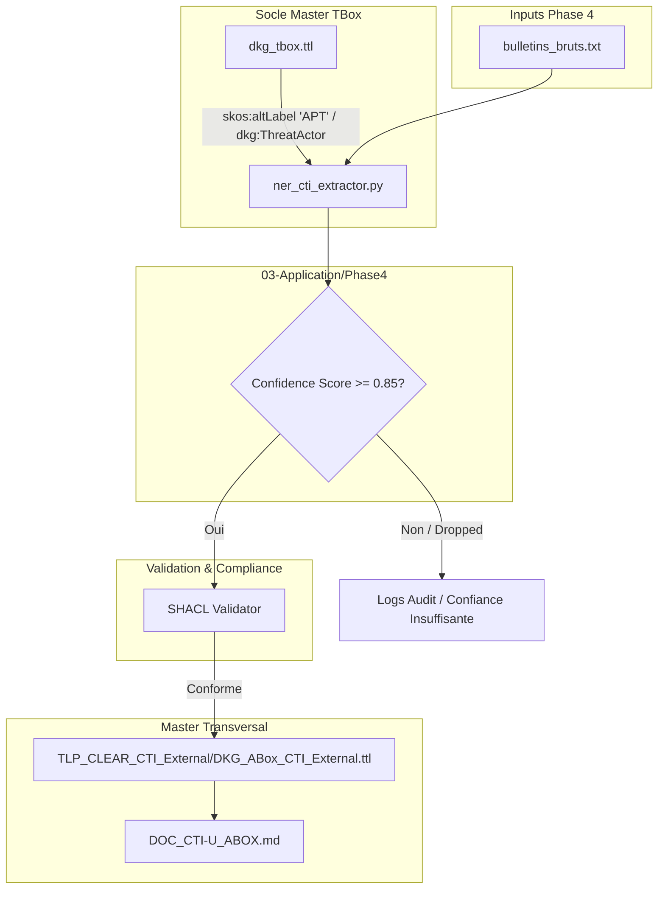
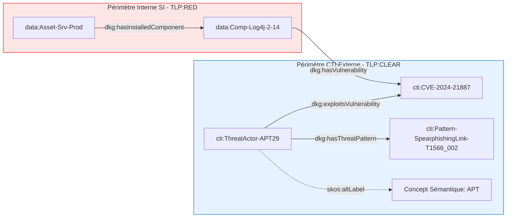

***Extraction NER & Ingestion d'Avis CTI Non Structurés***

**Classification :** `TLP:CLEAR` (Public / Partageable)  
**Domaine :** Cyber Threat Intelligence (CTI) & Natural Language Processing (NLP)  
**Architecture :** Decoupled Semantic Graph (TBox Master & ABox CTI)

---

## 📖 Glossaire & Table des Acronymes Métier

| Acronyme | Nom Complet | Rôle & Définition dans le Knowledge Graph DKG |
| :--- | :--- | :--- |
| **APT** | Advanced Persistent Threat | Groupe d'attaquants étatiques ou hautement organisés. Rattaché au concept `dkg:ThreatActor` via `skos:altLabel` dans la TBox Master. |
| **NER** | Named Entity Recognition | Pipeline NLP/Regex d'extraction d'entités de sécurité depuis du texte libre. |
| **CTI** | Cyber Threat Intelligence | Renseignements structurés sur les menaces informatiques. |
| **SSOT** | Single Source of Truth | Architecture de centralisation des graphes Master Turtle (`.ttl`). |
| **SHACL** | Shapes Constraint Language | Moteur de validation de conformité des données générées avant fusion. |
| **TLP** | Traffic Light Protocol | Standard de classification du niveau de partage des données (`TLP:CLEAR` vs `TLP:AMBER` vs `TLP:RED`). |

---

## 📌 Contextualisation & Objectif Métier

Les bulletins d'alerte et rapports d'incidents (CERT, avis éditeurs) sont majoritairement publiés au format texte non structuré. 

L'objectif de cette **Phase 4** est d'automatiser l'extraction des faits cyber (Threat Actors, CVEs, Patterns ATT&CK) depuis ces documents bruts, de valider leur niveau de certitude ($Score \ge 0.85$), et d'enrichir le Knowledge Graph **DKG-CyberSec** sans rupture sémantique avec la TBox centrale.

---

## 🏗️ Flux d'Ingestion MLOps & Contrôle Qualité


    

## 🔗 Topology Network Graph (Cross-Périmètre TLP)

Ce diagramme illustre le chaînage sémantique entre les données CTI externes (publiques) et le SI interne (confidentiel) :


## 🔍 Requête SPARQL d'Audit & Traçabilité CTI

Cette requête permet aux analystes SOC/CTI d'interroger les entités générées par le NER, de vérifier l'accrochage à l'acronyme `APT` du socle et de filtrer selon le score de confiance :
```sparql
PREFIX dkg:  [http://dkg.cybersec.org/tbox#](http://dkg.cybersec.org/tbox#)
PREFIX cti:  [http://dkg.cybersec.org/cti#](http://dkg.cybersec.org/cti#)
PREFIX rdfs: [http://www.w3.org/2000/01/rdf-schema#](http://www.w3.org/2000/01/rdf-schema#)
PREFIX skos: [http://www.w3.org/2004/02/skos/core#](http://www.w3.org/2004/02/skos/core#)

SELECT ?actor ?label ?acronym ?cve ?confidence WHERE {
    ?actor a dkg:ThreatActor ;
           dkg:exploitsVulnerability ?cve ;
           dkg:nerConfidenceScore ?confidence .
    
    OPTIONAL { ?actor rdfs:label ?label . }
    OPTIONAL { ?actor skos:altLabel ?acronym . }
    
    # Seuil de gouvernance MLOps
    FILTER(?confidence >= 0.85)
}
ORDER BY DESC(?confidence)
```


## 🛡️ RÈGLES DE GOUVERNANCE & MAINTENANCE

1. **Pilotage par le Socle (TBox First) :** Les concepts et acronymes (tels que `APT`) doivent être déclarés dans la TBox Master (`dkg_tbox.ttl`). Le script Python ne fait qu'instancier ces concepts.
    
2. **Garde-Fou MLOps :** Tout fait extrait ayant une confiance $< 0.85$ est rejeté afin d'éviter d'injecter du bruit dans l'ABox Master.
    
3. **Double Écriture Anti-Rupture :** Chaque exécution génère un Snapshot local (`01-Snapshots_Phases/Phase4_CTI_Unstructured`) avant de synchroniser le Master central (`02-Donnees/Master_Transversal/TLP_CLEAR_CTI_External`).