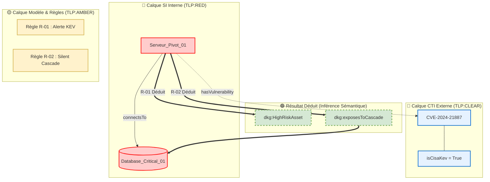
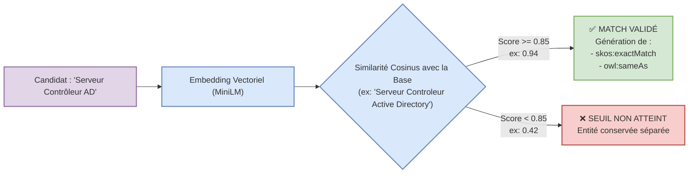
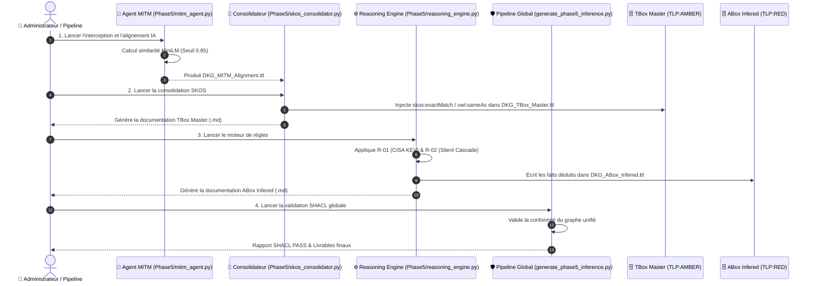

# 📖 Complément Memo_UseCase — Phase 5 : Alignement, Superposition & Raisonnement Sémantique

**Classification :** `TLP:AMBER` (Libre usage interne)

**Public Cible :** Métier, RSSI, Chefs de Projet, Décideurs non-techniques

**Objet :** Explication fonctionnelle des principes de superposition de graphes, de l'alignement IA (MITM) et de la chaîne d'exécution de la Phase 5.

## 🎯 Message Clé pour la Direction & les Métiers

> **Cette présentation constitue la vision fonctionnelle cible de notre application.**
> 
> Elle démontre comment le Knowledge Graph transforme des données fragmentées, hétérogènes et cloisonnées en une **intelligence décisionnelle unifiée, automatisée et explicable**.

## 1. Le Principe de Superposition de Graphes (Graph Overlay)

### 💡 Le Concept Expliqué Simplement

Imaginez que vous superposez des **calques transparents** sur une carte géographique :

1. **Calque 1 (ABox Interne - TLP:RED) :** La carte de vos équipements SI (serveurs, bases de données, liens réseau).
    
2. **Calque 2 (ABox CTI - TLP:CLEAR) :** Les renseignements sur la menace cyber mondiale (vulnérabilités CISA KEV, groupes d'attaquants APT).
    
3. **Calque 3 (TBox Master & SKOS - TLP:AMBER) :** Le dictionnaire des concepts métier, du thésaurus et des règles de sécurité.
    

Pris isolément, chaque calque est incomplet. En les **superposant**, le système fait apparaître des connexions invisibles à l'œil humain et matérialise instantanément de nouveaux risques.

### 🖼️ Illustration Visuelle de la Superposition

Extrait de code

## 2. Le Rapprochement Sémantique par Modèle IA (Agent MITM)

### 💡 Pourquoi un Modèle IA ?

Dans les systèmes informatiques, une même réalité est souvent nommée de manières différentes par divers outils ou équipes :

- L'équipe Réseau écrit : `"Serveur Controleur de Domaine Active Directory"`
    
- L'équipe CTI / Analystes écrit : `"Serveur Contrôleur AD"`
    

Pour un ordinateur classique, ces deux chaînes de caractères sont **différentes**.

### 🤖 Quel Modèle & Quel Rôle ?

Nous intégrons un modèle de Traitement Automatique du Langage (NLP) local et souverain : **`all-MiniLM-L6-v2`** (via la bibliothèque _SentenceTransformers_).

- **Son Rôle :** Il transforme chaque libellé texte en une **empreinte numérique (vectorisation)**. Il calcule ensuite la **distance sémantique** (similarité cosinus) entre l'entité candidate et l'annuaire existant.
    
- **Le Seuil de Décision (`0.85`) :**
    
    - **Si le score est $\ge 0.85$ :** Le modèle conclut qu'il s'agit du même élément. Le système crée automatiquement une équivalence sémantique officielle (`skos:exactMatch` / `owl:sameAs`).
        
    - **Si le score est $< 0.85$ :** Le système conserve l'entité comme indépendante pour éviter toute fausse fusion.
        

### 🖼️ Fonctionnement de la Réconciliation Sémantique

Extrait de code

## 3. Le Pipeline d'Exécution Complet

Le pipeline de la Phase 5 s'exécute selon une chaîne industrielle rigoureuse, garantissant la **traçabilité**, la **reproductibilité (Principe de Replay)** et la **non-pollution des données**.

Extrait de code

## 4. Synthèse des Valeurs Ajoutées Métier

|**Composant**|**Rôle Métier**|**Bénéfice Direct**|
|---|---|---|
|**Superposition**|Fusionner le SI Interne et la CTI Externe.|Détection de vulnérabilités critiques contextuelles sans modifier la base SI source.|
|**Agent MITM (IA)**|Réconcilier les synonymes et variantes de noms.|Suppression des doublons et alignement automatique des vocabulaires inter-équipes.|
|**Thésaurus SKOS**|Structurer le vocabulaire métier unifié.|Garantie que la TBox Master reste la source unique de vérité (`SSOT`).|
|**Reasoning Engine**|Déduire les risques cachés (Cascade).|Identification des chemins d'attaque menaçant les bases de données critiques.|
|**Auto-Documentation**|Générer un miroir Markdown (`.md`) pour chaque `.ttl`.|Auditabilité complète et explicabilité des décisions pour les équipes de direction.|