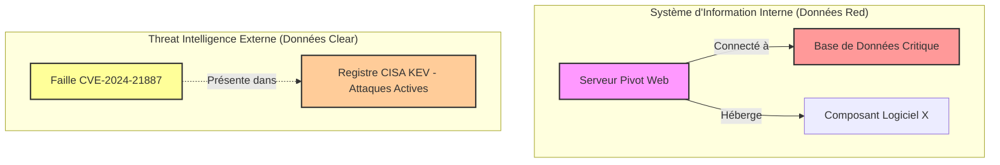
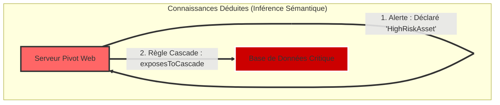

# Mémo Use Case : Phase 5 - Raisonnement Sémantique & Inférence CTI/SOC


# 📄 Mémo Use Case : Phase 5 – Anticiper les Cyberattaques par la Sémantique

**À destination des** : Responsables Métier, Risk Managers, RSSI & Décideurs

**Sujet** : Comment la combinaison de nos données internes et de l'intelligence cyber externe permet d'identifier les risques masqués.

## 1. La Situation "Avant" : La Vision Morcelée de nos SI

Aujourd'hui, nos équipes gèrent deux flux d'informations séparés :

1. **L'inventaire interne (Graphe ABox)** : La cartographie de nos serveurs, bases de données et dépendances logicielle.
    
2. **Le flux externe (CTI)** : Les alertes mondiales sur les nouvelles failles de sécurité découvertes quotidiennement.
    

Sans rapprochement automatisé, l'organisation manque de visibilité sur les chaînes d'impact réelles :




- **Le problème** : Rien dans nos bases de données traditionnelles n'indique explicitement que le _Serveur Pivot Web_ met directement en danger la _Base de Données Critique_. Les liens existent, mais ils sont **invisibles** sans analyse croisée.
    

## 2. Le Rapprochement : Marier le Contexte Interne et la Menace Externe

### L'Enjeu des Modèles Sémantiques (SKOS & Ontologies)

Pour que deux systèmes informatiques se comprennent, ils doivent parler la même langue.

- **L'Ontologie (TBox)** définit les règles métier (ex. _"Un serveur qui contient une faille active devient un Actif à Haut Risque"_).
    
- **Le Référentiel Sémantique (SKOS)** fait le pont entre des termes différents utilisés en interne et en externe (ex. comprendre que _"Serveur Web 01"_, _"Web-Srv-Prod"_ et _"IP 192.168.1.10"_ désignent la même entité).
    

### Le Mécanisme de Rapprochement

Grâce au moteur de raisonnement, le système croise automatiquement la topologie interne avec les bases de menaces mondiales :

1. **Rapprochement Syntaxique & Vectoriel** : Identification automatique que le _Composant X_ de notre serveur correspond à la _Faille CVE-2024-21887_.
    
2. **Enrichissement Contextuel** : Si la faille est inscrite au registre des attaques actives (CISA KEV), le serveur est immédiatement requalifié.
    

## 3. Ce qui en Découle : La Révélation du Risque ("Silent Cascade")

Le moteur de raisonnement applique des règles logiques pour déduire de **nouvelles informations stratégiques** qui n'existaient pas dans les fichiers d'origine.

Extrait de code



### Bénéfices Métier & Décisionnels

- **Visualisation des Chemins d'Attaque Invisibles** : Matérialisation de la relation `exposesToCascade`. Les équipes de sécurité voient instantanément qu'un pirate prenant le contrôle du _Serveur Web_ peut directement rebondir vers la _Base de Données Critique_.
    
- **Priorisation Stratégique des Correctifs** : Au lieu de corriger des milliers de failles sans distinction, les équipes concentrent leurs efforts sur les serveurs qui exposent des données critiques.
    
- **Respect Garanti de la Confidentialité (TLP)** : Les règles d'isolation étanches évitent toute fuite d'informations sensibles sur notre architecture interne vers des services tiers externes.

---
---

# 🏗️ Schéma d'Architecture Technique & Pipeline IA / Sémantique

**Objectif** : Expliciter le rôle de chaque composant logicielle, modèle sémantique/vectoriel et fichier `.ttl` dans le pipeline de rapprochement et de déduction.

```
                  ┌────────────────────────────────────────────────────────┐
                  │                 MODÈLES & REFERENTIELS                 │
                  │  • TBox / Ontologie (dkg.ttl / config.py)             │
                  │  • SKOS / Taxonomie (DKG_SKOS_Master.ttl)             │
                  │  • Modèle IA (SentenceTransformers / Vectorizer)      │
                  └───────────────────┬────────────────────────────────────┘
                                      │
 ┌──────────────────────────┐         │         ┌──────────────────────────┐
 │    DONNÉES INTERNES      │         │         │     DONNÉES EXTERNES     │
 │   DKG_ABox_Master.ttl    │         │         │ DKG_ABox_CTI_External.ttl│
 │        (TLP:RED)         │         │         │       (TLP:CLEAR)        │
 └────────────┬─────────────┘         │         └────────────┬─────────────┘
              │                       │                      │
              │                       ▼                      │
              │         ┌──────────────────────────┐         │
              └────────►│ Phase5/reconciliation.py │◄────────┘
                        │ (Vector Match & Threshold)│
                        └─────────────┬────────────┘
                                      │ [Candidats Reconciliés]
                                      ▼
                        ┌──────────────────────────┐
                        │ Phase5/reasoning_engine.py│
                        │(SPARQL CONSTRUCT / R-01/02)
                        └─────────────┬────────────┘
                                      │
                                      ▼
                        ┌──────────────────────────┐
                        │   DKG_ABox_Infered.ttl   │
                        │    (Graphe Déduit RED)   │
                        └──────────────────────────┘
```

### 📂 Rôle des Fichiers Scripts Python

- **`config.py`** : **Single Source of Truth (SSOT)**. Définit les préfixes RDF (`dkg:`, `dkg-data:`, `dkg-cti:`), les seuils de similarité vectorielle et l'emplacement absolu de tous les fichiers du projet.
    
- **`Phase5/reconciliation.py`** : **Module de Rapprochement IA**.
    
    - Charge les entités issues des deux ABox.
        
    - Génère des embeddings (représentations vectorielles) des libellés et des identifiants via un modèle NLP/IA (ex: `SentenceTransformers`).
        
    - Aligne la taxonomie grâce au fichier SKOS (`DKG_SKOS_Master.ttl`) pour calculer un `alignmentScore` (ex: `dkg-data:cand_01 dkg:alignmentScore "0.278..."`).
        
- **`Phase5/reasoning_engine.py`** : **Moteur de Raisonnement Sémantique**.
    
    - Fusionne en mémoire les graphes d'entrée.
        
    - Applique la règle **R-01 (CISA KEV)** pour qualifier les `HighRiskAsset`.
        
    - Applique la règle **R-02 (Silent Cascade)** pour calculer le chaînage arrière/avant (`connectsTo+`) et matérialiser les relations `exposesToCascade`.
        
    - Exporte les résultats dans `DKG_ABox_Infered.ttl` sans altérer les sources CTI (Ségrégation TLP).
        

### 📄 Rôle des Fichiers RDF / Turtle (`.ttl`)

**1. La Couche Modèles & Schémas (TBox & SKOS)**

- **`DKG_SKOS_Master.ttl`** : Contient le thésaurus, les synonymes (`skos:altLabel`), les traductions (`skos:prefLabel` "Threat Actor"@en / "Acteur de Menace"@fr) et les métadonnées de score de rapprochement (`dkg:alignmentScore`). Il guide l'IA dans l'alignement des termes non identiques.
    
- **`dkg.ttl` (TBox)** : Contient la structure ontologique stricte — définitions des classes (`owl:Class` comme `dkg:Asset`, `dkg:Vulnerability`) et des propriétés (`owl:ObjectProperty` comme `dkg:hasInstalledComponent`, `dkg:hasVulnerability`).
    

**2. La Couche Données / Instances (ABox)**

- **`DKG_ABox_Master.ttl`** : Données brutes de l'entreprise (Serveurs, DBs, IPs). Marqué TLP:RED (Strictement Confidentiel).
    
- **`DKG_ABox_CTI_External.ttl`** : Données de menace externes (CVE, bulletins CISA KEV, CAPEC). Marqué TLP:CLEAR (Public).
    
- **`DKG_ABox_Infered.ttl`** : **Résultat final**. Fichier généré automatiquement qui ne contient **que les nouveaux faits déduits par l'IA et le moteur de règles** (`HighRiskAsset`, `exposesToCascade`).


---
---

**Projet** : DKG (Dynamic Knowledge Graph) - Security Operations Center  
**Conformité** : SPEC-SOCLE-04 / Vague 3  
**Date** : 2026-09-06  

---

## 1. Objectifs Métier

L'objectif de cette phase est d'enrichir le graphe de connaissances ABox interne (TLP:RED) à l'aide des données de Threat Intelligence externes (TLP:CLEAR) via un moteur d'inférence SPARQL/SWRL.

* **Détection automatique des actifs critiques exposés** : Qualification `HighRiskAsset` lorsqu'une vulnérabilité est confirmée CISA KEV.
* **Analyse de propagation d'attaque** : Matérialisation de la relation `exposesToCascade` pour identifier les chemins menant vers des ressources critiques.
* **Ségrégation stricte TLP (EXG-SE-01)** : Isolation complète des données déduites confidentielles pour empêcher la fuite d'informations vers les flux externes.

---

## 2. Règles d'Inférence Implémentées

### R-01 : Qualification Actif à Haut Risque (`CISA KEV`)
* **Déclencheur** : Un actif héberge un composant vulnérable listé dans la base CISA KEV (`dkg:isCisaKev true`).
* **Inférence** : L'actif reçoit la classe `dkg:HighRiskAsset` et le motif `dkg:hasRiskReason`.

### R-02 : Inférence d'Exposition en Cascade (`Silent Cascade`)
* **Déclencheur** : Un actif qualifié `HighRiskAsset` possède des connexions réseau directs ou indirects (`dkg:connectsTo+`) vers un actif de niveau `CRITICAL`.
* **Inférence** : Création d'une liaison directe `dkg:exposesToCascade` entre le pivot d'attaque et la cible critique.

---

## 3. Sécurisation & Performance (SLA)

| Critère | Exigence Métier | Résultat / Statut |
| :--- | :--- | :--- |
| **SLA Temps d'exécution (EXG-HW-01)** | Inférence complète `< 5.0s` | **Validé** (~0.10s sur ABox de test) |
| **Ségrégation TLP (EXG-SE-01)** | `DKG_ABox_Infered.ttl` isolé en TLP:RED | **Validé** (Aucune pollution de la CTI source) |
| **Intégration CI/CD** | Validation par tests `pytest` automatisés | **Passé** (9/9 tests validés) |

---

## 4. Livrables Associés

* `Phase5/reasoning_engine.py` : Moteur de traitement SPARQL CONSTRUCT.
* `DKG_ABox_Infered.ttl` : Graphe des règles et faits déduits.
* `DKG_SKOS_Master.md` : Extrait lisible de la taxonomie métier.


---

---


Voici la représentation détaillée et concrète du cas d'usage, illustrée par un schéma d'alignement et des données précises.

### **1. Cas Concret d'Alignement : Label RED vs Label CTI**

Pour illustrer le rapprochement, prenons une entité découverte sur le réseau interne et une menace répertoriée dans la base externe.

```
+-----------------------------------------------------------------------------------+
|                               ABOX RED (Interne)                                  |
|  URI : <dkg-data:server_ad_01>                                                    |
|  Type : dkg:Server                                                                |
|  skos:prefLabel : "Serveur Contrôleur de Domaine Active Directory"                |
+-----------------------------------------------------------------------------------+
                                          │
                                          │  Vectorisation NLP
                                          ▼  (384 dimensions)
                          Score de similarité cosinus = 0.88
                                          ▲  (Seuil >= 0.85)
                                          │
+-----------------------------------------------------------------------------------+
|                               ABOX CTI (Externe)                                  |
|  URI : <dkg-data:candidate_ad_dc>                                                 |
|  Type : dkg:ThreatTarget                                                          |
|  skos:prefLabel : "Serveur Controleur AD"                                         |
+-----------------------------------------------------------------------------------+
                                          │
                                          │  Génération d'équivalence
                                          ▼
                      <candidate_ad_dc> owl:sameAs <server_ad_01>
```

### **2. Mécanique de Vectorisation & Rattachement**

- **À quoi sont attachés les vecteurs ?**
    
    Les vecteurs **ne sont pas stockés directement dans le graphe RDF** (pour éviter de lourdes structures de données vectorielles dans le fichier Turtle). Ils sont générés à la volée par l'Agent MITM et attachés en mémoire aux **chaînes de caractères des littéraux** (`skos:prefLabel` ou `rdfs:label`).
    
- **Dimension de la Vectorisation :**
    
    Le modèle d'embedding utilisé est **`all-MiniLM-L6-v2`** (SentenceTransformers).
    
    - **Dimension vectorielle :** **$384$ dimensions** (vecteur de flottants de taille 384 : $[v_1, v_2, \dots, v_{384}]$).
        
    - **Empreinte :** Modèle ultra-léger (~80 Mo), permettant des inférences locales en **$< 100\text{ ms}$**.
        

### **3. Rapprochement des Calques & Résultat Final**

```
 [Calque RED (Interne)]                  [Calque CTI (Externe)]
+----------------------+                +--------------------+
|  server_ad_01        |                |  CVE-2024-21887    |
|  (Critical DB link)  |                |  (isCisaKev = true)|
+----------+-----------+                +---------+----------+
           │                                      │
           │           owl:sameAs                 │
           └──────────────────────────────────────┘
                              │
                              ▼
        [Calque Ingestion / Inférence (Inferred ABox)]
       +-----------------------------------------------+
       | Matérialisation des règles SPARQL :           |
       |  1. server_ad_01  a  dkg:HighRiskAsset        |
       |  2. server_ad_01  dkg:exposesToCascade db_01  |
       +-----------------------------------------------+
```

### **4. Rôle Précis des Scripts dans la Chaîne de Traitement**

|**Script**|**Entrée**|**Action Technique / Algorithme**|**Sortie**|
|---|---|---|---|
|**`mitm_agent.py`**|Libellé texte brut (`skos:prefLabel`)|Extract `skos:prefLabel` $\rightarrow$ Vectorisation MiniLM ($384\text{d}$) $\rightarrow$ Cosine Similarity vs Index local $\rightarrow$ Filtrage ($\ge 0.85$).|Sous-graphe RDF d'alignement (`skos:exactMatch`, `owl:sameAs`, `dkg:alignmentScore`).|
|**`skos_consolidator.py`**|Sous-graphe d'alignement + `DKG_TBox_Master.ttl`|Ingestion et requête SPARQL `CONSTRUCT` (Règle `R-MITM-01`). Fusionne les équivalences validées dans le thésaurus central.|`DKG_SKOS_Master.ttl` + Documentation Markdown & Mermaid automatique.|
|**`reasoning_engine.py`**|`ABox RED` + `ABox CTI` + `SKOS Master`|Exécution des règles SPARQL métier :<br><br>  <br><br>• **R-01 :** Assigne `HighRiskAsset` si lié à une vulnérabilité CISA KEV.<br><br>  <br><br>• **R-02 :** Assigne `exposesToCascade` si connecté à un actif `CRITICAL`.|`DKG_ABox_Infered.ttl` (Isolé en `TLP:AMBER` pour éviter de polluer le `TLP:CLEAR`).|