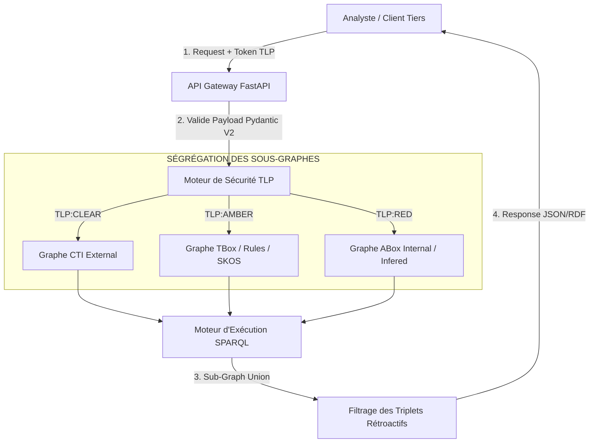

# Mémo Cas d'Usage — Phase 6 : API Gateway & Ségrégation TLP

## Glossaire des Acronymes
| Acronyme | Définition |
| :--- | :--- |
| **API** | Application Programming Interface |
| **DKG** | Dynamic Knowledge Graph |
| **RBAC** | Role-Based Access Control |
| **TLP** | Traffic Light Protocol (CLEAR, AMBER, RED) |
| **SPARQL** | SPARQL Protocol and RDF Query Language |

## Description Métier
L'API Gateway sert de point d'accès centralisé au graphe DKG-CyberSec[cite: 1]. En fonction du niveau d'habilitation de l'analyste ou du système tiers (ex: Client externe = TLP:CLEAR, Analyste SOC L2 = TLP:AMBER, Incident Responder = TLP:RED), le moteur de sécurité réécrit dynamiquement la requête SPARQL ou filtre les sous-graphes interrogés pour restreindre la portée de l'information retournée[cite: 1].

## Architecture d'Interception et Filtrage TLP

