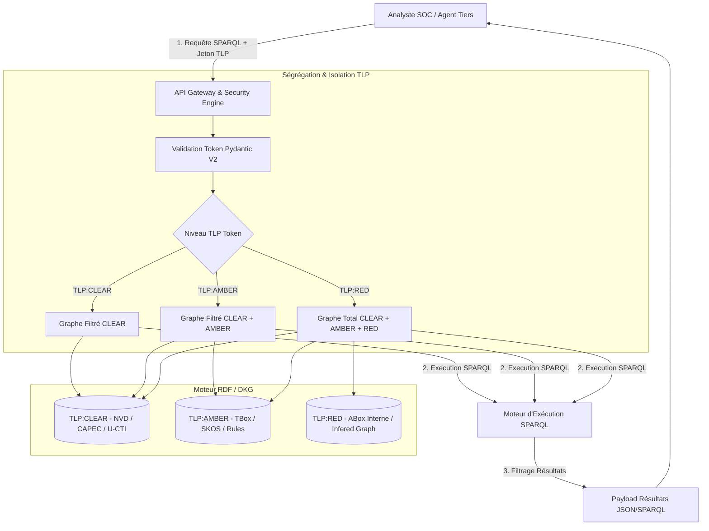
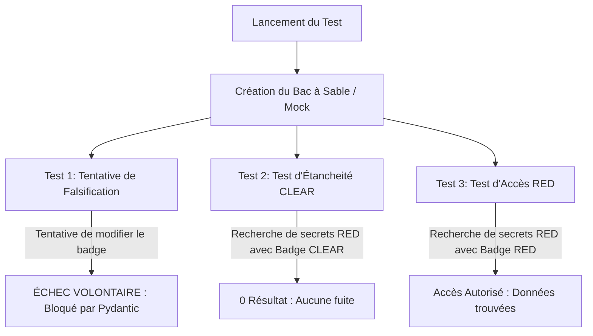

# Mémo Cas d'Usage — Phase 6 : API Gateway Cross-TLP & Security Engine

## 1. Description Fonctionnelle et Métier (SOC)
L'API Gateway constitue le point d'entrée unique pour les analystes SOC, les Micro-Agents de télémétrie et les outils tiers. Dans un environnement multi-tenant ou multi-niveaux d'habilitation, les données CTI externes (TLP:CLEAR), l'ontologie d'entreprise (TLP:AMBER) et la cartographie des actifs réels avec vulnérabilités (TLP:RED) coexistent dans le DKG.
L'API Gateway applique un filtre sémantique étanche :
- Un **Analyste L1 (Jeton TLP:CLEAR)** interroge l'API : Il n'obtient que les flux CTI publics (CVE, CAPEC, bulletins textuels NER).
- Un **Système Automatisé SOC (Jeton TLP:AMBER)** : Il accède à la CTI et à la structure ontologique TBox/SKOS.
- Un **Analyste L3 / Cert (Jeton TLP:RED)** : Il accède à la totalité du graphe d'union, incluant les actifs internes et les inférences de risques calculées (`dkg:HighRiskAsset`, `dkg:exposesToCascade`).

## 2. Diagramme d'Architecture et Workflow (Mermaid)

## 3. Glossaire des Acronymes

| **Acronyme** | **Définition Complète**                | **Contextualisation DKG**                                  |
| ------------ | -------------------------------------- | ---------------------------------------------------------- |
| **API**      | Application Programming Interface      | Interface d'exposition SPARQL/GraphQL de l'IA SOC.         |
| **CWA**      | Closed World Assumption                | Hypothèse du monde clos validée par SHACL.                 |
| **DKG**      | Dynamic Knowledge Graph                | Graphe de connaissances cybersec multi-calques.            |
| **SHACL**    | Shapes Constraint Language             | Langage de validation des contraintes de structure RDF.    |
| **SPARQL**   | SPARQL Protocol and RDF Query Language | Langage de requête standard pour le graphe RDF.            |
| **SSOT**     | Single Source of Truth                 | Source unique de vérité applicative (`config.py`).         |
| **TLP**      | Traffic Light Protocol                 | Protocole de classification de la sensibilité des données. |

---
---
---

# 📘 Mémo Cas d'Usage — Phase 6 : Sécurisation & Contrôle d'Accès Cross-TLP

## 1. Enjeu Métier & Vulgarisation : La Métaphore du Bâtiment Sécurisé
Dans un Graph de Connaissances en Cybersécurité (DKG), nous manipulons des données de sensibilités très différentes : des bulletins de menaces publics (TLP:CLEAR), des taxonomies d'entreprise (TLP:AMBER) et des données d'infrastructures hautement critiques ou des vulnérabilités non corrigées (TLP:RED).

Pour comprendre la Phase 6 sans être développeur, imaginez un **bâtiment gouvernemental sécurisé** :
* **TLP:CLEAR (Badge Vert) :** Vous avez accès au hall d'accueil public. Vous pouvez lire les brochures d'information et les affiches.
* **TLP:AMBER (Badge Jaune) :** Vous avez accès aux bureaux de travail. Vous voyez l'organisation interne et les procédures, mais pas les coffres-forts.
* **TLP:RED (Badge Rouge) :** Vous avez accès à la salle des coffres. Vous voyez l'intégralité des secrets et des infrastructures critiques.

L'**API Gateway** agit comme le **gardien à l'entrée du bâtiment**. Elle ne se contente pas de vous demander votre badge à la porte : elle **reconstruit une pièce sur mesure pour vous**, dans laquelle seuls les documents correspondant à votre couleur de badge sont posés sur la table.

---

## 2. Principes Clés Mis en Œuvre dans le Code

### A. Le Contrat Inviolable (Immutabilité avec Pydantic V2)
* **Le problème :** Dans un système logiciel, une requête d'utilisateur traverse plusieurs composants. Si un composant est malveillant ou défaillant, il pourrait modifier le niveau d'habilitation (transformer un badge Vert en badge Rouge) en cours de route.
* **La solution dans le code (`p6_schemas.py`) :** Les demandes de requêtes (`SPARQLQueryRequest`) sont rendues **immutables** via la consigne `frozen=True` de Pydantic V2. Une fois la demande créée par l'utilisateur, elle devient techniquement "scellée dans du verre" : personne ne peut la modifier en mémoire durant son traitement.

### B. Le Filtre Optique Sémantique (`SecurityEngine`)
* **Le problème :** La plupart des systèmes informatiques traditionnels récupèrent toutes les données en base, puis masquent les lignes interdites avant d'envoyer le résultat (filtrage a posteriori). C'est risqué : un bug dans le masque et la donnée confidentielle fuite.
* **La solution dans le code (`api_gateway.py`) :** Le moteur d'isolation applique un **filtrage a priori**. Avant même d'exécuter la recherche, il assemble uniquement les fichiers de données autorisés pour le badge présenté. Pour un utilisateur `TLP:CLEAR`, les fichiers contenant les serveurs critiques (`TLP:RED`) **n'existent physiquement pas** dans la mémoire de sa session de recherche.

### C. Le Registre Inviolable (Journal d'Audit)
Chaque interaction génère une ligne dans un registre d'audit (`api_gateway_audit.log`). Il conserve la preuve irréfutable de :
1. **Qui** a formulé la demande (`client_id`).
2. **Quel niveau de badge** a été présenté (`tlp_token`).
3. **Combien d'informations** ont été restituées.
4. **L'horodatage exact UTC** (utilisant le standard Python moderne pour éviter tout décalage horaire).

---

## 3. Principes Clés Mis en Œuvre dans les Tests (`test_phase6_gateway.py`)

Les tests automatisés servent de "crash-tests" pour prouver scientifiquement qu'aucune fuite de données n'est possible.

### A. Le Bac à Sable Synthétique (Mock Environment)

Pour tester la sécurité sans risquer de corrompre nos véritables bases de données, le test construit un "mini-monde" temporaire et étanche avec :
- Un fichier de test public contenant une vulnérabilité (`CVE-2024-0001`).
- Un fichier de test secret contenant un serveur critique (`Server_01`).
### B. Le Test de Non-Fuite (Zéro Leakage Test)

Le test simule un espion ou un auditeur muni d'un badge `TLP:CLEAR` qui tente de demander la liste des serveurs critiques.
- **Résultat attendu :** Le système doit répondre avec un succès de traitement, mais **exactement 0 résultat**.
- **Garantie :** Cela prouve que le système ne confirme même pas l'existence des données confidentielles.
### C. Le Test de Tentative de Falsification

Le test tente de créer une demande `TLP:CLEAR` puis de modifier la variable en `TLP:RED` à la volée.
- **Résultat attendu :** Le programme déclenche immédiatement une erreur système. L'objet refuse d'être altéré.

## 4. Présentation des Fichiers Générés & Utilité Métier

À l'issue de l'exécution de la Phase 6, trois artefacts majeurs sont produits dans le dossier Snapshot (`02-Donnees/Snapshots_Phases/Phase6_API_Gateway/`) :

|**Fichier Généré**|**Format**|**Profil Destinataire**|**Utilité & Contenu Métier**|
|---|---|---|---|
|`execution_results.json`|JSON|Développeurs / MLOps|**Compte-rendu d'exécution :** Contient l'ensemble des réponses structurées renvoyées par la Gateway pour le lot de requêtes de recette. Permet de rejouer et vérifier la conformité des données transmises aux agents IA.|
|`api_gateway_audit.log`|Texte / Log|RSSI / Auditeurs SOC|**Piste d'audit de sécurité :** Fichier de journalisation horodaté traçant chaque tentative d'accès. Sert de preuve de conformité lors des audits de sécurité de la plateforme.|
|`DOC_Phase6_Gateway.md`|Markdown|Chefferie de Projet / Métier|**Rapport Miroir Auto-généré :** Synthesise l'architecture appliquée, intègre les schémas de séquence synthétiques et définit le glossaire des termes techniques utilisés.|

## 5. Synthèse des Garanties de Confidentialité

1. **Aucun passe-droit possible :** L'absence de chargement en mémoire des calques non autorisés interdit physiquement les fuites d'informations par effet de bord.
2. **Inviolabilité des échanges :** Les structures de données Pydantic V2 scellent les intentions de l'appelant.
3. **Traçabilité totale :** Chaque accès est consigné et auditable a posteriori.