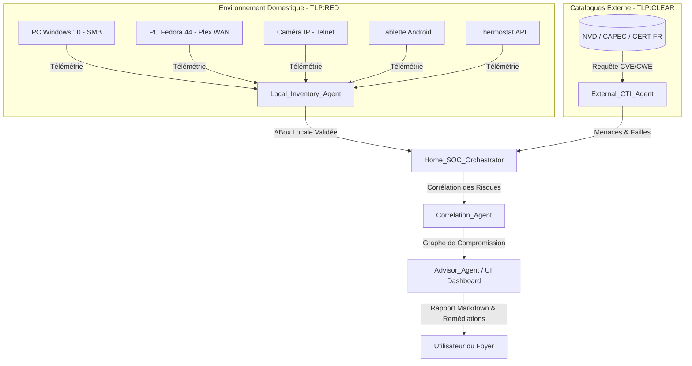

# Memo_UseCase_Phase7.md — Scénario Métier : L'Assistant SOC du Foyer

# Memo_UseCase_Phase7.md — Scénario Métier : L'Assistant SOC du Foyer

## 1. Le Scénario de Vie Courante & Les Actifs Cibles
- **PC Windows 10 / Linux Fedora / Caméra IP / Tablette / Thermostat** (5 actifs hétérogènes du foyer).
- **Connexion Live CTI :** Récupération dynamique des flux structurés (CISA KEV) et non structurés (bulletins) basée sur le catalogue `02-Donnees/Input_Phases/external_sources_config.json`.
- **Mode Agent Conseil :** Évaluation en amont de l'installation de tout nouveau logiciel (vérification de la réputation du dépôt, des failles associées et proposition d'alternatives sécurisées).

## 2. Architecture des Micro-Agents & Flux de Données

## 3. Matrice de Ségrégation TLP

- **TLP:RED** : Données de télémétrie du réseau local, adresses IP privées, états des actifs du foyer (Strictement cloisonné).
    
- **TLP:CLEAR** : Flux CTI publics, descriptions de vulnérabilités NVD, CWE/CAPEC (Partageable).
    
- **Passerelle de Sécurité** : L'orchestrateur garantit qu'aucune donnée TLP:RED brute ne fuit vers les flux CTI externes, seule la corrélation sémantique locale est opérée.

