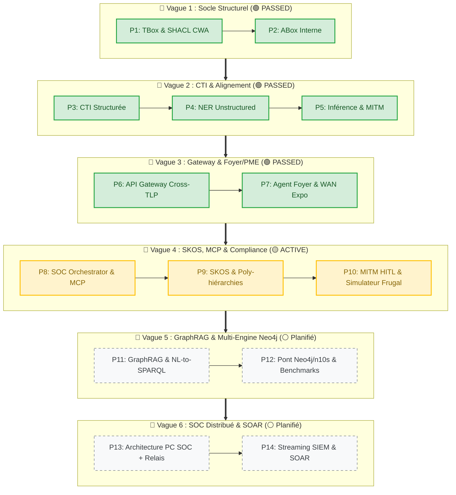

***Roadmap Produit & Backlog Évolutif : DKG-CyberSec & Agent IA SOC***

La roadmap est construite en 3 niveaux :
- ***Vague :*** Regroupement de principes pédagogiques intégrés dans le développement.
- ***Phase :*** Décomposition de la vague autour de sous-ensembles fonctionnels ou architecturaux.
- ***Étape :*** Application stricte commune à toutes les phases de développement "Spec-Driven".

---

## 0 - Périmètre SOC & Segmentation Fonctionnelle
Le cas d'usage SOC est décomposé en 3 groupes : 
**SOC_1** (Actifs, Vulnérabilités, Menaces),
**SOC_2** (Conformité/RGPD) 
**SOC_3** (Surveillance des Logs)


## 1 - Les Piliers Techniques Non Négociables

- **Adhérence W3C Stricte (100% OWL2 / SKOS / SHACL) :** Toute la logique repose sur des standards ouverts garantissant la traçabilité formelle, la réversibilité et la validation logique sous Closed World Assumption (CWA).
- **Sécurité & Isolation Native (TLP Matrix) :** Une ségrégation absolue et permanente des données garantit qu'aucun flux public (TLP:CLEAR) ne se mélange ou ne fuit vers les espaces sensibles (TLP:RED), malgré l'ingestion contrôlée de CTI externe.
- **Green-by-Design & Local-First :** L'architecture tourne en local et en mode isolé/étanche (Air-Gapped, poste standard 16 Go de RAM, sans GPU dédié), minimisant l'empreinte carbone.
- **Le Simulateur Évolutif & Banc d'Essai Transversal :** Un instrument de mesure intégré dès l'origine, qui évolue à chaque phase pour tester la montée en charge, le partitionnement et alimenter continuellement les abaques de performance.

---

## 2 - La Quête de la Limite et l'Arbitrage de Rupture (W3C vs Moteurs Propriétaires)

L'une des finalités majeures du projet est de pousser l'architecture W3C standard à son point de rupture absolu.
- **La démarche empirique :** Plutôt que d'adopter prématurément une base de graphes non-standard (type Neo4j), nous fatiguons le modèle standard par la montée en charge progressive, la croissance incrémentale et le calcul distribué sur l'Edge.
- **Le rôle du simulateur :** À travers notre banc d'essai et nos outils de simulation, chaque phase produit des abaques croisant volume de triplets, empreinte matérielle et temps de calcul, traçant objectivement la frontière entre la frugalité des standards W3C et la nécessité d'une base spécialisée.

---

## 3 - Vue Globale des Vagues Pédagogiques

[V1..3 - Phase 1-7 : Socle PoC & Métier] ➔ [V4 : SKOS, Green IT, MCP & Compliance] ➔ [V5 : GraphRAG & Multi-Engine Neo4j] ➔ [V6 : SOC Distribué & SOAR]

| Vague  | Titre & Horizon                             | Sens & Principes Pédagogiques                                                                     |     Statut     |
| :----: | :------------------------------------------ | :------------------------------------------------------------------------------------------------ | :------------: |
| **V1** | Socle Structurel & Cartographie Interne     | Standards W3C (OWL2, SHACL) & Confidentialité native (TLP:RED).                                   | 🟢 **PASSED**  |
| **V2** | Ingestion CTI, NER & Alignement Primitif    | Superposition de graphes & Rapprochement sémantique (NER local).                                  | 🟢 **PASSED**  |
| **V3** | Industrialisation, Micro-Agents & Gateway   | Structure IA Agentique et API Gateway sécurisée (Cross-TLP).                                      | 🟢 **PASSED**  |
| **V4** | **Gouvernance Agentique, MCP & Compliance** | Intégration du protocole MCP, finesse SKOS, multi-logs SOC et éco-conception (_Green-by-Design_). | 🟡 **ACTIVE**  |
| **V5** | GraphRAG, Standardisation MCP & Neo4j       | Assistants NL-to-SPARQL avancés et comparatif de performance W3C / Neo4j (n10s).                  | ⚪ **Planifié** |
| **V6** | SOC Distribué, Relais Edge & SOAR           | Architecture PC SOC centraliseur + relais multi-OS et automatisation SOAR.                        | ⚪ **Planifié** |

### 3.1 - Vue Graph (Mermaid)




## 4 - Tableau Détaillé des Vagues & Phases (Niveau Micro)

| **Phase** | **Intitulé Fonctionnel & Technique**                | **Objectif, Livrables & Matrice d'Exigences**                                                                                                                                                                                                                                                                                                                                                                                                                           | **Statut**     |
| --------- | --------------------------------------------------- | ----------------------------------------------------------------------------------------------------------------------------------------------------------------------------------------------------------------------------------------------------------------------------------------------------------------------------------------------------------------------------------------------------------------------------------------------------------------------- | -------------- |
| **P1**    | Socle TBox & SHACL CWA                              | Ontologie Master OWL2, Validation SHACL sous CWA, SSOT (`config.py`).                                                                                                                                                                                                                                                                                                                                                                                                   | 🟢 **PASSED**  |
| **P2**    | Cartographie ABox Interne                           | Modélisation des actifs locaux et vulnérabilités (`TLP:RED`).                                                                                                                                                                                                                                                                                                                                                                                                           | 🟢 **PASSED**  |
| **P3**    | Ingestion CTI Structurée                            | Flux NVD, CAPEC, CISA KEV (`TLP:CLEAR`).                                                                                                                                                                                                                                                                                                                                                                                                                                | 🟢 **PASSED**  |
| **P4**    | Ingestion CTI Textuelle (NER)                       | Extractor NLP Air-Gapped, validation SHACL du NER.                                                                                                                                                                                                                                                                                                                                                                                                                      | 🟢 **PASSED**  |
| **P5**    | Agent MITM & Inférence Cascade                      | Inférence locale économe, réconciliation cosinus, cascade.                                                                                                                                                                                                                                                                                                                                                                                                              | 🟢 **PASSED**  |
| **P6**    | API Gateway & Ségrégation TLP                       | Contrôle d'accès strict TLP (CLEAR/AMBER/RED), audit log.                                                                                                                                                                                                                                                                                                                                                                                                               | 🟢 **PASSED**  |
| **P7**    | Micro-Agents & Box Résidentielle                    | Inventaire 5 actifs, analyse exposition WAN, contrat API REST.                                                                                                                                                                                                                                                                                                                                                                                                          | 🟢 **PASSED**  |
| **P8**    | **Orchestration MCP & Moteurs d'Agents Souverains** | **P8SOC Orchestrator & MCP :** Boucle d'agents via Model Context Protocol (`mcp_server.py`).<br>**Agents Actifs :** Gardien TBox, Gestion des données externes (filtrage frugal) et Simulateur de charge.<br>**Scope & Rapprochement :** TBox, actifs ABox (segmentation TLP) et catalogues externes (_Les Communs_).<br>**Green-by-Design :** Simulateur d'enrichissement et abaques de performance (recherche des limites).                                           | 🟡 **ACTIVE**  |
| **P9**    | RGPD , **Taxonomies SKOS & Poly-hiérarchies**       | **Sémantique :** Internationalisation (FR/EN), nuances taxonomiques et versioning incrémental.                                                                                                                                                                                                                                                                                                                                                                          | ⚪ **Planifié** |
| **P10**   | **Logs**                                            | **Banc d'Essai :** Montée en charge progressive, génération de deltas et production des premiers abaques de performance.                                                                                                                                                                                                                                                                                                                                                | ⚪ **Planifié** |
| **P11**   | **GraphRAG & Copilot SOC Explicable**               | **IA Applicative :** Assistant conversationnel local (NL-to-SPARQL) et graphes de preuves RDF.                                                                                                                                                                                                                                                                                                                                                                          | ⚪ **Planifié** |
| **P12**   | **Multi-Engine Storage : Hybridation Neo4j**        | **Technique :** Comparatif Triple Store W3C vs Neo4j/n10s et analyse formelle des pertes sémantiques.                                                                                                                                                                                                                                                                                                                                                                   | ⚪ **Planifié** |
| **P13**   | **Architecture SOC Distribué & Relais**             | **Infrastructures :** PC SOC centraliseur sur LAN + agents relais légers (Windows/Android).                                                                                                                                                                                                                                                                                                                                                                             | ⚪ **Planifié** |
| **P14**   | **Streaming SIEM & SOAR Adaptatif**                 | **Temps Réel :** Ingestion continue d'événements et génération automatique de scripts de remédiation.                                                                                                                                                                                                                                                                                                                                                                   | ⚪ **Planifié** |
|           |                                                     |                                                                                                                                                                                                                                                                                                                                                                                                                                                                         |                |
|           |                                                     |                                                                                                                                                                                                                                                                                                                                                                                                                                                                         |                |
| Phase     | Intitulé                                            | Description / Modules & Composants Clés                                                                                                                                                                                                                                                                                                                                                                                                                                 | Statut         |
| **P8**    | **Orchestration MCP & Moteurs d'Agents Souverains** | **P8SOC Orchestrator & MCP :** Boucle d'agents via Model Context Protocol (`mcp_server.py`).<br><br>  <br><br>**Agents Actifs :** Gardien TBox, Gestion des données externes (filtrage frugal) et Simulateur de charge.<br><br>  <br><br>**Scope & Rapprochement :** TBox, actifs ABox (segmentation TLP) et catalogues externes (_Les Communs_).<br><br>  <br><br>**Green-by-Design :** Simulateur d'enrichissement et abaques de performance (recherche des limites). | 🟡 **ACTIVE**  |

## 5. Vue LLM
```
[CONTEXT: DKG-CyberSec Architecture & Roadmap]
- CORE PILLARS: Strict W3C (OWL2, SKOS, SHACL-CWA), Air-Gapped TLP Matrix (CLEAR/AMBER/RED), Green-by-Design local-first, evolutionary benchmarking.
- WAVES OVERVIEW:
  * V1 (Passed): Structural Core & Internal ABox.
  * V2 (Passed): CTI Ingestion, NER & Semantic Alignment.
  * V3 (Passed): Micro-Agents & Cross-TLP Gateway.
  * V4 (Active): Agentic Governance, MCP & Compliance.
  * V5 (Planned): GraphRAG & Neo4j Benchmarking.
  * V6 (Planned): Distributed SOC & SOAR.
- PHASES DETAIL:
  * P1-P2 (Passed): TBox/SHACL ontology & Internal ABox mapping (`TLP:RED`).
  * P3-P5 (Passed): Structured CTI (`TLP:CLEAR`), Air-Gapped NER extraction, MITM cosine matching & inference cascade.
  * P6-P7 (Passed): Cross-TLP API Gateway & Residential micro-agents box.
  * P8 (Active): P8SOC Orchestrator, Model Context Protocol (`mcp_server.py`), TBox Guardian, Frugal CTI engine, HITM validation, Green-by-design benchmarking.
  * P9 (Planned): GDPR, SKOS taxonomies & poly-hierarchies.
  * P10 (Planned): Load logs & performance abacuses.
  * P11-P14 (Planned): GraphRAG NL-to-SPARQL, Neo4j n10s hybridization, Distributed SOC relays & automated SOAR.
```
