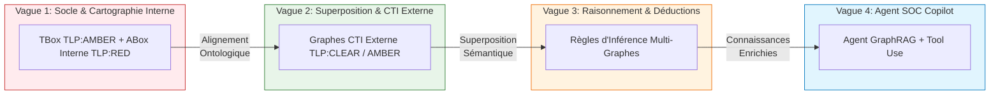

# 🗺️ Roadmap Produit : DKG-CyberSec & Agent IA SOC

[Bilan d'avancement par phase](Phases_Projet.md)

## 🎯 Vision Produit
Construire un **Agent IA SOC copilote** appuyé sur un **Knowledge Graph Cyber (DKG)** déterministe et explicable, capable de croiser des données externes ouvertes avec la cartographie interne sensible dans le strict respect du protocole TLP.

---

## 🌊 Vague 1 : Socle Ontologique & Cartographie Interne (`TLP:AMBER` / `TLP:RED`)
> **Valeur Agent :** L'Agent accède au schéma du SI et à la cartographie des actifs de l'entreprise.

* [x] **Phase 1 : Socle Modèle & SHACL (`TLP:AMBER`)**
  * Spécification de la TBox (Classes `Asset`, `SoftwareComponent`, `Vulnerability`...).
  * Contraintes de validation SHACL sous CWA et pipeline CI/CD GitHub Actions.
* [x] **Phase 2 : Instanciation ABox Master Interne (`TLP:RED`)**
  * Cartographie des équipements réels et composants sous le sous-dossier `TLP_RED_Instances_ABox/`.
  * Documentation Markdown automatique et diagrammes Mermaid.

---

## 🌊 Vague 2 : Ingestion CTI Externe & Superposition Sémantique (`TLP:CLEAR` / `TLP:AMBER`)
> **Valeur Agent :** L'Agent superpose les données de menaces externes (NVD, MITRE ATT&CK, CISA KEV) sur la cartographie interne sans compromettre la confidentialité des actifs.

* [ ] **Phase 2.5 : Ingestion & Alignement CTI Externe**
  * Ingestion de flux CTI publics (`TLP:CLEAR`) : bases CVE, faiblesses CWE, tactiques CAPEC/ATT&CK.
  * **Superposition de Graphes :** Rapprochement sémantique des instances internes (`TLP:RED`) avec les référentiels de menaces externes via les URI partagées et le schéma commun (`TLP:AMBER`).
  * Maintien du cloisonnement physique et logique selon le marquage TLP.

---

## 🌊 Vague 3 : Raisonnement Sémantique & Déductions Cross-TLP
> **Valeur Agent :** L'Agent déduit des risques complexes en faisant réagir les règles métier sur la superposition des graphes (Interne + Externe).

* [ ] **Phase 3 : Moteur de Règles & Inférence (SWRL / SPARQL Construct)**
  * Déduction d'impacts (ex: *Si `Asset [TLP:RED]` héberge `Composant [TLP:RED]` vulnérable à `CVE [TLP:CLEAR]` activement exploitée `[CISA KEV]`, alors instancier `HighRiskAsset`*).
  * Propagation des scores de sévérité et tagging des chemins d'attaque.

---

## 🌊 Vague 4 : Agent IA Copilot & GraphRAG
> **Valeur Agent :** Un assistant conversationnel L1/L2 interroge le DKG multi-niveaux et explicite le risque de manière déterministe.

* [ ] **Phase 4 : GraphRAG & Interface Analyste**
  * Déploiement du pipeline GraphRAG (Traduction NL -> SPARQL).
  * Restitution des réponses avec traçabilité complète de la chaîne de preuves (Sources internes `TLP:RED` vs Référentiels publics `TLP:CLEAR`).

---

## 🌊 Vague 5 : Continuous Improvement — Flux Dynamiques & SOAR
> **Valeur Agent :** L'Agent devient réactif aux événements temps réel et proactif dans la remédiation.

* [ ] **Ingestion Temps Réel :** Triples RDF horodatés issus des flux SIEM/EDR.
* [ ] **Orchestration SOAR :** Génération de contre-mesures (Règles YARA/Sigma) avec validation humaine (Human-in-the-loop).