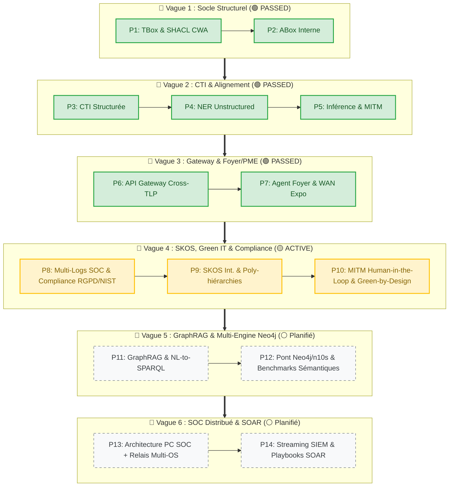

***Roadmap Produit & Backlog Évolutif : DKG-CyberSec & Agent IA SOC***

La roadmap est contruite en 3 niveaux
- ***Vague :*** Regroupement de principes pedagogique intégrés dans le dévelopement
- ***Phase :*** Décomposition de la vague autour de sous ensemble ou fonctionnel ou architecturaux
- ***Etape :*** Application strique commune a toutes les phase de dévelopement "Spec-Driven"

---
## 1 - Principes Directeurs & Logique d'Évolution

```
[V1..3 - Phase 1-7 : Socle PoC & Métier] ➔ [V4 : Poly-hiérarchies & Green IT] ➔ [V5 : GraphRAG & Multi-Engine] ➔ [V6 : SOAR & Scalabilité Industrialisée]
```

1. **Combinaison Didactique & Applicative :** Chaque vague équilibre le développement de briques techniques pédagogiques (ex. inférence, vectorisation, hybridation SPARQL/Cypher) et de démonstrateurs métiers très concrets (SOC PME, PC centralisateur, audit RGPD/NIST).
    
2. **Architecture SOC Décentralisée & Distribuée (PC Central + Relais) :** Le PC SOC local agit comme nœud centraliseur de connaissance (DKG), assisté par des agents légers/relais (Windows, Android) qui collectent les logs/télémétrie, soulagent les ressources et réinjectent le contexte.
    
3. **Manifeste "Green-by-Design" :** Re-vectorisation incrémentale, calculs locaux frugaux (Air-Gapped, PC 16 Go RAM) et arbitrages d'échelle systématiques (`EXG-GREEN-01` à `03`).
    
4. **Croissance Sémantique & Internationalisation :** Évolution de la TBox vers l'anglais/multilingue (SKOS), montée en finesse des nuances taxonomiques et versioning sans perte.
    
5. **Stratégie Multi-Moteurs & Hybridation Neo4j / Triple Store :** Conservation de la rigueur ontologique W3C (CWA/SHACL/OWL2) en stockage local (`.ttl`/`rdflib`) et pontage vers Triple Store serveur / Neo4j (n10s) pour les besoins de requêtage lourd, tout en explicitant la perte sémantique/contraintes lors de la migration.

## 2  -  Roadmap  vision des principe pédagogiques par vagues
### 2.1 - Vue Tableau

| **Vague** | **Titre**                                                     | **Sens & Principes Pédagogiques (P#)**                                                                                                                                                                                                                                                      | **Status**     |
| --------- | ------------------------------------------------------------- | ------------------------------------------------------------------------------------------------------------------------------------------------------------------------------------------------------------------------------------------------------------------------------------------- | -------------- |
| **V1**    | **Socle Structurel & <br>Cartographie Interne**               | **Principes :** (P1) Usage des standards (OWL2, SKOS, SHACL), <br>(P2) Confidentialité native (TLP:AMBER / TLP:RED).<br><br>**Cas d'usage minimal :** PC individuel.                                                                                                                        | 🟢 **PASSED**  |
| **V2**    | **Ingestion CTI, NER & <br>Alignement Primitif**              | **Principes :** (P3) Superposition de graphes, <br>(P4) Rapprochement sémantique (NER).<br><br>**Cas d'usage :** Superposer la CTI externe (NVD, CISA KEV) et le texte brut.                                                                                                                | 🟢 **PASSED**  |
| **V3**    | **Industrialisation, <br>Micro-Agents & Multi-Contextes PME** | **Principe :** (P5) Structure IA Agentique.<br><br>**Cas d'usage :** Passer au niveau Micro-Entreprise (API Gateway, Agents de logs & Veille CTI).                                                                                                                                          | 🟢 **PASSED** |
| **V4**    | **SKOS, Green IT & Compliance **                              | **Principe :** (P8) Montée en charge fonctionnelle avec la gestion de conformité, SKOS pilier des la finesse lexicale et du multilinguisme . Et mise en application d'un dévelopement eco-responsable                                                                           | 🟡 **ACTIVE** |
| **V5**    | **GraphRAG & Multi-Engine Neo4j**                             | **Principe :** (P11) Renforcement des ressources       | ⚪ **Planifié** |
| **V6**    | **OC Distribué & SOAR**                                        | **Principe :** (P13) Role d'un PC local centralisateur, mais aidé par les autres équipements | ⚪ **Planifié** |

### 2.2 - Vue Graph





## 3 - Tableau Détaillé des Vagues & Phases (Niveau Micro)


	
|**Phase**|**Intitulé Fonctionnel & Technique**|**Objectif, Livrables & Matrice d'Exigences**|**Statut**|
|---|---|---|---|
|**P1**|Socle TBox & SHACL CWA|Ontologie Master OWL2, Validation SHACL sous CWA, SSOT (`config.py`).<br>_(EXG-OR-01..05, EXG-TB-01..03, EXG-QU-01..03, EXG-SH-01)_|🟢 **PASSED**|
|**P2**|Cartographie ABox Interne|Modélisation des actifs locaux et vulnérabilités (`TLP:RED`).<br>_(EXG-OR-06, EXG-SE-02, EXG-QU-04)_|🟢 **PASSED**|
|**P3**|Ingestion CTI Structurée|Flux NVD, CAPEC, CISA KEV (`TLP:CLEAR`).<br>_(EXG-CT-01..03, EXG-SE-01)_|🟢 **PASSED**|
|**P4**|Ingestion CTI Textuelle (NER)|Extractor NLP Air-Gapped, validation SHACL du NER.<br>_(EXG-CT-01..02, EXG-QU-01, EXG-SE-03)_|🟢 **PASSED**|
|**P5**|Agent MITM & Inférence Cascade|Inférence local économe, réconciliation cosinus ($\ge 0.85$), matérialisation cascade.<br>_(EXG-MITM-01..02, EXG-IN-01..02, EXG-HW-01)_|🟢 **PASSED**|
|**P6**|API Gateway & Ségrégation TLP|Contrôle d'accès strict TLP (CLEAR/AMBER/RED), audit log.<br>_(EXG-SE-01..03, EXG-OR-07..09)_|🟢 **PASSED**|
|**P7**|Micro-Agents & Box Résidentielle|Inventaire 5 actifs, analyse exposition WAN, contrat API REST.<br>_(EXG-P7-01..06, EXG-TE-01..02)_|🟢 **PASSED**|
|**P8**|**SOC Dashboard, Replay & Compliance RGPD**|**Didactique & Métier :** Corrélation de logs système/réseau,<br>tableau de bord dynamique et module de justification/preuve de conformité (RGPD / NIS2 / ISO 27001).<br>_(EXG-SOC-01, EXG-COMP-01)_|🟡 **ACTIVE**|
|**P9**|**Taxonomies SKOS, Multi-langue & Nuances**|**Sémantique :** Internationalisation complète (FR/EN via `skos:prefLabel`/`altLabel`),<br>poly-hiérarchies métiers, gestion du versioning ontologique incrémental.<br>_(EXG-TB-05, EXG-ONT-01, EXG-SKOS-02)_|⚪ **Planifié**|
|**P10**|**Agent MITM HITL & Green-by-Design**|**Pédagogique & Frugalité :** Interface d'arbitrage Humain-in-the-Loop ($0.65 \le \text{Score} < 0.85$),<br>pipeline de re-vectorisation incrémentale à faible empreinte carbone.<br>_(EXG-GREEN-01..03, EXG-MITM-03)_|⚪ **Planifié**|
|**P11**|**GraphRAG & Copilot SOC Explicable**|**IA Applicative :** Assistant conversationnel local (NL-to-SPARQL), <br>génération de sous-graphes RDF de preuves pour chaque réponse d'analyse.<br>_(EXG-RAG-01, EXG-EXP-01)_|⚪ **Planifié**|
|**P12**|**Multi-Engine Storage : Hybridation Neo4j / Triple Store**|**Technique Didactique :** Support modulaire Triple Store (Jena/Fuseki) vs Graph Database (Neo4j/n10s). <br>**Etude comparative :** Illustration formelle des pertes de caractéristiques W3C<br>(CWA, typage strict OWL, SHACL) lors du passage à Neo4j.<br>_(EXG-ENG-01, EXG-NEO-01)_|⚪ **Planifié**|
|**P13**|**Architecture SOC Décentralisée & Relais Multi-OS**|**Infrastructures :** Modèle PC SOC centraliseur sur LAN + agents relais légers (Windows, Android) <br>partageant l'effort d'analyse et remontant leurs télémétries.<br>_(EXG-DIST-01, EXG-AGENT-01)_|⚪ **Planifié**|
|**P14**|**Streaming SIEM & SOAR Adaptatif**|**Réactivité Temps Réel :** Ingestion continue d'événements, boucle de réaction courte,<br>génération automatique de scripts de remédiation (YARA/Sigma/Ansible).<br>_(EXG-SOAR-01, EXG-STREAM-01)_|⚪ **Planifié**|


## 4  -  Backlog Non Intégré

Idées non encore intégrées à la Roadmap Vague/Phase


