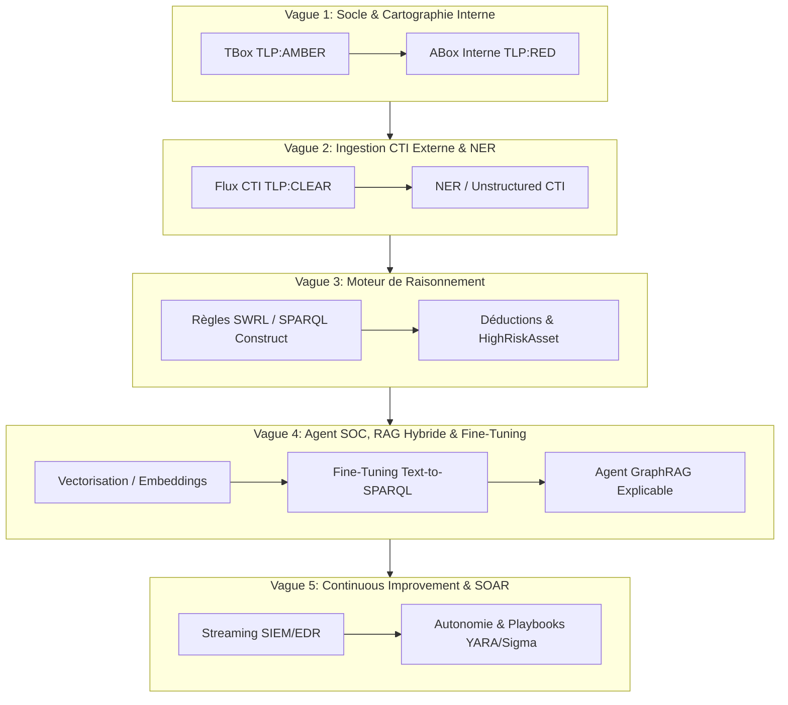

# 🗺️ Roadmap Produit & Backlog Évolutif : DKG-CyberSec & Agent IA SOC

| Avancement -> |                 Vague                 |        Phase         | étape  |
| :-----------: | :-----------------------------------: | :------------------: | :----: |
|               |                   1                   |          2           |   5    |
|               | Vague 1: Socle & Cartographie Interne | ABox Interne TLP:RED | Biilan |

---
## 1  -  Suivi d'avancement par Phases et Etapes

_des liens vous permettent d'accéder à :_
- Phase_content.md de chaque phase décrivant les étapes et livrables de cette phase
- Exemple de Specification resultant pour le Framework
- Exemple de livrable en version human .md de l'instanciation sur Use Case

| Vague |                     Phase Content                     | Titre                                                                                                                                                                  |      Status      |                                                    Exemple SPEC                                                    |                               Exemple  d'instantiation                                |                                          Commentaire                                           |
| :---: | :------------------------------------------------------: | :--------------------------------------------------------------------------------------------------------------------------------------------------------------------- | :--------------: | :-------------------------------------------------------------------------------------------------------------------: | :--------------------------------------------------------------------------------------: | :--------------------------------------------------------------------------------------------: |
|   1   |         [**Phase1**](./Phase1/Phase_Content.md)          | initialisation Socle Modèle Canonique & Qualité - TBox (class Datatype) ,  - RBox { relations, Inverse) - SHACL (shapes & validation)} dans un cas simple. | Reprise en cours | [SPEC-01](01-Principes_Spécifications/Specifications_Framework/SPEC-01_Socle_Structurel_Framework_TBox_RBox_SHACL.md) |     [TBox_Human](../../02-Donnees/Snapshots_Phases/Phase_1_Socle/DKG_TBox_Master.md)     |   Comprendre les enjeux du socle Ajout manuel des Acronymes T-R-A Box dans lexique du .md   |
|   1   |          [**Phase2**](2-ABox/Phase_Content.md)           | initialisation de l'instanciation interne - - ABox                                                                                                                  |   A reprendre.   |                                                        SPEC-02                                                        | [ABox_Human](../02-Donnees/Master_Transversal/TLP_RED_Instances_ABox/DKG_ABox_Master.md) |                                                                                                |
|   2   | [**Phase3**](./3-EnrichissementExterne/Phase_Content.md) | Enrichissement avec des donnéesExterne + Gouvernance ( TLP )                                                                                                        |   A Reprendre    |                                                                                                                       |                                                                                          | Comprendre l'articulation de TBox, RBox, ABox ref [lien](Phase3/Articulation_des_T-R-A_Box.md) |
|       |                        **Phase4**                        |                                                                                                                                                                        |                  |                                                                                                                       |                                                                                          |                                                                                                |

---

## 2  -  Roadmap : vision du graph de synthèse par Vagues et Phases

## 3  -  Backlog Détaillé par Vague

### 🌊 Vague 1 : Socle Ontologique & Cartographie Interne (`TLP:AMBER` / `TLP:RED`)

> **Valeur Agent :** L'Agent accède au schéma du SI et à la cartographie des actifs de l'entreprise.

#### 📌 Epic 1.1 : Socle Modèle TBox & Valimateur SHACL (`TLP:AMBER`)

- [x] **US-1.1.1 (Ontologie Master) :** Définir la TBox OWL2/RDFS pour unifier les concepts (`Asset`, `SoftwareComponent`, `Vulnerability`, `Weakness`, `ThreatPattern`).
    
- [x] **US-1.1.2 (Validation SHACL) :** Rédiger les formes SHACL sous CWA pour interdire les données orphelines et imposer l'intégrité des liens.
    
- [x] **US-1.1.3 (CI/CD Pipeline) :** Automatiser les tests de validation SHACL et d'intégrité sous GitHub Actions.
    

#### 📌 Epic 1.2 : Instanciation ABox Master Interne (`TLP:RED`)

- [x] **US-1.2.1 (Instances Métier) :** Générer l'ABox des équipements et failles réelles sous `02-Donnees/Master_Transversal/TLP_RED_Instances_ABox/`.
    
- [x] **US-1.2.2 (Auto-Documentation) :** Générer les livrables Markdown auto-documentés avec glossaire des acronymes et diagrammes Mermaid.
    
- [x] **US-1.2.3 (Rituel 5S & SSOT) :** Rapatrier la totalité des constantes de chemins et namespaces dans `03-Application/config.py`.
    

### 🌊 Vague 2 : Ingestion CTI Externe, NER & Superposition (`TLP:CLEAR`)

> **Valeur Agent :** L'Agent superpose les données de menaces mondiales sur la cartographie interne sans compromettre la confidentialité des actifs.

#### 📌 Epic 2.1 : Ingestion CTI Structurée & Superposition Cross-TLP

- [ ] **US-2.1.1 (Ingestion Référentiels) :** Importer les flux publics (NVD, MITRE ATT&CK, CISA KEV) sous `02-Donnees/Master_Transversal/TLP_CLEAR_CTI_External/`.
    
- [ ] **US-2.1.2 (Superposition Sémantique) :** Connecter les instances internes `TLP:RED` aux nœuds CTI `TLP:CLEAR` via la TBox commune `TLP:AMBER`.
    
- [ ] **US-2.1.3 (Rituel 5S Inter-Vague) :** Mettre à jour `config.py` pour intégrer les nouveaux répertoires et valider la séparation logique/physique.
    

#### 📌 Epic 2.2 : Unstructured CTI & Extraction NER

- [ ] **US-2.2.1 (NER Cyber) :** Déployer un modèle de NER (Named Entity Recognition) pour extraire les entités et relations depuis des bulletins de sécurité textuels (PDF, blogs).
    
- [ ] **US-2.2.2 (Mapping RDF) :** Convertir les prédictions NER en triples RDF valides et les injecter dans la ABox CTI.
    

### 🌊 Vague 3 : Moteur de Raisonnement Sémantique & Inférence

> **Valeur Agent :** L'Agent bénéficie de faits enrichis et de calculs d'impacts automatisés multi-graphes.

#### 📌 Epic 3.1 : Règles d'Inférence & Scoring de Menace

- [ ] **US-3.1.1 (Règles SWRL / CONSTRUCT) :** Écrire les règles d'inférence déduisant les nœuds critiques (ex: marquer `dkg:HighRiskAsset` si un composant porte une CVE exploitée selon CISA KEV).
    
- [ ] **US-3.1.2 (Validation des Déductions) :** S'assurer que les faits dérivés héritent du niveau de classification TLP le plus strict du chemin de preuve.
    
- [ ] **US-3.1.3 (Export Markdown Enrichi) :** Générer la synthèse Markdown de la ABox enrichie après raisonnement.
    

### 🌊 Vague 4 : Agent SOC Copilot, RAG Hybride & Fine-Tuning

> **Valeur Agent :** Un assistant conversationnel L1/L2 interroge le DKG, offre une recherche hybride et explique son raisonnement de manière déterministe.

#### 📌 Epic 4.1 : Vectorisation Hybride & GraphRAG

- [ ] **US-4.1.1 (Embeddings & Graph Vectorization) :** Indexer les sous-graphes et descriptions textuelles dans une base vectorielle pour permettre la recherche sémantique floue.
    
- [ ] **US-4.1.2 (Pipeline NL-to-SPARQL) :** Développer le composant de traduction des questions de l'analyste en requêtes SPARQL optimisées.
    
- [ ] **US-4.1.3 (Explicabilité & Traces de Preuves) :** Exposer dans chaque réponse de l'Agent la sous-structure RDF (triples) utilisée pour construire la conclusion.
    

#### 📌 Epic 4.2 : Fine-Tuning Spécialisé Agent SOC

- [ ] **US-4.2.1 (Fine-Tuning Text-to-SPARQL) :** Fine-tuner un SLM (type Mistral/Llama) sur le schéma TBox pour garantir un taux de syntaxe SPARQL valide > 98%.
    
- [ ] **US-4.2.2 (Instruction Tuning Analyste) :** Adapter le comportement conversationnel de l'Agent pour respecter le jargon SOC, la concision et la sécurité TLP.
    
- [ ] **US-4.2.3 (Évaluation Ragas / LangSmith) :** Évaluer la fidélité, le taux d'hallucination (proche de 0%) et la pertinence des réponses de l'Agent.
    

### 🌊 Vague 5 : Continuous Improvement — Flux Temps Réel & SOAR

> **Valeur Agent :** L'Agent devient réactif aux événements temps réel et proactif dans la proposition de remédiations.

#### 📌 Epic 5.1 : Ingestion SIEM & Autonomie Agentique

- [ ] **US-5.1.1 (Streaming Data RDF) :** Ingestion en continu d'événements/alertes SIEM sous forme de triples RDF horodatés.
    
- [ ] **US-5.1.2 (Génération de Playbooks SOAR) :** Permettre à l'Agent de générer automatiquement des règles de détection (YARA, Sigma) et des plans de remédiation soumis à validation humaine (Human-in-the-loop).