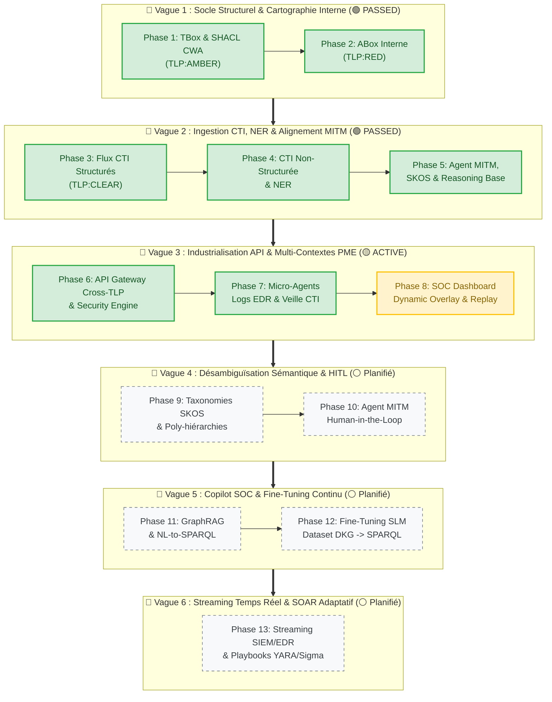

***Roadmap Produit & Backlog Évolutif : DKG-CyberSec & Agent IA SOC***

La roadmap est contruite en 3 niveaux
- ***Vague :*** Regroupement de principes pedagogique intégrés dans le dévelopement
- ***Phase :*** Décomposition de la vague autour de sous ensemble ou fonctionnel ou architecturaux
- ***Etape :*** Application strique commune a toutes les phase de dévelopement "Spec-Driven"

---

## 1  -  Roadmap  vision des principe pédagogiques par vagues

| **Vague** | **Titre**                                                     | **Sens & Principes Pédagogiques (P#)**                                                                                                                                                                                                                                                      | **Status**     |
| --------- | ------------------------------------------------------------- | ------------------------------------------------------------------------------------------------------------------------------------------------------------------------------------------------------------------------------------------------------------------------------------------- | -------------- |
| **V1**    | **Socle Structurel &  Cartographie Interne**               | **Principes :** (P1) Usage des standards (OWL2, SKOS, SHACL),  (P2) Confidentialité native (TLP:AMBER / TLP:RED).  **Cas d'usage minimal :** PC individuel.                                                                                                                        | 🟢 **PASSED**  |
| **V2**    | **Ingestion CTI, NER &  Alignement Primitif**              | **Principes :** (P3) Superposition de graphes,  (P4) Rapprochement sémantique (NER).  **Cas d'usage :** Superposer la CTI externe (NVD, CISA KEV) et le texte brut.                                                                                                                | 🟢 **PASSED**  |
| **V3**    | **Industrialisation,  Micro-Agents & Multi-Contextes PME** | **Principe :** (P5) Structure IA Agentique.  **Cas d'usage :** Passer au niveau Micro-Entreprise (API Gateway, Agents de logs & Veille CTI).                                                                                                                                          | 🟡 **ACTIVE**  |
| **V4**    | **Désambiguïsation Sémantique,  SKOS & Human-in-the-Loop** | **Principe :** (P6) Maintien de la cohérence du graphe face à la croissance des données.  **Cas d'usage :** Finesse taxonomique SKOS & Arbitrage Humain (MITM).                                                                                                                       | ⚪ **Planifié** |
| **V5**    | **Agent Copilot SOC,  GraphRAG & Fine-Tuning Continu**     | **Principe :** (P7) Agents locaux qui s'améliorent grâce aux données du DKG.  **Cas d'usage :** Entraînement/LoRA continu du SLM sur le DKG pour un Copilot explicable.                                                                                                               | ⚪ **Planifié** |
| **V6**    | **Streaming Temps Réel &  SOAR Adaptatif (POC Ciblé)**     | **Principe :** (P8) Démonstration de valeur sur boucle de réaction courte.  **Cas d'usage ciblé :** Reactivité SIEM/EDR temps réel sur le cas PC **OU** Analyse d'impact statique sur PME (éviter la sur-simulation d'infrastructures).  Déclenchement de playbooks YARA/Sigma. | ⚪ **Planifié** |

## 2 - Tableau Détaillé des Vagues & Phases (Niveau Micro)
### 2.1 - Vue Tableau

| **Vague** | **Phase** | **Intitulé Fonctionnel**           | **Objectif Technique / Livrable**                                                              |  **Statut**   |
| :-------: | :-------: | ---------------------------------- | ---------------------------------------------------------------------------------------------- | :-----------: |
|  **V1**   |  **P1**   | Socle TBox & SHACL CWA             | Ontologie Master OWL2 (`TLP:AMBER`) et formes SHACL.                                           | 🟢 **PASSED** |
|           |  **P2**   | Cartographie ABox Interne          | Actifs, logiciels et failles d'un PC individuel (`TLP:RED`).                                   | 🟢 **PASSED** |
|  **V2**   |  **P3**   | Ingestion CTI Structurée           | Flux NVD, CAPEC, CISA KEV (`TLP:CLEAR`).                                                       | 🟢 **PASSED** |
|           |  **P4**   | Ingestion CTI Textuelle (NER)      | Extraction d'entités CTI avec score de confiance `dkg:nerConfidenceScore`.                     | 🟢 **PASSED** |
|           |  **P5**   | Agent MITM & Reasoning Base        | Moteur d'inférence R-01/R-02 et alignement vectoriel Cosinus MiniLM.                           | 🟢 **PASSED** |
|  **V3**   |  **P6**   | API Gateway & Ségrégation TLP      | Endpoint SPARQL/GraphQL sécurisé avec filtrage dynamique par niveau d'habilitation.            | 🟢 **PASSED** |
|           |  **P7**   | Micro-Agents Télémétrie            | Agent Veille CTI Externe. Extension topologie family.                                          | 🟢 **PASSED** |
|           |  **P8**   | SOC Dashboard & Replay Ops         | Agent surveillance Logs, Dynamic Overlay du graphe, vue multi-calques et automatisation CI/CD. | 🟡 **ACTIVE** |
|  **V4**   |  **P9**   | Taxonomies SKOS & Poly-hiérarchies | Structuration fine des domaines produits/familles et gestion des périmètres étanches.          |  ⚪ Planifié   |
|           |  **P10**  | Agent MITM Human-in-the-Loop       | Interface d'arbitrage actif quand $0.65 \le \text{Score} < 0.85$. Enrichissement guidé.        |  ⚪ Planifié   |
|  **V5**   |  **P11**  | GraphRAG & NL-to-SPARQL            | Indexation hybride du DKG, explicabilité par sous-graphes RDF de preuves.                      |  ⚪ Planifié   |
|           |  **P12**  | Fine-Tuning Continu SLM            | Dataset d'entraînement automatique DKG ➔ SPARQL et ré-entraînement LoRA/QLoRA.                 |  ⚪ Planifié   |
|  **V6**   |  **P13**  | Streaming SIEM & SOAR              | Ingestion en continu d'événements et génération de playbooks YARA/Sigma.                       |  ⚪ Planifié   |
### 2.2 - Vue Graph

## 3  -  Backlog Non Intégré

Idées non encore intégrées à la Roadmap Vague/Phase

