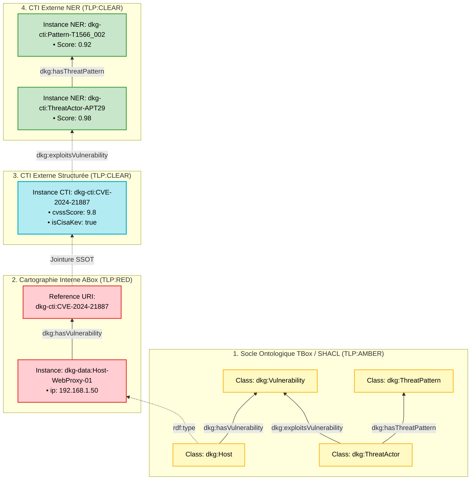
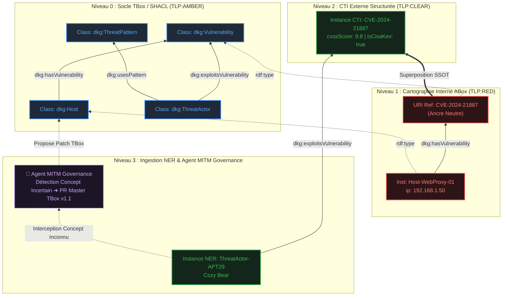
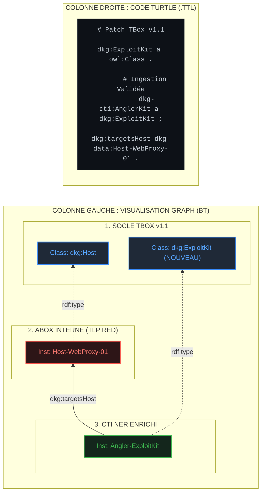

storyboard/script d'une vidéo didactique (format 5 à 7 minutes). Elle permet d'expliquer la transition du socle abstrait (TBox/SHACL) vers les données réelles (ABox).


## Seq_0 :  : INTRODUCTION & VISION AGENT SOC

Voici une trame vidéo spécifique pour la séquence d'introduction du storyboard, révisée pour mettre l'**Agent IA SOC** au cœur de la vision tout en ancrant l'architecture du projet DKG-CyberSec.

**Durée :** 1 minute 30

**Objectif :** Poser le problème opérationnel du SOC, présenter l'Agent IA comme copilote analyste, et introduire le Knowledge Graph (DKG) comme sa source de vérité explicable.

### 📍 Scene 1 : Le Défi du SOC & Le "Bruit" des Alertes (0:00 - 0:25)

- **Visuel :** Animation dynamique d'une interface de SOC submergée d'alertes SIEM/EDR rouges qui clignotent. Zoom sur un analyste L1 fatigué devant une alerte textuelle brute : `Alert: Apache 2.4.49 - Potential Vulnerability Detected`.
    
- **Voix Off :**
    
    > _"Dans un SOC moderne, les analystes ne manquent pas de données, ils manquent de contexte. Face à des milliers d'alertes quotidiennes, comment un analyste L1 peut-il savoir instantanément si cette faille touche un serveur critique de production ou une simple machine de test ?"_
    
- **Texte à l'écran :** `Le Défi SOC : Passer de l'Alerte Brute au Contexte Métier`.
    

### 📍 Scene 2 : L'Émergence de l'Agent IA SOC (0:25 - 0:50)

- **Visuel :** L'écran se sépare en deux. À droite, apparition d'un assistant virtuel (interface de chat type Copilot SOC). L'analyste pose la question : _"Agent, évalue l'impact de l'alerte sur Apache 2.4.49"_.
    
- **Voix Off :**
    
    > _"Pour résoudre ce défi, nous construisons un Agent IA SOC. Son rôle ? Agir comme un copilote d'investigation capable de lire une alerte, de comprendre l'architecture du SI, d'évaluer la menace CTI et de proposer une remédiation en quelques secondes."_
    
- **Texte à l'écran :** `Agent IA SOC : Percevoir → Raisonner → Recommander`.
    

### 📍 Scene 3 : Le DKG comme Moteur de Explicabilité (0:50 - 1:15)

- **Visuel :** Zoom arrière depuis l'Agent IA pour révéler ce qui se trouve "sous le capot" : un Knowledge Graph lumineux interconnecté (DKG). On voit un fil d'ariane s'éclairer : `Asset (Serv-Prod-01)` $\rightarrow$ `Composant` $\rightarrow$ `CVE` $\rightarrow$ `CWE` $\rightarrow$ `CAPEC`.
    
- **Voix Off :**
    
    > _"Mais attention : pas question de s'appuyer sur une boîte noire ! Pour prendre des décisions fiables, notre Agent IA s'appuie sur un Knowledge Graph Cyber : le DKG. Ce graphe fusionne la structure de votre entreprise sous TLP:AMBER et les faits opérationnels sous TLP:RED, offrant à l'Agent un raisonnement 100 % déductif, déterministe et explicable."_
    
- **Texte à l'écran :** `DKG CyberSec : La Source de Vérité Explicable de l'Agent`.
    

### 📍 Scene 4 : La Feuille de Route & L'Accroche (1:15 - 1:30)

- **Visuel :** Affichage d'une frise chronologique fluide représentant les 4 jalons du projet (TBox/SHACL $\rightarrow$ ABox $\rightarrow$ Inférence/Règles $\rightarrow$ Agent GraphRAG).
    
- **Voix Off :**
    
    > _"Dans cette série, nous allons bâtir pas à pas la mémoire et la logique de cet Agent SOC, de la conception du socle TBox jusqu'à l'injection de règles d'inférence. Bienvenue dans l'ingénierie du DKG-CyberSec."_
    
- **Texte à l'écran / Call to Action :** `Série DKG-CyberSec | Phase 1 à Phase 4`.
    

### 💡 Recommandation de Réalisation

|**Élément**|**Choix Artistique / Technique**|
|---|---|
|**Rythme**|Rapide et immersif sur les 25 premières secondes (effet de surcharge), puis plus posé et structuré dès l'apparition du graphe.|
|**Code Couleur TLP**|Utiliser des halos lumineux verts/ambres pour la structure TBox (`TLP:AMBER`) et un halo rouge discret autour des données réelles d'Asset/Alerte (`TLP:RED`).|
|**Transition vers la suite**|Enchaîner directement cette intro avec la présentation détaillée du socle TBox/SHACL (Phase 1).|


## Seq_1 : Du Socle Ontologique au Graph Cyber Operationnel

**Titre suggéré :** _Construire un Knowledge Graph Cyber : De la Théorie (TBox) à la Pratique (ABox)_

**Public cible :** Architectes Cyber, Ontologistes, Ingénieurs Data/DevOps.

### 1. Introduction (0:00 - 1:00) : Le Problème & La Ségrégation TLP

- **Visual :** Split-screen avec d'un côté un schéma conceptuel propre (`TLP:AMBER`) et de l'autre une carte d'infrastructure réseau réelle et critique (`TLP:RED`).
    
- **Voix off :** Expliquer qu'un Knowledge Graph Cyber solide repose sur une séparation stricte entre **le modèle** (comment s'articulent les concepts) et **les faits** (l'état réel du réseau et de ses menaces).
    
- **Concept clé :**
    
    - **TBox (`TLP:AMBER`)** : Le dictionnaire, la grammaire et les contraintes.
        
    - **ABox (`TLP:RED`)** : Les données de production ultra-sensibles.
        

### 2. Le Socle TBox : Modéliser le Schéma (1:00 - 2:30)

- **Visual :** Animation d'un graphe d'ontologie abstrait s'éclairant nœud par nœud.
    
- **Explication des Classes & Nœuds Socles :**
    
    - `dkg:Asset` : L'équipement informatique (serveur, machine).
        
    - `dkg:SoftwareComponent` : Le composant logiciel hébergé.
        
    - `dkg:Vulnerability` : La faille de sécurité (ex: identifiant CVE).
        
    - `dkg:Weakness` : La catégorie de faiblesse (ex: identifiant CWE).
        
    - `dkg:ThreatPattern` : Le modèle d'attaque (ex: motif CAPEC).
        
- **Explication des Relations (Arcs / Edge Properties) :**
    
    - `dkg:hasInstalledComponent` : Relie l'Asset au Composant.
        
    - `dkg:hasVulnerability` : Relie le Composant à la CVE.
        
    - `dkg:exploitsWeakness` : Relie la CVE au CWE.
        
    - `dkg:hasThreatPattern` : Relie le CWE au CAPEC.
        

### 3. La Garde-Fou SHACL : La Recette Qualité (2:30 - 3:45)

- **Visual :** Code Turtle SHACL qui vient "superposer" un filtre ou un moule transparent sur les nœuds de la TBox.
    
- **Explication Didactique :**
    
    - SHACL agit comme un **moule de validation** sous l'hypothèse du monde clos (CWA).
        
    - _Exemple concrétisé_ : Une règle `sh:NodeShape` impose que toute instance de `dkg:Asset` **doit** comporter au moins un lien `dkg:hasInstalledComponent` pointant vers un composant valide, sous peine de rejet par le pipeline CI/CD.
        

### 4. L'Instanciation ABox : Injecter les Données Réelles (3:45 - 5:30)

- **Visual :** Des objets concrets viennent s'instancier sous les classes de la TBox pour former un graphe de faits interconnectés.
    
- **Explication du Parcours de Menace (La Chaîne CTI) :**
    
    - **Étape 1 (Asset)** : `dkg-data:Serv-Prod-01` _(instance de Asset)_.
        
    - **Étape 2 (Composant)** : contienne `dkg-data:Apache-2.4.49` _(SoftwareComponent)_.
        
    - **Étape 3 (Vulnérabilité)** : porte la faille `dkg-data:CVE-2021-41773` _(Vulnerability)_.
        
    - **Étape 4 (Faiblesse)** : exploitant la faiblesse `dkg-data:CWE-22` _(Path Traversal)_.
        
    - **Étape 5 (Pattern)** : cible du motif d'attaque `dkg-data:CAPEC-126` _(Directory Traversal)_.
        

### 5. Conclusion & Automatisation CI/CD (5:30 - 6:30)

- **Visual :** Démonstration rapide du terminal lançant le pipeline Pytest / GitHub Actions au vert (`PASSED`).
    
- **Message clé :** Grâce à cette architecture, chaque modification de la ABox est automatiquement validée par le socle TBox/SHACL dans le pipeline CI/CD, garantissant un graphe 100% conforme et documenté automatiquement en Markdown et Diagramme Mermaid.0


## Seq_2 :  La Superposition Cross-TLP au Cœur du Dynamic Knowledge Graph (DKG)**

- **Étape 1 : Le Modèle Conceptuel — TBox, RBox & SHACL (`TLP:AMBER`)**
    
    - **Rôle** : Ontologie d'entreprise fixe. Définition des classes (`Host`, `Vulnerability`, `ThreatActor`, `ThreatPattern`), des relations admises et des contraintes de forme SHACL.
        
- **Étape 2 : L'Instanciation Interne — ABox Interne (`TLP:RED`)**
    
    - **Rôle** : Cartographie réelle du SI sous forte confidentialité.
        
    - **Nœuds & Propriétés** : `dkg-data:Host-WebProxy-01` avec ses propriétés d'infrastructure (IP, OS) et son lien sortant `dkg:hasVulnerability` pointant vers l'identifiant neutre `dkg-cti:CVE-2024-21887`.
        
- **Étape 3 : L'Enrichissement CTI Structuré — NVD & CISA-KEV (`TLP:CLEAR`)**
    
    - **Rôle** : Qualification factuelle et automatisée de la menace externe.
        
    - **Nœuds & Propriétés** : Résolution de l'URI `dkg-cti:CVE-2024-21887` qui s'enrichit des métadonnées officielles (`dkg:cvssScore "9.8"`, `dkg:isCisaKev true`).
        
- **Étape 4 : L'Enrichissement CTI Non Structuré — NLP / NER (`TLP:CLEAR`)**
    
    - **Rôle** : Extraction contextuelle à partir de bulletins de renseignement bruts (CERT-FR, blogs).
        
    - **Nœuds & Propriétés** : Détection automatique des nœuds `dkg-cti:ThreatActor-APT29` et `dkg-cti:Pattern-SpearphishingLink-T1566_002`, filtrés avec un score de confiance $\ge 0.85$.
        
    - **Sémantique de la Superposition** : La relation `dkg:exploitsVulnerability` connecte instantanément l'attaquant **APT29** à la vulnérabilité de l'hôte interne `Host-WebProxy-01` sans aucune recopie de données et en préservant l'isolation TLP.






```


```





## 💡 Intérêt Pédagogique pour le Storyboard / Vidéo

Dans votre trame vidéo, la **Vague 2** devient le moment visuel fort où l'on montre **deux calques/graphes qui se superposent** :

1. **Calque Rouge (`TLP:RED`)** : Les nœuds du réseau interne (anonymes/masqués pour le public).
    
2. **Calque Vert (`TLP:CLEAR`)** : Le graphe de menaces mondiales (MITRE / NVD).
    
3. **Le Noeud de Jonction (`TLP:AMBER`)** : La TBox qui permet aux deux mondes de se parler sans qu'aucune donnée confidentielle ne fuite vers l'extérieur.
