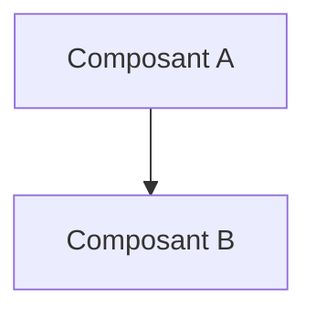

<%*
// 1. Parsing de la Roadmap pour extraire les phases
let roadmapFile = app.vault.getAbstractFileByPath("00-Projet/Roadmap_Suivi-Avancement.md");
if (!roadmapFile) {
    roadmapFile = tp.file.find_tfile("Roadmap_Suivi-Avancement.md");
}

let phasesList = [];
if (roadmapFile) {
    const content = await app.vault.read(roadmapFile);
    const lines = content.split("\n");
    let inSection2 = false;

    for (let line of lines) {
        if (line.includes("## 2")) { inSection2 = true; continue; }
        if (inSection2 && line.includes("## 3")) { break; }

        if (inSection2 && line.startsWith("|")) {
            let cleanLine = line.replace(/<br\s*\/?>/gi, " ").replace(/<[^>]*>/g, "").replace(/\*\*/g, "");
            let cols = cleanLine.split("|").map(c => c.trim());

            if (cols.length >= 6 && cols[2] && /^P\d+$/i.test(cols[2])) {
                phasesList.push({
                    code: cols[2].toUpperCase(),
                    nom: cols[3] || "Sans nom",
                    statut: cols[5] || "⚪ Planifié"
                });
            }
        }
    }
}

if (phasesList.length === 0) {
    phasesList.push({ code: "P1", nom: "Socle TBox & SHACL CWA", statut: "🟢 PASSED" });
}

// 2. Sélection de la Phase
const phaseDisplayList = phasesList.map(p => `${p.code} — ${p.nom} (${p.statut})`);
const selectedPhaseObj = await tp.system.suggester(phaseDisplayList, phasesList) || phasesList[0];

const targetPCode = selectedPhaseObj.code;
const pNom = selectedPhaseObj.nom;
const pStatut = selectedPhaseObj.statut;

// 3. Sélection de la Portée
const typeOptions = ["TRANSVERSAL", "USECASE_METIER", "USECASE_TECHNIQUE"];
const selectedType = await tp.system.suggester(typeOptions, typeOptions) || "TRANSVERSAL";

let porteeCode = "FWK";
if (selectedType === "USECASE_METIER") porteeCode = "MET";
if (selectedType === "USECASE_TECHNIQUE") porteeCode = "TEC";

// 4. Titres et Description
let rawTitle = tp.file.title;
let defaultCleanTitle = rawTitle.replace(/^SPC-[^-]+-[^-]+-/, "").replace(/_/g, " ");
const specTitre = await tp.system.prompt("Titre complet de la spécification :", defaultCleanTitle);

let defaultSnake = specTitre.toLowerCase()
    .normalize("NFD").replace(/[\u0300-\u036f]/g, "")
    .replace(/[^a-z0-9]/g, "_")
    .replace(/_+/g, "_")
    .replace(/^_|_$/g, "");

const titreSnake = await tp.system.prompt("Titre court (snake_case) :", defaultSnake);
const specDescription = await tp.system.prompt("Résumé / Description courte (1 phrase) :", "");

// Numéro de révision et Référence Unique (Format canonique SPC-[PORTÉE]-[PHASE]-[TITRE]_[REV])
const revisionNum = 1;
const revisionSuffix = String(revisionNum).padStart(2, "0");
const specReference = `SPC-${porteeCode}-${targetPCode}-${titreSnake}_${revisionSuffix}`;

// 5. Publics visés
const publicPresets = [
    "Architectes Ontologues",
    "Développeurs DevSecOps",
    "Analystes CTI / SOC, Lead Tech",
    "Architectes Ontologues, Analystes CTI / SOC",
    "✏️ Autre combinaison..."
];

let chosenPublic = await tp.system.suggester(publicPresets, publicPresets) || publicPresets[0];
if (chosenPublic.startsWith("✏️")) {
    chosenPublic = await tp.system.prompt("Saisir le(s) public(s) visé(s) (séparés par des virgules) :", "Architectes Ontologues");
}

const publicList = chosenPublic
    ? chosenPublic.split(",").map(p => p.trim()).filter(p => p.length > 0)
    : ["Architectes Ontologues"];

// 6. Injection unifiée dans le Frontmatter YAML incluant les exigences structurées
app.fileManager.processFrontMatter(tp.config.target_file, (fm) => {
    fm["type"] = "spec";
    fm["reference"] = specReference;
    fm["revision"] = revisionNum;
    fm["titre"] = specTitre;
    fm["titre_court"] = titreSnake;
    fm["description"] = specDescription;
    fm["phase_code"] = targetPCode;
    fm["phase_nom"] = pNom;
    fm["statut"] = pStatut;
    fm["portee"] = selectedType;
    fm["public_vise"] = publicList;
    
    if (!fm["exigences"]) {
        fm["exigences"] = [
            {
                id: `EXG-${targetPCode}-01`,
                domaine: "SE",
                titre: "Titre de l'exigence",
                description: "Critère formel vérifiable.",
                test: "PyTest / SHACL"
            }
        ];
    }
});
-%>
---
type: spec
reference: <% specReference %>
revision: <% revisionNum %>
titre: "<% specTitre %>"
titre_court: <% titreSnake %>
description: "<% specDescription %>"
phase_code: <% targetPCode %>
phase_nom: "<% pNom %>"
statut: "<% pStatut %>"
portee: <% selectedType %>
public_vise:
<% publicList.map(p => `  - "${p}"`).join("\n") %>
exigences:
  - id: EXG-<% targetPCode %>-01
    domaine: SE
    titre: "Exigence Initiale"
    description: "Description formelle et critères d'acceptation."
    test: "PyTest / SPARQL / SHACL"
---
# 📜 <% specTitre %>

## 📖 1. Résumé Exécutif & Glossaire

### 1.1 Objectif
[Décrire en 2-3 phrases le but de cette spécification, son rôle dans l'architecture DKG-CyberSec et sa valeur métier/technique.]

### 1.2 Glossaire Métier & Technique
| Acronyme / Concept | Définition | Contexte DKG |
| :--- | :--- | :--- |
| **DKG** | Dynamic Knowledge Graph | Graphe de connaissances dynamique du projet. |

## 🏗️ 2. Périmètre & Rôle de la Spécification
- **Positionnement dans l'Architecture** : [Préciser s'il s'agit d'un socle transversal, d'un cas d'usage métier ou d'une implémentation technique].
- **Gouvernance & Validation** : Validé par l'Architecte Sémantique et IA SOC.

## 📐 3. Spécifications Formelles & Règles

### 3.1 Axiomes, Structures RDF ou Scénario Métier

[Description détaillée, règles formelles, schémas de données ou flux d'agents]

### 3.2 Directives d'Implémentation Code & Scripts

[Règles d'utilisation des objets de `config.py`, contraintes d'immutabilité Pydantic V2, séparation TLP]

## 📊 4. Matrice dings Exigences & Critères d'Acceptation (EXG-)

|**Identifiant**|**Domaine**|**Intitulé de l'Exigence**|**Description & Critères d'Acceptation**|**Mode de Test / Asset**|
|---|---|---|---|---|
|**EXG-<% targetPCode %>-01**|`SE`|Exigence Initiale|Description formelle et critères d'acceptation.|Pytest / SPARQL / SHACL|

## 🛡️ 5. Outillage, CI/CD & Traçabilité Pytest

- **Scripts de Génération / Exécution** : `03-Application/[script].py`
    
- **Suites de Tests Associées** : `tests/test_[module].py`
    
- **Critères d'Acceptation** : [Validation syntaxique, tests unitaires]
    
- **Artefacts Produits** : [Fichier_Maître.ttl]
    

## 📚 6. Documents Liés & Références

- **[SPEC-PARENTE]** : [Lien vers la spécification de niveau supérieur ou dépendante]