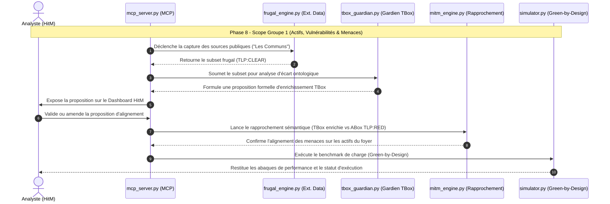

# Memo_UseCase_Phase8.md — Gouvernance & Orchestration MCP (Scope : Actifs, Vulnérabilités et Menaces)

**Objectif Phase 8 :** Orchestration MCP de la gestion des menaces et des actifs (Groupe 1) appliquée à un environnement étendu (DMZ/Pare-feu/Postes) et pilotée par le simulateur d'empreinte pour tracer les abaques de performance _Green-by-Design_.

## 📖 1. L'Histoire Métier

Le SOC résidentiel pilote la gestion des menaces et des vulnérabilités via une architecture multi-agents collaborative et souveraine, circonscrite au **Groupe 1** :

1. **L'Agent Explorateur (Références Externes) :** Capture et filtre de manière frugale les flux de menaces publics et catalogues de référence (MITRE ATT&CK, CVE / _Les Communs_) sous forme de deltas minimes en **`TLP:CLEAR`**.
    
2. **Le Gardien de la TBox :** Analyse l'écart ontologique entre le dictionnaire de référence et les catalogues externes pour formuler une **proposition formelle d'enrichissement de la TBox**.
    
3. **L'Analyste (Human-in-the-Middle - HitM) :** Valide, amende ou rejette cette proposition d'alignement sémantique via le Dashboard Front-End.
    
4. **Confrontation ABox & Simulateur :** Une fois la TBox enrichie, le moteur de rapprochement croise ces menaces avec la cartographie réelle des actifs du foyer (**`TLP:RED`**), tandis que le simulateur évalue la charge et recherche les limites de performance (_Green-by-Design_).
    

## 🔄 2. Diagramme de Flux et des Artefacts (Mermaid)

