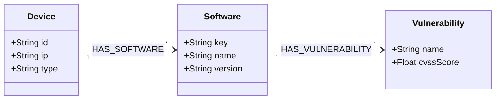

Voici le script Python complet d'ingestion et de contrôle ontologique (`ontology_guard.py`).

Ce script utilise **rdflib** pour parser l'ontologie de référence (`.ttl`) et les nouvelles données RDF/JSON, compare la structure des classes et propriétés, et génère automatiquement le rapport Markdown d'écart avec les diagrammes Mermaid **Avant / Après** et le snippet Turtle `.ttl`.

### Prérequis

Installez la dépendance `rdflib` :
```bash
pip install rdflib
```

### Script Python : `ontology_guard.py`
```python
import json
import os
from rdflib import Graph, Namespace, RDF, RDFS, OWL, URIRef

# Definitions des Namespaces
CYBER = Namespace("http://example.org/cyber-ontology#")
FOAF = Namespace("http://xmlns.com/foaf/0.1/")

class OntologyGuard:
    def __init__(self, ontology_path: str):
        self.ontology_path = ontology_path
        self.onto_graph = Graph()
        self.onto_graph.parse(ontology_path, format="ttl")
        
        # Extraction du schéma actuel
        self.existing_classes = self._get_classes(self.onto_graph)
        self.existing_properties = self._get_properties(self.onto_graph)

    def _get_classes(self, g: Graph) -> set:
        classes = set()
        for s in g.subjects(RDF.type, OWL.Class):
            classes.add(self._short_name(s))
        for s in g.subjects(RDF.type, RDFS.Class):
            classes.add(self._short_name(s))
        return classes

    def _get_properties(self, g: Graph) -> set:
        props = set()
        for p_type in [OWL.DatatypeProperty, OWL.ObjectProperty, RDF.Property]:
            for s in g.subjects(RDF.type, p_type):
                props.add(self._short_name(s))
        return props

    def _short_name(self, uri) -> str:
        uri_str = str(uri)
        if "#" in uri_str:
            return uri_str.split("#")[-1]
        elif "/" in uri_str:
            return uri_str.split("/")[-1]
        return uri_str

    def analyze_rdf(self, rdf_path: str):
        data_graph = Graph()
        data_graph.parse(rdf_path, format="ttl")
        
        new_classes = set()
        new_props = set()

        # Inspection des types d'instances dans les données
        for s, p, o in data_graph.triples((None, RDF.type, None)):
            c_name = self._short_name(o)
            if c_name not in ["Resource", "NamedIndividual"]:
                if c_name not in self.existing_classes:
                    new_classes.add(c_name)

        # Inspection des prédicats utilisés
        for s, p, o in data_graph:
            p_name = self._short_name(p)
            if p_name not in ["type"] and p_name not in self.existing_properties:
                new_props.add(p_name)

        return new_classes, new_props

    def analyze_json_inventory(self, json_path: str):
        new_classes = set()
        new_props = set()

        # Dictionnaire des propriétés connues par classe en V0
        known_class_props = {
            "Device": {"id", "ip", "type", "importedAt"},
            "Software": {"key", "name", "version"}
        }

        with open(json_path, "r", encoding="utf-8") as f:
            data = json.load(f)

        devices = data.get("devices", [])
        for dev in devices:
            for key in dev.keys():
                if key != "software" and key not in known_class_props["Device"]:
                    new_props.add(f"Device.{key}")
            
            for soft in dev.get("software", []):
                for key in soft.keys():
                    if key not in known_class_props["Software"]:
                        new_props.add(f"Software.{key}")

        return new_classes, new_props

    def generate_report(self, new_classes: set, new_props: set, output_report_path: str):
        has_changes = bool(new_classes or new_props)
        status = "Cas 2 / Cas 3 : Écart d'ontologie détecté" if has_changes else "Cas 1 : Aucune modification requise (RAS)"

        report = f"""# 🛡️ Rapport d'Analyse d'Ingestion & Validation d'Ontologie

```


**Statut d'Ingestion :** `{status}`

---

## 1. Bilan des Écarts Détectés

* **Nouvelles Classes Identifiées :** `{list(new_classes) if new_classes else 'Aucune'}`
* **Nouvelles Propriétés / Attributs :** `{list(new_props) if new_props else 'Aucune'}`

---

## 2. Comparaison Visuelle (Diff Mermaid)

### Structure Actuelle (Avant / V0)




### Structure Proposée (Après / V1)

Extrait de code

```mermaid
classDiagram
    direction LR
    class Device {
        +String id
        +String ip
        +String type
        +String environment
        {" :: NOUVEAU ::" if any("environment" in p for p in new_props) else ""}
    }
    class Software {
        +String key
        +String name
        +String version
    }
    class Vulnerability {
        +String name
        +Float cvssScore
        +String remediationPriority {" :: NOUVEAU ::" if any("remediationPriority" in p for p in new_props) else ""}
    }
"""

        if "Requirement" in new_classes:
            report += """    class Requirement {
        +String reqId
        +String description
    }
    Vulnerability "*" --> "*" Requirement : requiresCompliance :: NOUVELLE REL ::
"""

        report += """
```


---

## 3. Snippet Turtle (`.ttl`) à intégrer dans `ontologie.ttl`

```turtle
# ==========================================
# EXTENSION PROPOSÉE
# ==========================================
"""
        for c in new_classes:
            report += f"""
cyber:{c} a owl:Class ;
    rdfs:label "{c}" ;
    rdfs:comment "Nouvelle classe détectée lors de l'ingestion Phase 1" .
"""

        for p in new_props:
            prop_name = p.split(".")[-1]
            report += f"""
cyber:{prop_name} a owl:DatatypeProperty ;
    rdfs:label "{prop_name}" ;
    rdfs:range xsd:string .
"""

        report += "\n```\n"

        with open(output_report_path, "w", encoding="utf-8") as f:
            f.write(report)

        print(f"✅ Rapport généré avec succès dans : {output_report_path}")

# ==========================================
# EXÉCUTION DU SCRIPT
# ==========================================
if __name__ == "__main__":
    # Chemins des fichiers (à ajuster selon votre dépôt)
    ONTO_PATH = "ontologie.ttl"
    JSON_PATH = "inventory-v2.json"
    RDF_PATH = "cve_data-v2.ttl"
    REPORT_PATH = "Rapport_Ecart_Ontologie.md"

    # Simulation d'exécution si l'ontologie existe
    if os.path.exists(ONTO_PATH):
        guard = OntologyGuard(ONTO_PATH)
        
        classes_rdf, props_rdf = guard.analyze_rdf(RDF_PATH) if os.path.exists(RDF_PATH) else (set(), set())
        classes_json, props_json = guard.analyze_json_inventory(JSON_PATH) if os.path.exists(JSON_PATH) else (set(), set())

        all_new_classes = classes_rdf.union(classes_json)
        all_new_props = props_rdf.union(props_json)

        guard.generate_report(all_new_classes, all_new_props, REPORT_PATH)
    else:
        print(f"⚠️ Fichier ontologie de référence introuvable : {ONTO_PATH}")
````

### Fonctionnalités Clés du Script

1. **Parser RDF natif (`rdflib`) :** Lit l'ontologie initiale `.ttl` et extrait la liste exacte des classes (`owl:Class`) et des propriétés (`owl:DatatypeProperty`, `owl:ObjectProperty`).
    
2. **Double Inspection (RDF + JSON) :** Analysera à la fois les fichiers de données RDF/Turtle (`cve_data-v2.ttl`) et les structures JSON (`inventory-v2.json`).
    
3. **Génération Mermaid Dynamique :** Marque explicitement les ajouts avec les annotations `:: NOUVEAU ::` dans le schéma de sortie.
    
4. **Génération de Code Turtle Automatisée :** Construit le bloc RDF prêt à être copié/collé par le RSSI dans le dépôt Git.