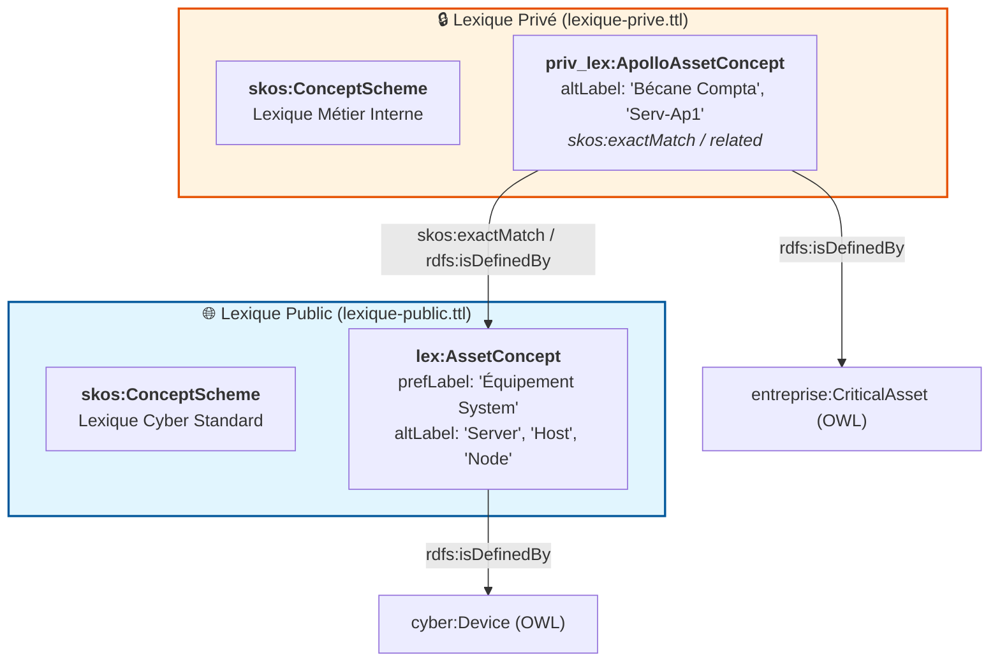

**Oui, exactement sur le même principe**, mais avec une nuance importante liée à la nature même d'un lexique SKOS : la **séparation des visibilités** et la **gouvernance**.

Séparer le lexique en **Lexique Public** et **Lexique Privé / Métier** apporte une étanchéité parfaite à votre architecture d'information.

### Pourquoi scinder également le Lexique ?

#### 1. Lexique Public (Vocabulaire Canonique / Standards Cyber)

- **Contenu :** Synonymes standards, jargon sectoriel et termes issus des référentiels publics (ex: _CVE_, _Zero-Day_, _Ransomware_, _Buffer Overflow_, _DMZ_, _LAN_, _Patch_).
    
- **Usage :** Indispensable pour que le LLM et les agents RAG comprennent les flux d'informations externes (bulletins CERT, feeds NVD/CVE, documentation constructeur).
    

#### 2. Lexique Privé / Confidentiel (Jargon Interne & Code Names)

- **Contenu :** Termes propres à l'entreprise, acronymes internes, noms de projets confidentiels, surnoms d'applications ou zones réseau spécifiques (ex: _Nom de code projet "APOLLO"_, _Zone "Z-PCI-PROD"_, _Acronyme interne "BU-FIN-01"_, _Serveur "Bécane-Compta"_).
    
- **Usage :** Permet à l'IA de traduire le "jargon de couloir" des utilisateurs internes vers les concepts formels du DKG, **sans jamais risquer de fuiter ce vocabulaire confidentiel** vers des modèles externes ou des partenaires.
    

### Structure SKOS des deux Lexiques

Tout comme pour l'ontologie OWL, la liaison entre les deux lexiques se fait naturellement via les propriétés SKOS W3C (`skos:inScheme`, `skos:related`, `skos:exactMatch`).

Extrait de code



### Organisation des Fichiers dans le Dépôt GitHub

Vous pouvez refléter cette étanchéité directement dans vos dossiers Markdown (sources éditables par les humains) et Turtle (fichiers compilés) :

Plaintext

```
00-Projet/
├── LEXIQUE_PUBLIC.md              # Jargon standard & vocabulaire cyber commun
└── LEXIQUE_PRIVEE.md              # Acronymes internes, noms de projets & jargon SI

02-Donnees/Phase0/
├── Publique/
│   ├── ontologie-publique-v0.ttl
│   └── lexique-public-v0.ttl      # Compilé depuis LEXIQUE_PUBLIC.md
│
└── PseudoPrivate/
    ├── ontologie-privee-v0.ttl
    └── lexique-prive-v0.ttl       # Compilé depuis LEXIQUE_PRIVEE.md
```

### Fonctionnement dans le Pipeline (`md_to_skos.py` & Guard)

1. **Compilateur (`md_to_skos.py`) :**
    
    Il peut compiler séparément `LEXIQUE_PUBLIC.md` $\rightarrow$ `lexique-public-v0.ttl` et `LEXIQUE_PRIVEE.md` $\rightarrow$ `lexique-prive-v0.ttl`.
    
2. **Alignement Sémantique (`ontology_guard.py`) :**
    
    Lorsqu'une requête utilisateur ou un fichier d'inventaire arrive :
    
    - Le Guard interroge en priorité le **Lexique Privé** (pour résoudre le jargon spécifique à votre entreprise).
        
    - S'il ne trouve pas, il bascule sur le **Lexique Public** (pour le jargon cyber générique).
        

Cette étanchéité garantit une isolation parfaite des données sensibles tout en maintenant la pleine intelligence sémantique du système.