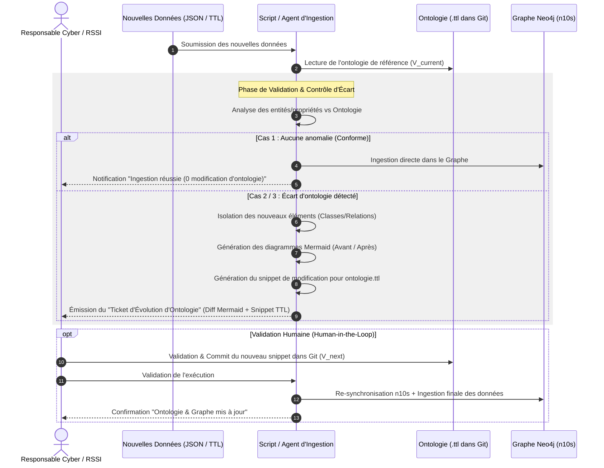

```mermaid
sequenceDiagram
    autonumber
    actor RSSI as Responsable Cyber / RSSI
    participant Input as Nouvelles Données (JSON / TTL)
    participant Agent as Script / Agent d'Ingestion
    participant Onto as Ontologie (.ttl dans Git)
    participant Neo4j as Graphe Neo4j (n10s)

    Input->>Agent: Soumission des nouvelles données
    Agent->>Onto: Lecture de l'ontologie de référence (V_current)
    
    rect rgb(240, 240, 240)
        Note over Agent: Phase de Validation & Contrôle d'Écart
        Agent->>Agent: Analyse des entités/propriétés vs Ontologie
        alt Cas 1 : Aucune anomalie (Conforme)
            Agent->>Neo4j: Ingestion directe dans le Graphe
            Agent-->>RSSI: Notification "Ingestion réussie (0 modification d'ontologie)"
        else Cas 2 / 3 : Écart d'ontologie détecté
            Agent->>Agent: Isolation des nouveaux éléments (Classes/Relations)
            Agent->>Agent: Génération des diagrammes Mermaid (Avant / Après)
            Agent->>Agent: Génération du snippet de modification pour ontologie.ttl
            Agent-->>RSSI: Émission du "Ticket d'Évolution d'Ontologie" (Diff Mermaid + Snippet TTL)
        end
    end

    opt Validation Humaine (Human-in-the-Loop)
        RSSI->>Onto: Validation & Commit du nouveau snippet dans Git (V_next)
        RSSI->>Agent: Validation de l'exécution
        Agent->>Neo4j: Re-synchronisation n10s + Ingestion finale des données
        Agent-->>RSSI: Confirmation "Ontologie & Graphe mis à jour"
    end
    
```