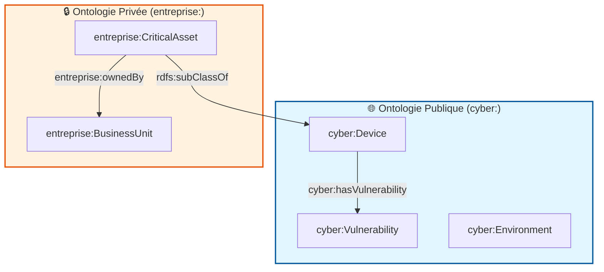

# 📐 Spécification de l'Ontologie DKG (Phase 0)

Ce document constitue la spécification lisible de l'ontologie du Domain Knowledge Graph (DKG).
Elle est construite par composition modulable de deux schémas OWL :
1. **Ontologie Publique (`ontologie-publique-v0.ttl`)** : Socle cyber et infrastructure standard.
2. **Ontologie Privée (`ontologie-privee-v0.ttl`)** : Extension métier, gouvernance et criticité interne.

---

## 🏗️ Architecture & Relations entre Ontologies

L'ontologie privée importe formellement l'ontologie publique via `owl:imports`.



## 🌐 1. Dictionnaire de l'Ontologie Publique (`cyber:`)

**Namespace URI :** `http://example.org/cyber-ontology#`

**Fichier Source :** `02-Donnees/Phase0/Publique/ontologie-publique-v0.ttl`

### Classes Standards

|**Classe**|**Label (FR)**|**Description**|
|---|---|---|
|`cyber:Device`|Équipement Système|Ressource matérielle ou virtuelle dotée d'une adresse IP.|
|`cyber:Vulnerability`|Vulnérabilité Sécurité|Faille ou faiblesse logicielle (ex: issue de la base NVD/CVE).|
|`cyber:Environment`|Zone Réseau Standard|Périmètre ou segment réseau abstrait (ex: DMZ, LAN).|
|`cyber:Software`|Composant Logiciel|Application ou package exécuté sur un équipement.|

### Propriétés Standards

|**Propriété**|**Type**|**Domaine**|**Portée (Range)**|**Description**|
|---|---|---|---|---|
|`cyber:hasVulnerability`|ObjectProperty|`cyber:Device`|`cyber:Vulnerability`|Associe un équipement aux failles qui l'affectent.|
|`cyber:runsSoftware`|ObjectProperty|`cyber:Device`|`cyber:Software`|Indique les logiciels installés sur un équipement.|
|`cyber:cvssScore`|DatatypeProperty|`cyber:Vulnerability`|`xsd:float`|Score de sévérité CVSS.|

## 🔒 2. Dictionnaire de l'Ontologie Privée (`entreprise:`)

**Namespace URI :** `http://example.org/entreprise-ontology#`

**Fichier Source :** `02-Donnees/Phase0/PseudoPrivate/ontologie-privee-v0.ttl`

### Classes Métier Interne

|**Classe**|**SubClassOf**|**Label (FR)**|**Description**|
|---|---|---|---|
|`entreprise:CriticalAsset`|`cyber:Device`|Actif Critique Métier|Équipement soumis à des exigences d'indisponibilité ou de confidentialité strictes.|
|`entreprise:InternalZone`|`cyber:Environment`|Enclave Sécurisée|Zone réseau interne soumise à filtrage renforcé (ex: zone PCI-DSS).|
|`entreprise:BusinessUnit`|`-`|Unité d'Organisation|Entité organisationnelle ou direction métier propriétaire d'un actif.|

### Propriétés Confidentielles & Gouvernance

|**Propriété**|**Type**|**Domaine**|**Portée (Range)**|**Description**|
|---|---|---|---|---|
|`entreprise:ownedBy`|ObjectProperty|`cyber:Device`|`entreprise:BusinessUnit`|Rélie un équipement à sa direction métier responsable.|
|`entreprise:businessOwner`|DatatypeProperty|`cyber:Device`|`xsd:string`|Nom du responsable applicatif ou opérationnel.|
|`entreprise:pciDssScope`|DatatypeProperty|`cyber:Device`|`xsd:boolean`|Indique si l'équipement entre dans le périmètre de conformité PCI-DSS.|

## 🔄 3. Alignement avec les Lexiques SKOS

Chaque classe formelle de ces ontologies est directement référencée dans les lexiques SKOS correspondants grâce à la propriété `rdfs:isDefinedBy` :

- **`cyber:Device`** $\leftarrow$ définis le concept **`lex:AssetConcept`** dans `lexique-public-v0.ttl`.
    
- **`entreprise:CriticalAsset`** $\leftarrow$ définis le concept **`lex_priv:CriticalAssetConcept`** dans `lexique-prive-v0.ttl`.
    

Cela permet au module **GraphRAG** de faire la passerelle automatique entre les termes employés dans les prompts utilisateurs (jargon, acronymes) et les labels formels du graphe Neo4j.


---

### Option Automatisée : Script Python `ttl_to_md_onto.py`

Si vous souhaitez par la suite automatiser la génération de cette documentation Markdown directement à partir des fichiers Turtle (par exemple dans une action CI/CD), voici un script léger utilisant `rdflib` :

```python
import rdflib
from rdflib import RDF, RDFS, OWL

def generate_onto_md():
    g_pub = rdflib.Graph().parse("02-Donnees/Phase0/Publique/ontologie-publique-v0.ttl", format="ttl")
    g_priv = rdflib.Graph().parse("02-Donnees/Phase0/PseudoPrivate/ontologie-privee-v0.ttl", format="ttl")

    md_content = "# 📐 Spécification Générée de l'Ontologie DKG (Phase 0)\n\n"
    
    # Inspection Publique
    md_content += "## 🌐 Ontologie Publique\n\n### Classes\n"
    for s in g_pub.subjects(RDF.type, OWL.Class):
        label = g_pub.value(s, RDFS.label) or s.split("#")[-1]
        md_content += f"* **`{s.split('#')[-1]}`** : {label}\n"
        
    # Inspection Privée
    md_content += "\n## 🔒 Ontologie Privée\n\n### Classes\n"
    for s in g_priv.subjects(RDF.type, OWL.Class):
        label = g_priv.value(s, RDFS.label) or s.split("#")[-1]
        md_content += f"* **`{s.split('#')[-1]}`** : {label}\n"

    with open("01-Principes_Architecture/ONTOLOGIE/ONTOLOGIE_SPEC.md", "w", encoding="utf-8") as f:
        f.write(md_content)

if __name__ == "__main__":
    generate_onto_md()
````