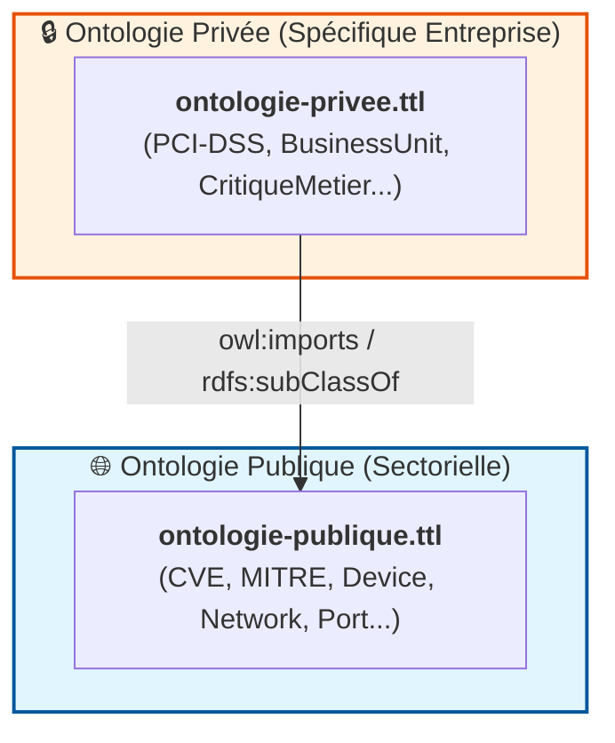

### Pourquoi réintroduire la double composante d'ontologie ?

#### 1. L'Ontologie Publique (Socle Sectoriel / Standard)

- **Objet :** Elle modélise les concepts standards du secteur cyber et réseau (ex: normes ISO 27001, MITRE ATT&CK, NIST, STIX/TAXII, vulnérabilités CVE, types d'équipements génériques comme `Device`, `Vulnerability`, `Subnet`).
    
- **Intérêt :**
    
    - Elle peut être partagée avec la communauté, des partenaires ou des auditeurs externes.
        
    - Elle facilite l'ingestion de flux de données externes (feeds CVE, bulletins CERT, référentiels de menaces).
        
    - Elle reste stable et évolue au rythme des standards du secteur.
        

#### 2. L'Ontologie Privée / Confidentielle (Extension Métier & SI Interne)

- **Objet :** Elle étend l'ontologie publique en y greffant le modèle métier spécifique à l'entreprise (ex: concepts de `CriticitélOpérationnelle`, `ZonePaiementPCI_DSS`, `PropriétaireApplicatif`, `RèglesPérimétriquesSecOps`, `NiveauHabillitation`).
    
- **Intérêt :**
    
    - **Sécurité & Confidentialité :** Elle protège la modélisation fine de votre architecture interne et de vos processus critiques.
        
    - **Ancrage Métier :** Elle permet à votre GraphRAG de répondre à des questions métier très spécifiques ("_Quel est le niveau de risque sur le domaine de paiement PCI-DSS ?_") tout en s'appuyant sur les concepts standards sous-jacents.
        

### Comment structurer cette séparation dans W3C / OWL ?

En OWL, cette séparation se fait naturellement et de manière élégante grâce au mécanisme d'**import d'ontologies** (`owl:imports`).

- **Exemple d'extension :**
    
    - _Publique :_ La classe `cyber:Server` existe dans l'ontologie publique.
        
    - _Privée :_ L'ontologie privée définit `entreprise:ServerPaiement rdfs:subClassOf cyber:Server` et lui associe la propriété `entreprise:rTO_Minutes`.
        

### Ajustement de la Structure Documentaire GitHub

Dans votre arborescence actuelle, vous avez déjà des traces de ce besoin (`PseudoPrivate`, `ontologie-pseudo-privee.ttl`). Pour rendre cela limpide et éviter la dispersion, vous pouvez formaliser le découpage ainsi dans `./01-Principes_Architecture/ONTOLOGIE/` et `./02-Donnees/PhaseX/` :