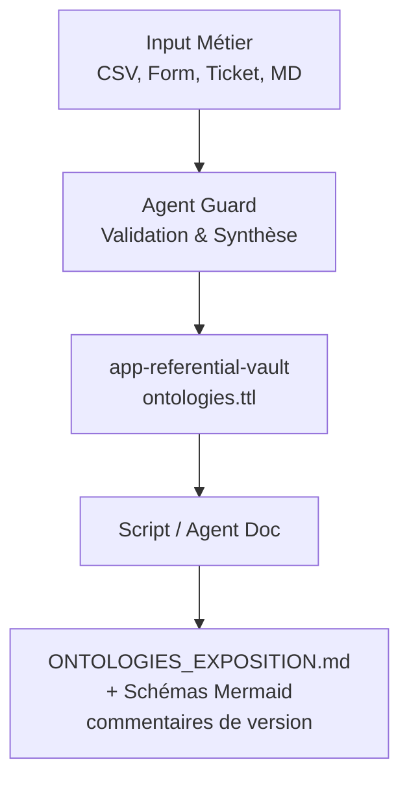
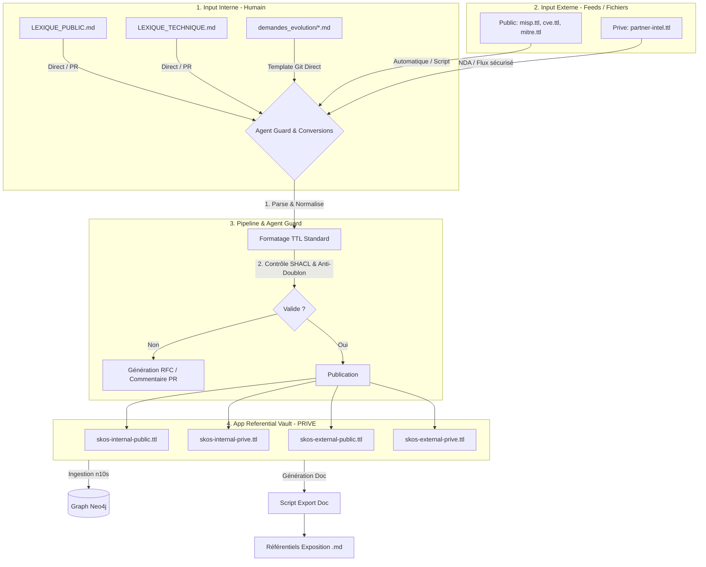

### 2. Revue de l'Ontologie & Gouvernance des entrées non-techniques

Vos doutes sont entièrement fondés. Valider ou faire évoluer directement du Turtle (`.ttl`) est **improbable pour un RSSI ou un expert métier** : le risque d'erreur de syntaxe est fort et la lisibilité est mauvaise pour les non-développeurs.

Le `.ttl` doit rester la **reprélection machine (Read-Only pour l'humain)**, compilée automatiquement à partir de formats sources ou générée en artifact d'exposition.

#### A. Formats d'input envisageables pour les parties prenantes non-techniques

Pour qu'un utilisateur métier propose une évolution (ex: "ajouter un concept", "créer une relation entre deux entités"), il faut privilégier des formats à faible barrière à l'entrée :

- **Tableurs / Formulaires Structured (Excel / CSV / Google Sheets) :**
    
    - C'est le format le plus pragmatique pour le métier.
        
    - _Structure simple :_ `[Terme]` | `[Définition]` | `[Relation/Parent]` | `[Exemple]`.
        
    - _Avantage :_ Facile à parser via un script Python ou un agent, pas de problème d'indentation.
        
- **Tickets / Issues avec Forms (GitHub/GitLab Issues, Jira) :**
    
    - Créer des modèles de tickets (Issue Templates) avec des champs obligatoires (Nom du concept, Domaine, Type de relation).
        
    - _Avantage :_ Traçabilité native, validation/discussion en commentaire par le RSSI avant merge.
        
- **Formulaire UI / Micro-Application (Streamlit / App interne) :**
    
    - Une interface web simplifiée où l'utilisateur saisit son nouveau terme. L'application génère la demande dans la chaîne Git.
        
- **Textes / Notes de cadrage en Markdown guidé (Templates `.md`) :**
    
    - Proposer un dossier `input-interne/demandes_evolutions/` avec des fichiers `.md` à trous pré-remplis.

#### B. La boucle de restitution : Les "Ontologies.md" générés

Pour répondre à votre besoin de visibilité, l'architecture doit inverser la responsabilité : **l'humain n'écrit pas le référentiel complet en TTL ou MD, c'est le pipeline qui régénère la documentation Markdown d'exposition**.


 ```
 [ Input Métier ] ────────► [ Agent Guard ] ────────► [ app-referential-vault/ ]
(CSV, Form, Ticket, MD)      Validation & Synthèse       (ontologies.ttl)
                                                                │
                                                                ▼
                                                     [ Script / Agent Doc ]
                                                                │
                                                                ▼
                                                     [ ONTOLOGIES_EXPOSITION.md ]
                                                     + Schémas Mermaid
                                                     + Commentaires de version
```


df




- **`ONTOLOGIES_EXPOSITION.md`** : Généré automatiquement à partir du `.ttl` consolidé du Vault. Ce fichier contient :
    
    - La liste claire des entités et relations.
        
    - Des diagrammes **Mermaid** générés automatiquement pour chaque sous-domaine (restreints à 10-15 nœuds pour rester lisibles).
        
    - Les commentaires et la traçabilité des modifications (changelog généré par l'agent).
        
- **Processus de validation par le RSSI :** Le RSSI valide la Pull Request en lisant le diff du fichier `.md` généré (très lisible), tandis que le pipeline CI/CD pousse le `.ttl` technique dans Neo4j/n10s une fois la PR approuvée.
    

Cette approche garantit que la source de vérité technique reste propre (`.ttl`), tout en offrant un support documentaire de décision (`.md` + Mermaid) et des moyens de contribution simples (CSV / Form / PR).


<!-- 
  ========================================================================
  FORMULAIRE DE DEMANDE D'ÉVOLUTION D'ONTOLOGIE / LEXIQUE (DKG)
  ========================================================================
  Consignes :
  - Remplissez les champs entre crochets [ ... ].
  - Ne modifiez pas la structure des titres pour permettre le traitement par l'Agent.
-->

# 📝 Demande d'évolution : [Nom court de l'évolution / du concept]

**Informations sur le demandeur**
* **Auteur :** [Prénom Nom]
* **Rôle / Métier :** [ex: Analyste SOC, RSSI, Expert Métier, Architecte]
* **Date :** [AAAA-MM-JJ]
* **Statut de la demande :** [ ] En attente de revue | [ ] Validé RSSI | [ ] Rejeté

---

## 1. Type de modification

> *Cochez la case correspondante avec un "X" : [X]*

* [ ] **Ajout** d'un nouveau terme ou d'une nouvelle entité
* [ ] **Modification** d'une définition ou d'une relation existante
* [ ] **Obsolescence / Suppresion** d'un concept

---

## 2. Description du Concept / de l'Entité

* **Nom du concept (Français) :** [ex: Vecteur d'Attaque]
* **Nom du concept (Anglais - Optionnel) :** [ex: Attack Vector]
* **Abreviation / Sigle :** [ex: VA]
* **Synonymes / Termes alternatifs :** [ex: Canal d'intrusion, Vecteur d'infection]

### Définition métier
> *Fournissez une définition claire et compréhensible par tous.*

[Inscrivez la définition détaillée ici...]

### Contexte & Justification
> *Pourquoi cette évolution est-elle nécessaire ? (ex: Nouvelle menace, alignement avec un standard, besoin d'analyse SOC)*

[Expliquez le contexte opérationnel ici...]

---

## 3. Positionnement dans le Graphe (Relations & Ontologie)

> *Renseignez les liens avec les concepts déjà existants dans le DKG.*

* **Catégorie / Domaine principal :** [ex: Menace / Technique / Asset / Vulnérabilité]
* **Est un sous-type de (Parent) :** [ex: Incident de Sécurité]
* **Est relié à (Autres concepts) :**
  * Est relié à : `[Nom d'un autre concept existant]` via la relation : `[ex: EXPLOITE / CIBLE / PROTEGE]`
  * Est relié à : `[Nom d'un autre concept existant]` via la relation : `[ex: APPARTIENT_A]`

---

## 4. Propriétés & Attributs requis (Optionnel)

> *Quelles informations clés doit-on pouvoir stocker sur ce concept ?*

* **Propriété 1 :** [ex: Niveau de sévérité (Élevé, Moyen, Faible)]
* **Propriété 2 :** [ex: Horodatage de première détection]
* **Propriété 3 :** [ex: Identifiant externe (CVE, MITRE ID)]

---

## 5. Espace de Validation & Registre (Réservé RSSI / Agent Guard)

<!-- Ne pas remplir cette section lors de la création de la demande -->

* **Analyse d'impact automatisée (Agent Guard) :**
  * *Conflit ou doublon détecté :* [Non / Oui - préciser]
  * *Fichiers TTL cibles impactés :* `[Chemin du fichier TTL]`

* **Avis du RSSI / DSI :**
  * [ ] Accepté tel quel
  * [ ] Accepté avec modifications
  * [ ] Refusé (Motif : [Indiquer la raison])

* **Signature / Approval :** [Nom du valideur] le [Date]
  
  
  
  
#  Workflow global de traitement
  
  ```
  [Demandeur (Métier / SOC)]
          │
          ▼  1. Crée un fichier .md basé sur le template
[ 02-Donnees/LexiquesOntologie/input-interne/demandes_evolution/ ]
          │
          ▼  2. Déclenchement de la CI/CD (ou webhook)
[ Agent Guard (Script Python / LLM) ]
          │  ├── Parsing du Markdown
          │  ├── Contrôle d'impact & Anti-doublon (lecture du Vault)
          │  └── Génération d'une Pull Request (PR) avec proposition .ttl
          │
          ▼  3. Notification & Revue
[ RSSI / Expert Métier ]
          │  ├── Lit le rapport de l'agent dans la PR
          │  └── Valide / Fusionne la PR (Merge)
          │
          ▼  4. Post-Merge Automatisation
[ app-referential-vault/ ] ──► Ingestion Neo4j/n10s
```


### Étapes de mise en œuvre technique

**1. Emplacement du Template et des demandes** Créez la structure suivante dans votre dépôt :

```
02-Donnees/LexiquesOntologie/input-interne/ 
└── demandes_evolution/ 
├── .templates/ 
│ └── TEMPLATE_DEMANDE_EVOLUTION.md 
└── 2026-08-EVOL-001_VecteurAttaque.md <-- Exemple de demande créée
```
**2. Modalité de saisie pour l'utilisateur**

- **Option Git natif (Développeurs / Cyber) :** Copier le template, le renseigner et faire un `git push` sur une branche dédiée.
    
- **Option GitHub/GitLab Issues (Métier non-technique) :** Copier le contenu du template dans les _Issue Templates_ du dépôt. Un utilisateur remplit simplement un formulaire Web dans son navigateur.
    

**3. Traitement automatisé par l'Agent Guard** Lorsqu'un nouveau fichier apparaît dans `demandes_evolution/`, l'Agent Guard exécute ces trois sous-actions :

- **Extraction des champs (Parsing) :** Il lit le Markdown à l'aide d'expressions régulières ou d'un prompt structuré pour récupérer les paires clé/valeur (`Nom du concept`, `Définition`, `Relations`).
    
- **Analyse d'impact & Anti-doublons :** L'agent compare le terme demandé avec l'existant dans `app-referential-vault/`.
    
    - _Si le terme existe déjà :_ L'agent ajoute un commentaire "Doublon détecté avec le concept X".
        
    - _Si le terme est valide :_ L'agent pré-génère le bloc RDF/SKOS correspondant.
        
- **Mise à jour du registre :** L'agent remplit automatiquement la **Section 5** du Markdown avec son rapport d'analyse.
    

**4. Circuit de validation (Humain dans la boucle / HITL)** Le RSSI ou l'expert métier ne lit jamais le code Turtle généré. Il se contente de :

1. Consulter la PR ou la demande Markdown enrichie par l'Agent.
    
2. Vérifier la définition métier et l'analyse d'impact de l'Agent.
    
3. Déplacer la case à cocher sur `[X] Accepté tel quel` et valider le Merge.
    

**5. Script d'injection dans le Vault** Dès la validation, un hook déclenche le compilateur qui convertit la demande acceptée en Turtle, l'ajoute au fichier `.ttl` correspondant dans `app-referential-vault/`, puis archive la demande.

### Exemple de script d'extraction (Agent Guard - Python)

Pour traiter le formulaire programmatiquement, voici un extrait de la logique de parsing que l'agent utilise :

```python
import re

def parse_evolution_request(md_content: str) -> dict:
    data = {}
    
    # Extraction des champs simples par regex
    data['label_fr'] = re.search(r'\* \*\*Nom du concept \(Français\) :\*\* \[(.*?)\]', md_content).group(1)
    data['definition'] = re.search(r'### Définition métier\n> .*?\n\n\[(.*?)\]', md_content, re.DOTALL).group(1)
    
    # Extraction des relations
    relations_raw = re.findall(r'\* Est relié à : `(.*?)` via la relation : `(.*?)`', md_content)
    data['relations'] = [{"target": target, "predicate": pred} for target, pred in relations_raw]
    
    return data
    
```

#  Cas d'usage avec  Git direct

Cela garde tout l'historique au même endroit, assure un versionnage strict et s'intègre naturellement avec des actions automatisées (GitHub Actions ou GitLab CI).

Voici la mise en œuvre concrète de ce workflow Git direct.

### 1. Organisation du dépôt

Dans votre arborescence, créez le sous-dossier `demandes_evolution/` dédié :

Plaintext

```
02-Donnees/LexiquesOntologie/input-interne/
└── demandes_evolution/
    ├── .templates/
    │   └── TEMPLATE_DEMANDE_EVOLUTION.md
    └── archive/                         # Demandes traitées et intégrées
```

### 2. Procédure étape par étape pour le contributeur

1. **Création de la branche :** Le contributeur crée une branche explicite : `git checkout -b feat/evol-ontologie-vecteur-attaque`
    
2. **Rédaction :** Il copie le fichier `.templates/TEMPLATE_DEMANDE_EVOLUTION.md` à la racine de `demandes_evolution/`, le nomme (ex: `2026-08-EVOL_VecteurAttaque.md`) et le remplit.
    
3. **Push & Pull Request :**
    
    ```bash
    git add 02-Donnees/LexiquesOntologie/input-interne/demandes_evolution/2026-08-EVOL_VecteurAttaque.md
    git commit -m "feat(ontologie): ajout du concept Vecteur d'Attaque"
    git push origin feat/evol-ontologie-vecteur-attaque
    ```
    
4. Le contributeur ouvre une **Pull Request (PR)** vers la branche principale (`main`).
    

### 3. Automatisation CI/CD & Agent Guard (GitHub Actions / GitLab CI)

Dès l'ouverture ou la mise à jour de la PR, le pipeline déclenche l'**Agent Guard** via un script Python.

**Rôle du pipeline automatisé :**

- **Lecture & Parsing :** L'agent extrait le contenu du nouveau `.md`.
    
- **Analyse d'impact :** Il contrôle si le concept existe déjà dans `app-referential-vault/` (vérification anti-doublon).
    
- **Génération de proposition :** L'agent pré-compile le bout de code Turtle (`.ttl`) correspondant.
    
- **Feedback automatique :** L'agent poste un **commentaire directement sur la PR Git** avec son rapport et la preview du Turtle généré :
    

> 🤖 **Agent Guard - Rapport d'analyse :**
> 
> - **Statut :** Valide (aucun doublon détecté).
>     
> - **Concept extrait :** `ex:Concept_Vecteur_d_Attaque`
>     
> - **Impact Vault :** Ajout de 1 concept et 2 relations dans `lexique_technique.ttl`.
>     
> 
> _Preview RDF/SKOS générée :_
> 
> Extrait de code
> 
> ```
> ex:Concept_Vecteur_d_Attaque a skos:Concept ;
>     skos:prefLabel "Vecteur d'Attaque"@fr ;
>     skos:definition "Chemin ou moyen par lequel un attaquant obtient l'accès..."@fr .
> ```

### 4. Validation par le RSSI & Fusion (Merge)

1. Le RSSI ou l'expert métier ouvre la PR sur GitHub/GitLab.
    
2. Il ne consulte **que le Markdown rédigé et le rapport clair laissé par l'Agent Guard** en commentaire.
    
3. Si la définition lui convient, il valide la PR (**Approve & Merge**).
    

### 5. Post-Merge : Mise à jour du Vault

Une fois la PR fusionnée dans `main`, le pipeline de publication :

- Convertit définitivement la demande validée en TTL.
    
- Injecte/Met à jour les fichiers dans `app-referential-vault/`.
    
- Déplace le fichier `.md` de la demande vers `demandes_evolution/archive/`.
    
- Déclenche la mise à jour ou le rechargement de Neo4j (`n10s`).
  
  
  
  ### Clarification 1 : Flux et mécanismes des évolutions (Privé/Public, MD/TTL)

Qu'il s'agisse d'un formulaire `.md` (interne) ou d'un flux `.ttl`/JSON externe (CVE, MISP, partenaire), toute évolution passe par le même filtre de contrôle (**Agent Guard / SHACL**) avant d'atterrir dans le coffre-fort d'application (`app-referential-vault/`).
  


### Clarification 2 : Fichiers TTL vs Fichiers Markdown générés

Afin d'éviter la prolifération incontrôlée de fichiers Markdown, **la règle est d'associer exactement 1 fichier Markdown d'exposition par grand sous-domaine / niveau de confidentialité**, plutôt que de créer un fichier par demande d'évolution.


