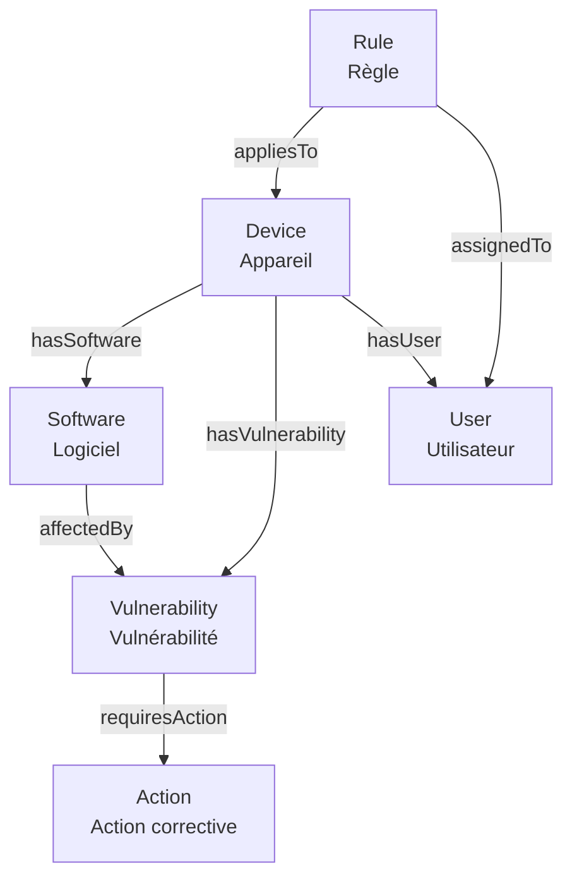

Voici une **analyse complète** du format **TTL/OWL**, des **outils pour le lire/éditer**, et une **documentation clé en main** au format `.md` que vous pouvez intégrer à votre dépôt pour que **toute votre équipe puisse y accéder facilement**.

---

## 1 - Guide Complet : TTL/OWL pour les Ontologies**

_(À ajouter dans `02-Architecture/ONTOLOGIE/TTL_OWL_GUIDE.md`)_

---

### 1.1 - Qu’est-ce que TTL/OWL ?**

| Format                          | Définition                                                                  | Extension | Standard | Lisibilité              |
| ------------------------------- | --------------------------------------------------------------------------- | --------- | -------- | ----------------------- |
| **TTL** (Turtle)                | Syntax **textuelle et compacte** pour RDF.                                  | `.ttl`    | W3C      | ⭐⭐⭐⭐⭐ (Très lisible)    |
| **OWL** (Web Ontology Language) | Langage pour **définir des ontologies** (classes, propriétés, contraintes). | `.owl`    | W3C      | ⭐⭐⭐ (Plus formel)       |
| **RDF/XML**                     | Syntax XML pour RDF.                                                        | `.rdf`    | W3C      | ⭐ (Peu lisible)         |
| **JSON-LD**                     | Syntax JSON pour RDF.                                                       | `.jsonld` | W3C      | ⭐⭐⭐⭐ (Lisible, moderne) |

**🔹 Relation entre TTL et OWL** :

- **TTL** = **Format de sérialisation** (comme JSON ou XML).
- **OWL** = **Langage de modélisation** (comme UML pour les bases de données).
- **Votre fichier `ontologie-v1.0.ttl`** contient **à la fois** :
    - Des **déclarations RDF** (triplets sujet-prédicat-objet).
    - Des **constructs OWL** (`owl:Class`, `owl:ObjectProperty`, etc.).

**Exemple** :
```turtle
# Cela est du RDF + OWL en format TTL
:Device a owl:Class ;  # <-- OWL : déclaration d'une classe
    rdfs:label "Appareil" .  # <-- RDF : propriété rdfs:label
```


## 1.2 - Outils pour Lire/Éditer TTL/OWL**

_(Classés par usage : édition, visualisation, validation, intégration)_
### 1.2.1 - Outils d’Édition (Pour Créer/Modifier l’Ontologie)

| Outil                    | Type            | Fonctionnalités                                                         | Lien                                                                                                               | Public Cible       | Difficulté |
| ------------------------ | --------------- | ----------------------------------------------------------------------- | ------------------------------------------------------------------------------------------------------------------ | ------------------ | ---------- |
| **Protégé**              | Desktop (Java)  | Éditeur **complet** (OWL + RDF). Visualisation, validation, inférences. | [https://protege.stanford.edu/](https://protege.stanford.edu/)                                                     | Experts            | ⭐⭐⭐        |
| **TopBraid Composer**    | Desktop/Cloud   | Éditeur **professionnel** (support OWL 2, SPARQL, SHACL).               | [https://www.topquadrant.com/products/topbraid-composer/](https://www.topquadrant.com/products/topbraid-composer/) | Entreprises        | ⭐⭐⭐⭐       |
| **WebVOWL**              | Web             | Visualisation **interactive** d’ontologies OWL.                         | [http://vowl.visualdataweb.org/](http://vowl.visualdataweb.org/)                                                   | Tous               | ⭐          |
| **RDF/OWL Validator**    | Web             | Validation de fichiers TTL/OWL.                                         | [https://www.ldf.fi/service/rdf-validator/](https://www.ldf.fi/service/rdf-validator/)                             | Tous               | ⭐          |
| **VS Code + Extensions** | Éditeur de code | Colorisation syntaxique, autocomplétion.                                | [Extensions RDF/OWL](https://marketplace.visualstudio.com/items?itemName=redhat.vscode-yaml)                       | Développeurs       | ⭐⭐         |
| **Ontotext GraphDB**     | Base de données | Éditeur intégré + stockage RDF.                                         | [https://www.ontotext.com/products/graphdb/](https://www.ontotext.com/products/graphdb/)                           | Entreprises        | ⭐⭐⭐⭐       |
| **Neo4j + n10s**         | Plugin Neo4j    | Chargez directement les fichiers TTL/OWL dans Neo4j.                    | [n10s](https://github.com/neo4j-labs/neordf)                                                                       | Utilisateurs Neo4j | ⭐⭐         |

### 1.2.2 - Outils de Visualisation (Pour Comprendre l’Ontologie)

| Outil                           | Type               | Fonctionnalités                                                     | Lien                                                                       | Exemple de Sortie                                       |
| ------------------------------- | ------------------ | ------------------------------------------------------------------- | -------------------------------------------------------------------------- | ------------------------------------------------------- |
| **WebVOWL**                     | Web                | Visualisation **interactive** (nœuds = classes, arcs = propriétés). | [http://vowl.visualdataweb.org/](http://vowl.visualdataweb.org/)           |  |
| **GraphDB Workbench**           | Web                | Visualisation + requêtes SPARQL.                                    | Inclus avec GraphDB                                                        | Graphe interactif                                       |
| **Protégé (Onglet "OntoGraf")** | Desktop            | Visualisation intégrée.                                             | [Protégé](https://protege.stanford.edu/)                                   | Diagramme UML-like                                      |
| **Mermaid (via Markdown)**      | Intégration GitHub | Diagrammes **textuels** dans votre README.                          | [Mermaid](https://mermaid.js.org/)                                         | ```mermaid\ngraph TD\n A[Device] -->                    |
| **yEd**                         | Desktop            | Diagrammes personnalisables (export en image).                      | [https://www.yworks.com/products/yed](https://www.yworks.com/products/yed) | Diagramme vectoriel                                     |

---

### 1.2.3 - Outils de Validation (Pour Vérifier la Syntax)

|Outil|Type|Fonctionnalités|Lien|
|---|---|---|---|
|**W3C RDF Validator**|Web|Valide la syntax RDF/TTL.|[https://www.w3.org/RDF/Validator/](https://www.w3.org/RDF/Validator/)|
|**Protégé**|Desktop|Validation OWL (détection d’incohérences).|[Protégé](https://protege.stanford.edu/)|
|**RDFLib (Python)**|Bibliothèque|Validation programmatique.|[https://rdflib.readthedocs.io/](https://rdflib.readthedocs.io/)|
|**SHACL**|Langage|Validation **sémantique** (ex: "Chaque Device doit avoir un Software").|[https://www.w3.org/TR/shacl/](https://www.w3.org/TR/shacl/)|

---

### 1.2.4 - Outils d’Intégration (Pour Utiliser l’Ontologie dans des Apps)

| Outil/Librairie             | Langage  | Fonctionnalités                             | Lien                                                                           | Exemple d’Usage                                        |
| --------------------------- | -------- | ------------------------------------------- | ------------------------------------------------------------------------------ | ------------------------------------------------------ |
| **RDFLib**                  | Python   | Parse/manipule RDF/OWL en Python.           | [https://rdflib.readthedocs.io/](https://rdflib.readthedocs.io/)               | Charger `ontologie-v1.0.ttl` et extraire les classes.  |
| **Apache Jena**             | Java     | Moteur RDF/OWL complet.                     | [https://jena.apache.org/](https://jena.apache.org/)                           | Validation, requêtes SPARQL.                           |
| **OWL API**                 | Java     | Bibliothèque dédiée à OWL.                  | [https://github.com/owlcs/owlapi](https://github.com/owlcs/owlapi)             | Manipulation avancée d’ontologies.                     |
| **n10s (Neo4j RDF Plugin)** | Neo4j    | Chargez TTL/OWL **directement** dans Neo4j. | [n10s](https://github.com/neo4j-labs/neordf)                                   | `CALL n10s.rdf.import.file('ontologie.ttl', 'Turtle')` |
| **SPARQL**                  | Requêtes | Langage de requête pour RDF (comme SQL).    | [https://www.w3.org/TR/sparql11-query/](https://www.w3.org/TR/sparql11-query/) | `SELECT ?device WHERE { ?device a :Device }`           |

### 1.2.5 - Outils de Conversion (Pour Changer de Format)

| Outil                  | De → Vers                 | Lien                                                      | Exemple                                                                 |
| ---------------------- | ------------------------- | --------------------------------------------------------- | ----------------------------------------------------------------------- |
| **Protégé**            | OWL → TTL/JSON-LD/RDF/XML | [Protégé](https://protege.stanford.edu/)                  | Exportez votre ontologie dans le format souhaité.                       |
| **RDFLib (Python)**    | TTL → JSON-LD/NTriples    | [RDFLib](https://rdflib.readthedocs.io/)                  | `g.parse("ontologie.ttl", format="turtle").serialize(format="json-ld")` |
| **Apache Jena (riot)** | TTL → RDF/XML/JSON-LD     | [Jena RIOT](https://jena.apache.org/documentation/riot/)  | `riot ontologie.ttl --output=jsonld`                                    |
| **Online Converters**  | TTL ↔ RDF/XML             | [RDF Converter](https://www.ldf.fi/service/rdf-converter) | Upload + téléchargez le fichier converti.                               |


## 1.3 - Comment Rendre TTL/OWL Accessible à Toute l’Équipe ?**

_(Solutions classées par facilité d’implémentation)_

### 1.3.1 - 🟢 Solution 1 : Fichiers Markdown + Exemples (Recommandé pour un POC)**

**→ Idéal pour votre cas actuel.**

- **Avantages** : Simple, intégration GitHub, pas besoin d’outils externes.
- **Inconvénients** : Pas de validation automatique.

**Implémentation** :

1. **Créez un guide** (`02-Architecture/ONTOLOGIE/TTL_OWL_GUIDE.md`) avec :
    
    - Explication du format TTL/OWL (comme ci-dessus).
    - **Exemples concrets** extraits de votre `ontologie-v1.0.ttl`.
    - **Liens vers les outils** (WebVOWL, Protégé, etc.).
2. **Ajoutez des badges** dans votre `README.md` :
    
    markdown
    
    Copier
    
    ```
    [](http://vowl.visualdataweb.org/?url=https://raw.githubusercontent.com/AlbanLher/Dkg-cybersec/main/02-Architecture/ONTOLOGIE/ontologie-v1.0.ttl)
    [](https://www.w3.org/RDF/Validator/uri?uri=https://raw.githubusercontent.com/AlbanLher/Dkg-cybersec/main/02-Architecture/ONTOLOGIE/ontologie-v1.0.ttl)
    ```
    
3. **Utilisez GitHub pour héberger les fichiers** :
    
    - Les fichiers `.ttl` sont **directement lisibles** dans le navigateur.
    - Ajoutez un **rendering Markdown** pour expliquer chaque partie.

---

### 1.3.2 - 🟡 Solution 2 : Visualisation Intégrée avec Mermaid

**→ Pour une documentation visuelle dans GitHub.** **Exemple** (à ajouter dans `02-Architecture/ONTOLOGIE/SCHEMA.md`) :


 📊 Schéma de l'Ontologie (Mermaid)




**Avantages** :
- **Intégration native** dans GitHub.
- **Pas besoin d’outils externes**.

### 1.3.3 - 🔵 Solution 3 : Hébergement d’un Visualiseur Web (WebVOWL)
**→ Pour une visualisation interactive.**
1. **Hébergez votre ontologie sur GitHub** (déjà fait).
2. **Utilisez WebVOWL en ligne** :
   - Lien direct : [http://vowl.visualdataweb.org/?url=https://raw.githubusercontent.com/AlbanLher/Dkg-cybersec/main/02-Architecture/ONTOLOGIE/ontologie-v1.0.ttl](http://vowl.visualdataweb.org/?url=https://raw.githubusercontent.com/AlbanLher/Dkg-cybersec/main/02-Architecture/ONTOLOGIE/ontologie-v1.0.ttl)
   - **Badges** : Ajoutez ce lien dans votre `README.md` (voir Solution 1).

**Avantages** :
- **Visualisation interactive** (zoom, clic sur les nœuds).
- **Pas d’installation** requise.

**Inconvénients** :
- Nécessite une **connexion Internet**.

### 1.3.4 - 🟣 Solution 4 : Serveur RDF Local (Pour les Entreprises)
**→ Pour une équipe technique avancée.**
1. **Installez GraphDB ou Apache Jena Fuseki** :
```bash
   # Exemple avec Fuseki (Docker)
   docker run -p 3030:3030 -v /data/rdf:/data apache/jena-fuseki
```

2. **Chargez votre ontologie** :
    - Upload `ontologie-v1.0.ttl` via l’interface web.
3. **Partagez l’URL** avec votre équipe :
    - `http://votre-serveur:3030` (accès au SPARQL endpoint).

**Avantages** :

- **Requêtes SPARQL** pour interroger l’ontologie.
- **Validation automatique**.

**Inconvénients** :

- **Complexité** (nécessite un serveur).

## 1.4 - Documentation Clé en Main : `TTL_OWL_GUIDE.md`

_(Copiez ce contenu dans `02-Architecture/ONTOLOGIE/TTL_OWL_GUIDE.md`)_

**Guide TTL/OWL pour l'Ontologie DKG Cybersécurité**
🎯 Sommaire
1. [Introduction à TTL/OWL](#1-introduction-à-ttlowl)
2. [Syntaxe de Base](#2-syntaxe-de-base)
3. [Outils Recommandés](#3-outils-recommandés)
4. [Exemples Concrets](#4-exemples-concrets)
5. [Bonnes Pratiques](#5-bonnes-pratiques)
6. [Ressources Utiles](#6-ressources-utiles)

#### 1️⃣ Introduction à TTL/OWL

##### 🔹 Qu’est-ce que RDF ? 
**RDF (Resource Description Framework)** est un **modèle de données** pour représenter des informations sous forme de **triplets** :
`Sujet → Prédicat → Objet`

Exemple :
```turtle
\:PC-Alban \:hasSoftware \:OpenSSL_1_0_2 .
# Sujet    Prédicat   Objet
````

##### 🔹 Qu’est-ce que OWL ?

**OWL (Web Ontology Language)** est un **langage** pour définir des **ontologies** (structures de connaissances) en s’appuyant sur RDF.  
Il permet de définir :

- **Classes** (ex: `:Device`, `:Software`).
- **Propriétés** (ex: `:hasSoftware`, `:cvssScore`).
- **Relations** entre classes.
- **Contraintes** (ex: "Un Device doit avoir au moins un Software").

#### 2️⃣ Syntaxe de Base

##### 📌 Déclaration de Préfixes
```turtle
@prefix : <http://example.org/cyber-ontology#> .
@prefix owl: <http://www.w3.org/2002/07/owl#> .
@prefix rdf: <http://www.w3.org/1999/02/22-rdf-syntax-ns#> .
@prefix rdfs: <http://www.w3.org/2000/01/rdf-schema#> .
@prefix xsd: <http://www.w3.org/2001/XMLSchema#> .
```
→ **À quoi ça sert ?** Éviter de répéter les URLs complètes.
##### 📌 Déclaration de Classes
``` turtle
\:Device a owl\:Class ;
    rdfs\:label "Appareil" ;
    rdfs\:comment "Un device physique ou virtuel (PC, routeur, serveur)." .
```

- `a owl:Class` : Déclare `:Device` comme une **classe**.
- `rdfs:label` : Nom **lisible** de la classe.
- `rdfs:comment` : Description **détaillée**.
##### 📌 Déclaration de Propriétés

###### Propriétés d’Objet (relations entre classes)
```turtle
\:hasSoftware a owl\:ObjectProperty ;
    rdfs\:domain \:Device ;
    rdfs\:range \:Software ;
    rdfs\:label "a pour logiciel" .
```

- `owl:ObjectProperty` : Propriété qui **relie deux classes**.
- `rdfs:domain` : **Classe source** (ex: `:Device`).
- `rdfs:range` : **Classe cible** (ex: `:Software`).

######  Propriétés de Données (attributs)
```turtle
\:cvssScore a owl\:DatatypeProperty ;
    rdfs\:domain \:Vulnerability ;
    rdfs\:range xsd\:float ;
    rdfs\:label "score CVSS" .
```
- `owl:DatatypeProperty` : Propriété qui **stocke une valeur** (nombre, texte).
- `rdfs:range` : Type de la valeur (`xsd:float`, `xsd:string`, etc.).
##### 📌 Déclaration d’Instances
```turtle
\:PC-Alban a \:Device ;
    foaf\:name "PC Alban" ;
    \:hasSoftware \:OpenSSL_1_0_2 .
```
- `a :Device` : `:PC-Alban` est une **instance** de `:Device`.
- `foaf:name` : Propriété **standard** pour le nom.
##### 📌 Hiérarchie de Classes
```turtle
\:InternalDevice a owl\:Class ;
    rdfs\:subClassOf \:Device ;  # <-- Hiérarchie
    rdfs\:label "Device interne" .
```
→ `:InternalDevice` **hérite** de `:Device`.
##### 📌 Contraintes (OWL)
```turtle
\:Device a owl\:Class ;
    owl\:equivalentClass [
        a owl\:Restriction ;
        owl\:onProperty \:hasSoftware ;
        owl\:someValuesFrom \:Software  # Chaque Device DOIT avoir au moins un Software
```


#### 3️⃣ Outils Recommandés

##### 🎨 **Pour Éditer**

| Outil                    | Lien                                                             | Usage                                 |
| ------------------------ | ---------------------------------------------------------------- | ------------------------------------- |
| **Protégé**              | [https://protege.stanford.edu/](https://protege.stanford.edu/)   | Éditeur complet (OWL + RDF).          |
| **WebVOWL**              | [http://vowl.visualdataweb.org/](http://vowl.visualdataweb.org/) | Visualisation interactive.            |
| **VS Code + Extensions** | [Marketplace](https://marketplace.visualstudio.com/)             | Édition avec colorisation syntaxique. |

##### ✅ **Pour Valider**

| Outil                 | Lien                                                                   | Usage                      |
| --------------------- | ---------------------------------------------------------------------- | -------------------------- |
| **W3C RDF Validator** | [https://www.w3.org/RDF/Validator/](https://www.w3.org/RDF/Validator/) | Valider la syntax RDF/TTL. |
| **RDFLib (Python)**   | [https://rdflib.readthedocs.io/](https://rdflib.readthedocs.io/)       | Validation programmatique. |

##### 🔌 **Pour Intégrer**

| Outil               | Lien                                                                         | Usage                        |
| ------------------- | ---------------------------------------------------------------------------- | ---------------------------- |
| **n10s (Neo4j)**    | [https://github.com/neo4j-labs/neordf](https://github.com/neo4j-labs/neordf) | Chargez TTL/OWL dans Neo4j.  |
| **RDFLib (Python)** | [https://rdflib.readthedocs.io/](https://rdflib.readthedocs.io/)             | Manipulez RDF/OWL en Python. |

---

#### 4️⃣ Exemples Concrets (Extrait de `ontologie-v1.0.ttl`)

##### 📄 Exemple 1 : Déclaration d’une Classe
```turtle
\:Vulnerability a owl\:Class ;
    rdfs\:label "Vulnérabilité" ;
    rdfs\:subClassOf \:Threat ;
    rdfs\:comment "Une vulnérabilité (ex: CVE)." .
```
##### 📄 Exemple 2 : Déclaration d’une Propriété
```turtle
\:requiresAction a owl\:ObjectProperty ;
    rdfs\:domain \:Vulnerability ;
    rdfs\:range \:Action ;
    rdfs\:label "nécessite l'action" .
```
##### 📄 Exemple 3 : Instance Complète
```turtle
\:MonPC a \:Device ;
    foaf\:name "PC Alban" ;
    \:hasSoftware \:OpenSSL_1_0_2, \:Apache_2_4_54 ;
    \:hasVulnerability cve\:CVE-2023-1234 .

\:OpenSSL_1_0_2 a \:Software ;
    foaf\:name "OpenSSL" ;
    \:version "1.0.2" .

cve\:CVE-2023-1234 a \:Vulnerability ;
    foaf\:name "CVE-2023-1234" ;
    \:cvssScore 9.8 ;
    \:requiresAction \:UpdateOpenSSL .
```

---

#### 5️⃣ Bonnes Pratiques

##### ✅ **Nommage**

- **Classes** : `PascalCase` (ex: `:Device`, `:Vulnerability`).
- **Propriétés** : `camelCase` (ex: `:hasSoftware`, `:cvssScore`).
- **Instances** : `PascalCase` ou `snake_case` (ex: `:MonPC`, `:CVE-2023-1234`).

##### ✅ **Documentation**

- **Toujours ajouter** `rdfs:label` et `rdfs:comment` pour chaque classe/propriété.
- **Utiliser des préfixes** pour éviter les collisions (ex: `cve:`, `mitre:`).

##### ✅ **Validation**

- **Valider avec [W3C RDF Validator](https://www.w3.org/RDF/Validator/)** avant de commiter.
- **Tester avec Protégé** pour détecter les incohérences.

##### ✅ **Modularité**

- **Séparer en fichiers** :
    - `ontologie-publique.ttl` : Classes/propriétés génériques.
    - `ontologie-privee.ttl` : Extensions spécifiques.
    - `regles.ttl` : Règles de sécurité.

---

#### 6️⃣ Ressources Utiles

##### 📚 **Documentation Officielle**

- [W3C RDF Primer](https://www.w3.org/TR/rdf-primer/)
- [W3C OWL 2 Primer](https://www.w3.org/TR/owl2-primer/)
- [Turtle Syntax](https://www.w3.org/TeamSubmission/turtle/)

##### 🎓 **Tutoriels**

- [RDF/OWL Tutorial (Cambridge)](https://www.cambridgesemantics.org/learn/)
- [Protégé Tutorial](https://protegewiki.stanford.edu/wiki/Prot%C3%A9g%C3%A9_Tutorial)

##### 🛠 **Outils en Ligne**

- [WebVOWL](http://vowl.visualdataweb.org/) : Visualisation.
- [RDF Validator](https://www.w3.org/RDF/Validator/) : Validation.
- [SPARQL Query Editor](https://yasoom.com/sparql) : Requêtes SPARQL.

### 🔗 Outils Recommandés (Liens SÛRS)

| Outil                 | Lien                                                                   | Description                                          |
| --------------------- | ---------------------------------------------------------------------- | ---------------------------------------------------- |
| **W3C RDF Validator** | [https://www.w3.org/RDF/Validator/](https://www.w3.org/RDF/Validator/) | Validez votre fichier TTL en le collant directement. |
| **WebVOWL**           | [http://vowl.visualdataweb.org/](http://vowl.visualdataweb.org/)       | Upload manuel de votre fichier TTL.                  |
| **Protégé**           | [https://protege.stanford.edu/](https://protege.stanford.edu/)         | Téléchargez la version Desktop.                      |
| **RDFLib**            | `pip install rdflib`                                                   | Utilisez en local avec Python.                       |
