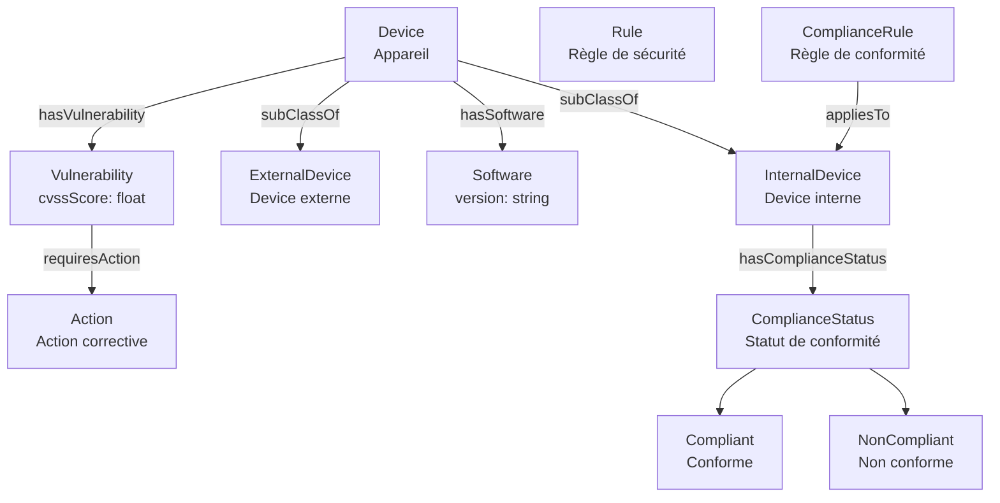
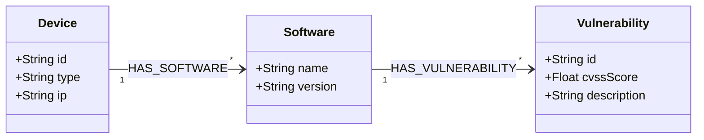
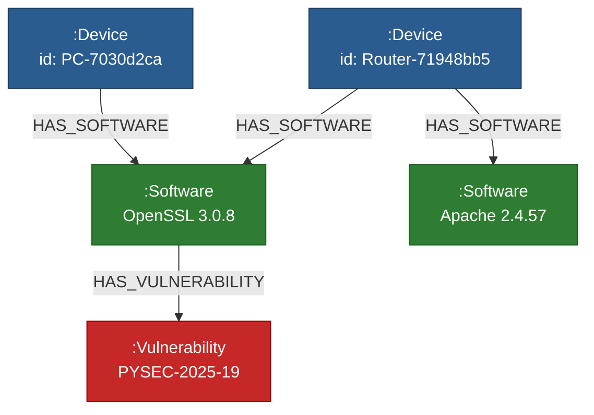
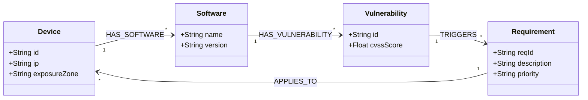

# 📊 Schéma de l'Ontologie Cybersécurité (Phase 0)

> *Ce schéma représente les **classes**, **propriétés**, et **hiérarchies** de notre ontologie.
> Pour une version technique complète, voir [ontologie.ttl](./ontologie.ttl).*

---

## 🔗 Diagramme Mermaid

📖 Légende Détaillée
🏷 Classes

| Nom              | URI                                                  | Description                            | Exemple                      |     |
| ---------------- | ---------------------------------------------------- | -------------------------------------- | ---------------------------- | --- |
| Action           | `http://example.org/cyber-ontology#Action`           | Une action corrective.                 | Mettre à jour OpenSSL        |     |
| ComplianceRule   | `http://example.org/cyber-ontology#ComplianceRule`   | Une règle de conformité.               | CVSS < 5 pour les serveurs   |     |
| ComplianceStatus | `http://example.org/cyber-ontology#ComplianceStatus` | Statut de conformité.                  | Conforme, Non conforme       |     |
| Device           | `http://example.org/cyber-ontology#Device`           | Un device physique ou virtuel.         | PC-Alban-POC, Router-POC     |     |
| ExternalDevice   | `http://example.org/cyber-ontology#ExternalDevice`   | Device hors du réseau de l’entreprise. | Client-External-001          |     |
| InternalDevice   | `http://example.org/cyber-ontology#InternalDevice`   | Device appartenant à l’entreprise.     | Server-Prod, PC-Employee1    |     |
| Rule             | `http://example.org/cyber-ontology#Rule`             | Une règle de sécurité.                 | Règle de mise à jour OpenSSL |     |
| Software         | `http://example.org/cyber-ontology#Software`         | Un logiciel installé.                  | OpenSSL, Apache, PostgreSQL  |     |
| Vulnerability    | `http://example.org/cyber-ontology#Vulnerability`    | Une vulnérabilité (ex: CVE).           | CVE-2023-1234, CVE-2026-5678 |     |
    

🔗 Propriétés

| Nom                 | URI                                                     | Domaine        | Range            | Description                             | Exemple                               |
| ------------------- | ------------------------------------------------------- | -------------- | ---------------- | --------------------------------------- | ------------------------------------- |
| requiresAction      | `http://example.org/cyber-ontology#requiresAction`      | Vulnerability  | Action           | Une vulnérabilité nécessite une action. | CVE-2023-1234 → Mettre à jour OpenSSL |
| hasVulnerability    | `http://example.org/cyber-ontology#hasVulnerability`    | Device         | Vulnerability    | Un device a une vulnérabilité.          | Server-Prod → CVE-2023-1234           |
| hasSoftware         | `http://example.org/cyber-ontology#hasSoftware`         | Device         | Software         | Un device a un logiciel installé.       | PC-Alban → OpenSSL                    |
| hasComplianceStatus | `http://example.org/cyber-ontology#hasComplianceStatus` | InternalDevice | ComplianceStatus | Statut de conformité d’un device.       | Server-Prod → Non conforme            |
| cvssScore           | `http://example.org/cyber-ontology#cvssScore`           | Vulnerability  | xsd              | Score CVSS (0.0 à 10.0).                | CVE-2023-1234 → 9.8                   |
| appliesTo           | `http://example.org/cyber-ontology#appliesTo`           | ComplianceRule | InternalDevice   | Une règle s’applique à un device.       | CVSS < 5 → Server-Prod                |
  

📌 Contraintes OWL (Non Visibles dans Mermaid)

|Contrainte|Description|Exemple|
|---|---|---|
|`InternalDevice rdfs:subClassOf Device`|Tout InternalDevice est un Device.|Server-Prod est un Device et un InternalDevice.|
|`ComplianceRule rdfs:subClassOf Rule`|Toute ComplianceRule est une Rule.|CVSS < 5 est une Rule et une ComplianceRule.|
|`Restriction: InternalDevice doit avoir un hasComplianceStatus`|Tout InternalDevice a un statut de conformité.|Server-Prod a un statut (Conforme/Non conforme).|
    
## Vue G
#### 1. Support Visuel de l'Ontologie (Le Modèle)

Pour présenter le cadre sémantique de la Phase 0 aux équipes non-techniques, ce schéma Mermaid illustre la structure théorique minimale :


#### Fiche Sémantique d'Accompagnement

> **Scénario Métier d'Exemple :** _"Le serveur de production `Router-01` (IP: `192.168.1.1`) exécute le composant `OpenSSL 3.0.8`. La base NVD indique que ce composant est touché par la faille `CVE-2023-1234` de score CVSS `9.8`. L'ontologie permet de relier automatiquement l'alerte CVE directement au serveur concerné."_
#### 2. Représentation du Graphe Instancié (Les Données)

Lorsque vos fichiers de données (`inventory.json` et `cve_data.ttl`) sont chargés, Neo4j matérialise l'ontologie. Le graphe réel ressemble à ceci :


**Légende :** Les nœuds bleus (`Device`), verts (`Software`) et rouges (`Vulnerability`) respectent strictement les types et relations autorisés par l'ontologie OWL/TTL initiale.



```
[Changement d'Ontologie (Nouveaux concepts)]
            │
            ▼ 
[Adaptation des Outils de l'Agent]
  ├── Fine-tuning / Few-Shot Prompting pour le NER 
  └── Mise à jour du Schéma de Vectorisation 
            │
            ▼ 
[Re-Parsing & Ré-indexation des Fichiers Sources] 
            │ 
            ▼ 
[Migration / Enrichment du Graphe Neo4j]
```
#### 2. Stratégie d'Adaptation des Outils de l'Agent

- **Étape 1 : Amélioration des Prompts / Few-Shot Learning (Court terme)**
    
    Mettre à jour le système de Prompting de l'agent d'extraction en lui injectant le nouveau schéma sous forme de contraintes JSON-Schema ou de directives d'extraction d'entités/relations.
    
- **Étape 2 : Fine-Tuning du Modèle d'Extraction (Moyen terme)**
    
    Dès que la Phase 1 se stabilise avec un jeu de données annotées (textes bruts $\rightarrow$ triplets RDF/Cypher validés), fine-tuner un modèle compact (ex: Qwen, Llama) dédié à la tâche de **Text-to-Graph** / **NER relationnel**.
    
- **Étape 3 : Ré-exécution du Pipeline (Re-ingestion)**
    
    Pousser les anciens et nouveaux documents bruts dans le nouveau pipeline pour générer les nœuds `:Requirement` et les connecter aux `:Vulnerability` existantes via des requêtes `MERGE` en Cypher.