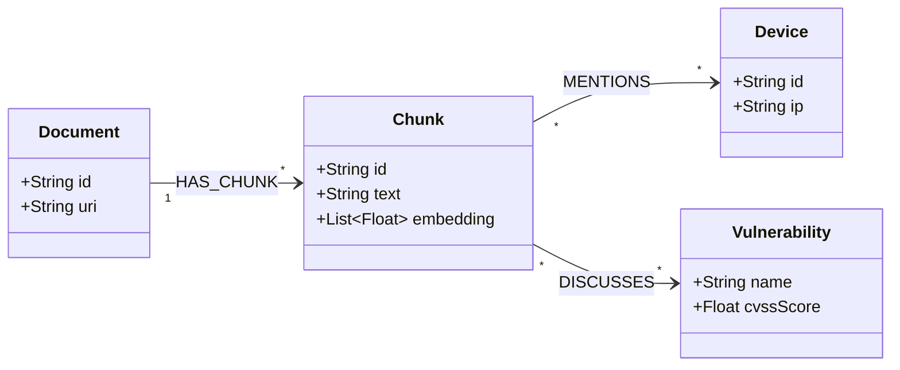

Pour lier les nœuds du graphe de votre ontologie Cyber aux embeddings des documents (approche hybride **GraphRAG**), Neo4j s'appuie sur des **index vectoriels natifs** basés sur l'algorithme HNSW (_Hierarchical Navigable Small World_).

L'architecture repose sur un pattern d'**indexation distribuée par entités/chunks** : les documents sont découpés en Chunks, vectorisés, puis reliés formellement aux nœuds métier de l'ontologie (`Device`, `Vulnerability`, `Requirement`).

### 1. Architecture du Modèle de Données (GraphRAG)

Au lieu de stocker les embeddings dans une base vectorielle séparée (ex: Pinecone, Chroma), ils sont stockés comme des propriétés de type `LIST<FLOAT>` directement sur les nœuds Neo4j.

Extrait de code



### 2. Procédure de Configuration & Création des Index Vectoriels

#### Étape A : Activer l'Index Vectoriel sur les Chunks / Documents

On crée un index sur le nœud `:Chunk` et sa propriété `embedding` (exemple avec un modèle de 1536 dimensions comme `text-embedding-3-small` d'OpenAI ou `bge-large-en`).

```cypher
// Création de l'index vectoriel sur les Text Chunks (Recherche Cosinus)
CREATE VECTOR INDEX chunk_embeddings_idx IF NOT EXISTS
FOR (c:Chunk) ON (c.embedding)
OPTIONS {
  indexConfig: {
    `vector.dimensions`: 1536,
    `vector.similarity_function`: 'cosine'
  }
};
```

#### Étape B : (Optionnel) Activer un Index Vectoriel sur les Entités de l'Ontologie

Pour faire du matching direct entre une requête utilisateur et un concept métier de l'ontologie (`Vulnerability`, `Requirement`), on vectorise également les descriptions d'entités.
```cypher
// Index vectoriel sur les descriptions de Vulnérabilités/Exigences
CREATE VECTOR INDEX vulnerability_embeddings_idx IF NOT EXISTS
FOR (v:cyber__Vulnerability) ON (v.embedding)
OPTIONS {
  indexConfig: {
    `vector.dimensions`: 1536,
    `vector.similarity_function`: 'cosine'
  }
};
```

### 3. Pipeline d'Ingestion & Rapprochement (Cypher + Python)

Voici le script Cypher à exécuter lors de l'ingestion d'un nouveau document vectorisé (ex: rapport NIS2 ou bulletin d'alerte CVE) pour le relier à l'ontologie :
```cypher
// 1. Ingestion d'un Chunk de texte et de son vecteur
MERGE (doc:Document {id: "Rapport_NIS2_2026.pdf"})
CREATE (c:Chunk {
    id: "chunk_102",
    text: "Les serveurs situés en DMZ exécutant OpenSSL doivent être patchés sous 48h.",
    embedding: $vectorPayload // Injection du tableau de floats via paramètre
})
CREATE (doc)-[:HAS_CHUNK]->(c)

// 2. Rapprochement Sémantique / Contextuel avec les Nœuds de l'Ontologie
WITH c
MATCH (d:Device) WHERE d.environment = "DMZ"
MATCH (v:cyber__Vulnerability) WHERE toLower(c.text) CONTAINS toLower(v.name) OR v.name = "OpenSSL"

// 3. Traçabilité Formelle : Liaison entre le vecteur et les instances du DKG
MERGE (c)-[:MENTIONS]->(d)
MERGE (c)-[:DISCUSSES]->(v);
```

### 4. Requête de Recherche Hybride "Vector + Cypher" pour le RSSI

C'est là que réside la vraie puissance du GraphRAG : on utilise la recherche vectorielle pour capter l'intention floue du RSSI, puis la traversée de graphe pour récupérer le contexte d'infrastructure exact et précis.
```cypher
// 1. Recherche par similarité vectorielle sur la question du RSSI
WITH $queryEmbedding AS userQueryVector
CALL db.index.vector.queryNodes('chunk_embeddings_idx', 5, userQueryVector) 
YIELD node AS chunk, score

// 2. Traversée du graphe à partir des Chunks trouvés vers les instances de l'ontologie
MATCH (chunk)-[:MENTIONS|DISCUSSES]->(entity)
OPTIONAL MATCH (entity)<-[:HAS_SOFTWARE]-(dev:Device)

// 3. Structuration du contexte pour la génération du LLM
RETURN 
    chunk.text AS PassagePertinent,
    score AS ScoreSimilarite,
    labels(entity) AS TypeEntite,
    entity.name AS NomEntite,
    collect(DISTINCT dev.ip) AS EquipementsImpactes
ORDER BY score DESC;
```

### Pourquoi cette approche protège contre la dérive sémantique ?

1. **Précision Déterministe :** Même si le vecteur renvoie des passages flous ou approximatifs, le lien Cypher `(Chunk)-[:MENTIONS]->(Device)` garantit que le LLM ne parlera **que des équipements réellement impactés** dans la base.
    
2. **Auditabilité :** Le RSSI peut cliquer sur le sous-graphe pour voir la phrase exacte du document qui a justifié l'alerte sur le serveur `SRV-WEB-01`.