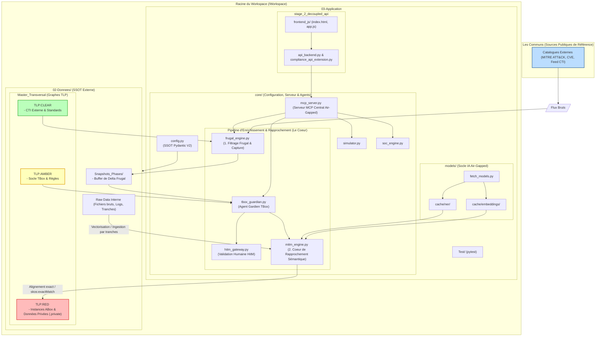

### 1. Les Communs (Sources Publiques de Référence)

- **Catalogues Externes (MITRE ATT&CK, CVE, Feeds CTI) :**
    
    - _Rôle / Fonction :_ Flux de données de cybermenaces publics et de référence. Ils constituent la matière brute externe que l'agent en charge va capturer périodiquement de manière sélective.
        

### 2. Le Socle de Données Externes (`02-Donnees/`)

- **`Master_Transversal` (Graphes TLP) :** Le cœur ontologique segmenté selon les standards TLP pour garantir la cloisonnement de la sécurité :
    
    - **`TLP:AMBER` (Socle TBox & Règles) :** Contient la structure conceptuelle de référence (`DKG_TBox_Master.ttl`) et les règles de raisonnement métier.
        
    - **`TLP:RED` (Instances ABox & Données Privées) :** Regroupe les actifs critiques de l'organisation, les inférences logiques et les données résidentielles/familiales ou hôtes (`.private`).
        
    - **`TLP:CLEAR` (CTI Externe & Standards) :** Intègre les flux de menaces publiques filtrés en amont et les registres de régulation.
        
- **`Raw Data Interne` :** Fichiers bruts, logs et rapports internes nécessitant une vectorisation ou un découpage minimal par tranches pour alimenter le graphe.
    
- **`Snapshots_Phases/` (Tampons de Deltas) :** Stockage intermédiaire (ex. `frugal_delta_buffer.ttl`) contenant les paquets de données filtrés prêts pour l'analyse.
    

### 3. Le Cœur Applicatif et les Agents (`03-Application/core/`)

- **`config.py` (SSOT Pydantic V2) :** Source unique de vérité (Single Source of Truth) qui centralise la configuration et résout dynamiquement les chemins vers le répertoire externe `02-Donnees`.
    
- **`mcp_server.py` (Serveur MCP Central) :** Point d'entrée standardisé (_Model Context Protocol_) fonctionnant en mode _Air-Gapped_ pour exposer l'ensemble des moteurs et outils aux agents IA.
    
- **`simulator.py` (DKGSimulator) :** Moteur de simulation de charge et de montée en échelle permettant de mesurer l'impact sur les ressources et de générer des abaques (_Green-by-Design_).
    
- **`frugal_engine.py` (Filtrage Frugal CTI) :** Assure le premier niveau de filtrage en amont sur les gros catalogues externes pour ne capturer que les deltas à haute densité sémantique.
    
- **`tbox_guardian.py` (Agent Gardien TBox) :** Supervise l'ingestion des deltas externes, vérifie la conformité conceptuelle et prépare les propositions d'enrichissement.
    
- **`hitm_gateway.py` (Passerelle HitM) :** Orchestre le contrôle humain (_Human-in-the-Middle_) pour valider ou rejeter de manière souveraine les propositions d'enrichissement sémantique.
    
- **`mitm_engine.py` (Agent MITM / Cœur de Rapprochement) :** Moteur central de rapprochement sémantique. S'appuie sur les modèles d'embeddings et de similarité pour établir les correspondances (`skos:exactMatch`).
    
- **`soc_engine.py` (Orchestrateur SOC) :** Pilote les audits globaux, les validations de contraintes (SHACL) et la production des rapports de conformité.
    

### 4. Le Socle d'Intelligence Artificielle (`03-Application/models/`)

- **`fetch_models.py` :** Script utilitaire d'approvisionnement pour télécharger et vérifier l'intégrité des modèles en mode hors-ligne (_Air-Gapped_).
    
- **`cache/embeddings/` :** Stocke le modèle vectoriel local (ex: `sentence-transformers`) utilisé pour le calcul de similarité cosinus.
    
- **`cache/ner/` :** Héberge les modèles de Reconnaissance d'Entités Nommées (ex: `GLiNER`) pour structurer les données textuelles non structurées.
    

### 5. La Couche d'Accès et de Test (`03-Application/stage_2_decoupled_api/` & `Test/`)

- **`api_backend.py` & `compliance_api_extension.py` :** Couche API (FastAPI) exposant les services du backend vers l'extérieur de manière contrôlée.
    
- **`frontend_js/` (Dashboard Opérateur) :** Interface web légère (`index.html`, `app.js`) permettant à l'analyste de piloter les flux et les validations.
    
- **`Test/` (Suite Pytest) :** Ensemble des tests unitaires et d'intégration validant toutes les phases de développement (de la phase 1 à la phase 8).

### 6. Le Graph


### 7. LLM version,

```
[CONTEXT: DKG-CyberSec Phase 8 - Sovereign Air-Gapped Multi-Agent Architecture]
- ROOT & SSOT: /Workspace with external '02-Donnees/' (TLP-segmented Masters & Snapshots) and '03-Application/core/config.py'.
- MASTER TLP SEGMENTATION (02-Donnees/Master_Transversal/):
  * TLP:AMBER: Core TBox ontology (DKG_TBox_Master.ttl) & reasoning rules.
  * TLP:RED: Critical ABox instances, inferred graphs & private residential/host data (.private).
  * TLP:CLEAR: Filtered public CTI (MITRE/CVE) & compliance standards.
- INPUT SOURCES: Public references ('Les Communs' like MITRE/CVE) & internal raw data chunks.
- CORE ENGINES & AGENTS (03-Application/core/):
  * mcp_server.py: Central Model Context Protocol registry in Air-Gapped mode.
  * simulator.py: Load benchmarking & resource abacuses (Green-by-Design).
  * frugal_engine.py: Upstream CTI filtering for high semantic density deltas.
  * tbox_guardian.py: Supervises external catalog ingestion & enrichment proposals.
  * hitm_gateway.py: Human-in-the-Middle sovereign validation gateway.
  * mitm_engine.py: Core semantic matching engine (embeddings, similarity thresholds, skos:exactMatch).
  * soc_engine.py: SOC audit pipeline, SHACL validation & compliance reporting.
- OFFLINE AI LAYER (03-Application/models/cache/): Local sentence-transformers (embeddings) & GLiNER (NER) cache provisioned via fetch_models.py.
- ACCESS LAYER (stage_2_decoupled_api/): FastAPI backend (api_backend.py, compliance_api_extension.py) & static JS dashboard (frontend_js/).
- TESTING: Comprehensive pytest suite in Test/.
- GOAL: Sovereign, Air-Gapped, Green-by-Design, human-validated semantic security graph management.
```