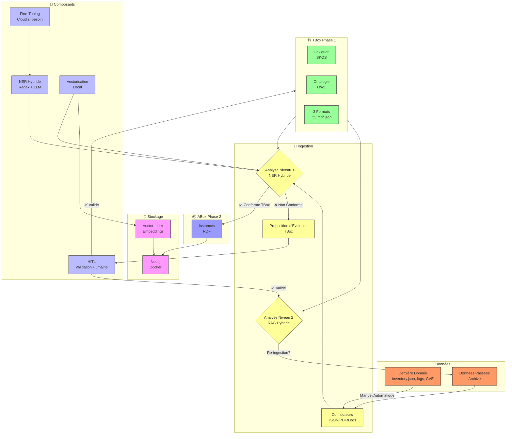
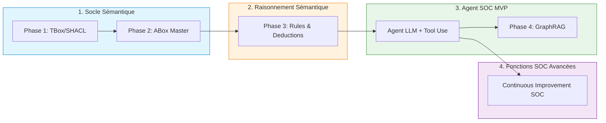

```mermaid
graph TD
    %% Données
    subgraph Données["📁 Données"]
        D0[Dernière Donnée<br />inventory.json, logs, CVE]
        D1[Données Passées<br />Archive]
    end

    %% TBox (Phase 1)
    subgraph TBox["🏗️ TBox Phase 1"]
        TB0[Lexiquer<br />SKOS]
        TB1[Ontologie<br />OWL]
        TB2[3 Formats<br />.ttl/.md/.json]
    end

    %% Ingestion (Phases 2-5)
    subgraph Ingestion["🔄 Ingestion"]
        I0[Connecteurs<br />JSON/PDF/Logs]
        I1{Analyse Niveau 1\nNER Hybride}
        I2[Proposition d'Évolution\nTBox]
        I3{Analyse Niveau 2\nRAG Hybride}
    end

    %% ABox Phase 2
    subgraph ABox["📦 ABox Phase 2"]
        AB0[Instances\nRDF]
    end

    %% Stockage
    subgraph Stockage["💾 Stockage"]
        G0[Neo4j\nDocker]
        G1[Vector Index\nEmbeddings]
    end

    %% Composants
    subgraph Composants["🤖 Composants"]
        MITM[HITL\nValidation Humaine]
        Ner[NER Hybride\nRegex + LLM]
        Vec[Vectorisation\nLocal]
        FineTune[Fine-Tuning\nCloud si besoin]
    end

    %% Flux
    D0 -->|Manuel/Automatique| I0
    I0 --> I1
    I1 -->|✅ Conforme TBox| AB0
    I1 -->|❌ Non Conforme| I2
    I2 --> MITM
    MITM -->|✅ Validé| TBox
    MITM -->|✅ Validé| I3
    I3 -->|Ré-ingestion?| D1
    D1 --> I0

    %% Liens TBox
    TBox --> I1
    TBox --> I3

    %% Liens Composants
    Ner --> I1
    Vec --> I1
    Vec --> G1
    FineTune --> Ner

    %% Liens Stockage
    AB0 --> G0
    G1 --> G0

    %% Styles
    classDef data fill:#f96,stroke:#333;
    classDef tbox fill:#9f9,stroke:#333;
    classDef ingestion fill:#ff9,stroke:#333;
    classDef abox fill:#99f,stroke:#333;
    classDef stockage fill:#f9f,stroke:#333;
    classDef composants fill:#bbf,stroke:#333;

    class D0,D1 data;
    class TB0,TB1,TB2 tbox;
    class I0,I1,I2,I3 ingestion;
    class AB0 abox;
    class G0,G1 stockage;
    class MITM,Ner,Vec,FineTune composants;
```

```mermaid

graph LR
    subgraph Milestone_1 [1. Socle Sémantique]
        TBox[Phase 1: TBox/SHACL] --> ABox[Phase 2: ABox Master]
    end
    subgraph Milestone_2 [2. Raisonnement Sémantique]
        ABox --> Rules[Phase 3: Rules & Deductions]
    end
    subgraph Milestone_3 [3. Agent SOC MVP]
        Rules --> Agent[Agent LLM + Tool Use]
        Agent --> RAG[Phase 4: GraphRAG]
    end
    subgraph Milestone_4 [4. Fonctions SOC Avancées]
        Agent --> CI[Continuous Improvement SOC]
    end
    
    style Milestone_1 fill:#e1f5fe,stroke:#0288d1
    style Milestone_2 fill:#fff3e0,stroke:#f57c00
    style Milestone_3 fill:#e8f5e9,stroke:#388e3c
    style Milestone_4 fill:#f3e5f5,stroke:#7b1fa2
```
