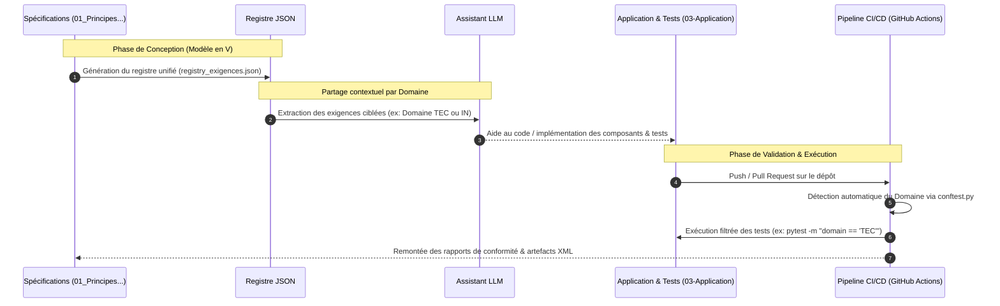

Ce répertoire centralise les spécifications système, le registre des exigences et les scripts de gouvernance du projet DKG-CyberSec. L'approche adoptée est **Spec-Driven**, étendue au **cycle en V**, permettant de lier de manière bi-directionnelle les besoins fonctionnels, l'architecture, le design technique et la validation par les tests.


## 0. Contenu
Ce repertoire rassemble les Spécifications considérées utiles pour le Framework mais aussi celles complétée pour la mise en application sur le cas d'usage Cyber SOC, respectivement dans les sous-répertoires : 
- **`./TRANSVERSAL/`**  destiné a recevoir les spécifications du framework appliquable indépendament du cas d'usage,
- **`./USECASE_METIER/`**  desté a receuillir la description du cas d'usage, dans le cade de ce projet : la cybersecurité
- **`./USECASE_TECHNIQUE/ : `** déstiné a recevoir les aspect techniques du design

Chaque spécification applique le template défini dans /00-Projet/Templates/
Les spécification contiennent des exigences, qui ont des catégotiers :
- **Domaine** -> distinction permettant de regrouper les exigences pour le partage avec LLM et la segregation de test
- **Core/Non-Core** -> permet de différentier les exigencesCore de l'application et son contexte, dont les test associé contribuent à la non regression. Des exigences non core, qui sont utilisées ponctuellement pour le développement dans une phase mais qui ne sont plus appliquables par la suite.

Des plugins Obsidian sont utilisés pour générer une entête yml, qui permet d'automatiser les copnsolidations


## 1. Architecture du Registre et Domaines Officiels

Le registre global (`registry_exigences.json`) est généré et administré via les scripts présents dans ce dossier. Chaque exigence est rattachée à un **Domaine** normé permettant de ségréger le fonctionnel pur de l'architecture technique :

|**Code Domaine**|**Nom Complet**|**Description & Périmètre**|
|---|---|---|
|**CT**|Cyber Threat Intelligence|Modélisation des données CTI externes, vulnérabilités (CVE, CWE, CAPEC, CISA KEV, scores CVSS).|
|**HW**|Hardware & Infrastructures|Contraintes matérielles, d'exécution locale et performance système (ex: RAM 16 Go, mode Air-Gapped).|
|**IN**|Inférence & Graph Analytics|Règles de raisonnement sémantique, déduction de liens et calculs de propagation (ex: `HighRiskAsset`).|
|**OR**|Organisation & Processus|Gouvernance du projet, méthodologie Spec-Driven et standards de livraison.|
|**QU**|Qualité & Conformité|Règles de validation de la qualité des données et métriques d'intégrité (pySHACL, CWA).|
|**SE**|Sécurité & Isolation|Étanchéité, marquage TLP et politiques de contrôle d'accès aux graphes (`TLP:CLEAR` vs `TLP:RED`).|
|**SH**|SHACL Shapes|Modélisation abstraite et concrète des formes de validation (`sh:NodeShape`, méta-shapes).|
|**TB**|TBox & Ontologies Master|Définition formelle des classes, propriétés, relations inverses et SKOS.|
|**TEC**|Technique & Core Framework|Socle applicatif, gestion des types de données, immutabilité et bas niveau (Pydantic V2).|

## 2. Diagramme de Séquence : Le Cycle en V et le Rebouclage des Tests

Le diagramme ci-dessous illustre le flux complet, de la rédaction des spécifications (SyRS / SyAD) jusqu'à la validation automatisée par domaine dans la CI/CD :

Extrait de code




## 3. Tutoriels et Guides Opérationnels

### Tuto 1 : Générer le registre des exigences JSON

Le fichier `registry_exigences.json` centralise l'ensemble des exigences du projet. Pour le régénérer à partir des sources de spécifications :

```python
import os
import json
import yaml

VAULT_PATH = "."  # Chemin vers votre vault Obsidian
OUTPUT_JSON = "registry_exigences.json"

registry = {
    "metadata": {
        "description": "Registre centralisé des exigences DKG-CyberSec",
        "spec_driven_version": "2.0"
    },
    "exigences": []
}

# Parcours de l'arborescence du vault
for root, dirs, files in os.walk(VAULT_PATH):
    # Ignorer les dossiers cachés comme .git ou .obsidian
    if ".obsidian" in root or ".git" in root:
        continue
        
    for file in files:
        if file.endswith(".md"):
            file_path = os.path.join(root, file)
            try:
                with open(file_path, "r", encoding="utf-8") as f:
                    content = f.read()
                    
                # Extraction du Frontmatter YAML
                if content.startswith("---"):
                    parts = content.split("---", 2)
                    if len(parts) >= 3:
                        fm = yaml.safe_load(parts[1])
                        if isinstance(fm, dict) and fm.get("type") == "spec":
                            spec_ref = fm.get("reference", file)
                            spec_phase = fm.get("phase_code", "P1")
                            
                            for ex in fm.get("exigences", []):
                                registry["exigences"].append({
                                    "id": ex.get("id"),
                                    "domaine": ex.get("domaine"),
                                    "core": ex.get("core", True),
                                    "phase": spec_phase,
                                    "spec_source": spec_ref,
                                    "titre": ex.get("titre"),
                                    "critere": ex.get("critere"),
                                    "test": ex.get("test")
                                })
            except Exception as e:
                print(f"Erreur de lecture sur {file_path}: {e}")

# Sauvegarde du registre global
with open(OUTPUT_JSON, "w", encoding="utf-8") as out:
    json.dump(registry, out, indent=2, ensure_ascii=False)

print(f"Succès : {len(registry['exigences'])} exigences indexées dans {OUTPUT_JSON}")
```

### Tuto 2 : Extraire un sous-ensemble par Domaine pour un LLM

Lorsque vous souhaitez interroger un LLM sur une partie spécifique du système (par exemple, uniquement l'architecture technique `TEC` ou l'inférence `IN`) sans saturer le contexte :

Bash

```
# Exemple d'extraction via un script ou jq des exigences du domaine TEC
jq '[.[] | select(.domain == "TEC")]' 01_Principes_Specifications/registry_exigences.json > context_tec.json
```

Vous pouvez ensuite fournir ce fichier `context_tec.json` à votre assistant pour concevoir ou modifier du code aligné sur ces exigences précises.

### Tuto 3 : Créer une nouvelle Spécification (Règle Spec-Driven)

1. Ouvrez le fichier source de spécification correspondant dans `01_Principes_Specifications/`.
    
2. Ajoutez votre exigence en respectant la syntaxe d'indentation et en lui affectant l'un des **domaines officiels** (ex: `domain: "IN"` pour une règle d'inférence).
    
3. Régénérez le registre (voir _Tuto 1_).
    
4. Dans `03-Application/Test/`, créez ou mettez à jour votre script de test et associez-le au domaine correspondant (le `conftest.py` global se chargera de le classifier automatiquement via le mapping des fichiers de test).


### Tuto 4 : Exécuter les tests localement par Domaine

Grâce à la classification par domaine injectée par le `conftest.py`, vous pouvez exécuter de manière isolée les tests d'une brique spécifique (très utile lors d'une évolution d'infrastructure `TEC` ou de sécurité `SE`) :

Bash

```
cd 03-Application
# Lancer uniquement les tests du domaine Technique & Core Framework
pytest -v Test/ -m "domain == 'TEC'"

# Lancer les tests d'Inférence et de SHACL
pytest -v Test/ -m "domain == 'IN' or domain == 'SH'"
```


📐 RÈGLE STRICTE DE NOMMAGE ET NUMÉROTATION DES SPÉCIFICATIONS (01-Principes_Spécifications/) :

1. ARBORESCENCE OBLIGATOIRE :
   - 01-Principes_Spécifications/TRANSVERSAL/ (Socles, TBox, SHACL, Règlements)
   - 01-Principes_Spécifications/USECASE_METIER/ (Vision fonctionnelle SOC / Métier)
   - 01-Principes_Spécifications/USECASE_TECHNIQUE/ (Implémentations, APIs, Agents)


