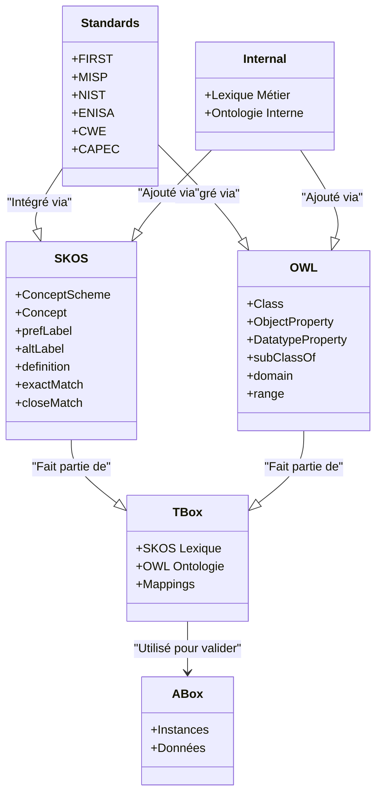

```mermaid
classDiagram
    class SKOS {
        +ConceptScheme
        +Concept
        +prefLabel
        +altLabel
        +definition
        +exactMatch
        +closeMatch
    }

    class OWL {
        +Class
        +ObjectProperty
        +DatatypeProperty
        +subClassOf
        +domain
        +range
    }

    class TBox {
        +SKOS Lexique
        +OWL Ontologie
        +Mappings
    }

    class ABox {
        +Instances
        +Données
    }

    class Standards {
        +FIRST
        +MISP
        +NIST
        +ENISA
        +CWE
        +CAPEC
    }

    class Internal {
        +Lexique Métier
        +Ontologie Interne
    }

    SKOS --|> TBox : "Fait partie de"
    OWL --|> TBox : "Fait partie de"
    Standards --|> SKOS : "Intégré via"
    Standards --|> OWL : "Intégré via"
    Internal --|> SKOS : "Ajouté via"
    Internal --|> OWL : "Ajouté via"
    TBox --> ABox : "Utilisé pour valider"
```
