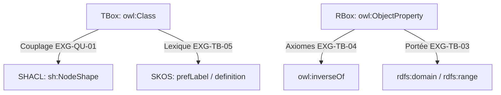

# 📜 Méta-Architecture Ontologique TBox, RBox & SHACL

## 📖 1. Résumé Exécutif & Glossaire

### 1.1 Objectif
La présente spécification définit la méta-architecture ontologique du **DKG Framework**.
Elle est **strictement agnostique du domaine d'application** et fixe les règles formelles de construction de la couche Terminologique (**TBox**), de la couche des Rôles (**RBox**), du socle lexical multilingue (**SKOS**) et des contraintes d'intégrité (**SHACL Shapes**).

### 1.2 Glossaire Métier & Technique

| Acronyme / Concept | Définition | Contexte DKG |
| :--- | :--- | :--- |
| **DKG** | Dynamic Knowledge Graph | Graphe de connaissances dynamique. |
| **TBox** | Terminological Box | Composante décrivant la structure abstraite : classes et métadonnées. |
| **RBox** | Role Box | Composante décrivant les propriétés, rôles, domaines/portées et axiomes d'inversion. |
| **SHACL** | Shapes Constraint Language | Langage W3C de validation de contraintes structurelles. |
| **SKOS** | Simple Knowledge Organization System | Standard d'alignement et de représentation lexicale. |

## 🏗️ 2. Périmètre & Rôle de la Spécification

- **Positionnement dans l'Architecture** : Document de niveau **Niveau 1 — Socle Transversal**. Il régit l'élaboration de `DKG_TBox_Master.ttl` applicable à toutes les ABox du projet.
- **Gouvernance & Validation** : Validé par l'Architecte Sémantique Lead. Il constitue le contrat structurel pour l'ensemble des cas d'usage.

## 📐 3. Spécifications Formelles & Méta-Règles

### 3.1 Espaces de Noms & Séparateurs Abstraits

- **Espace de Noms & Séparateur `#` [`EXG-TB-01`]** : Tout concept du Framework TBox/RBox doit résider sous l'espace de noms racine du framework et utiliser le séparateur `#` afin de garantir un chargement performant en mémoire du schéma d'ontologie.
    

### 3.2 Directives d'Architecture TBox (Classes & Typage)

- **Typage OWL Strict [`EXG-TB-02`]** : Tout concept du schéma doit être explicitement typé `owl:Class`, `owl:ObjectProperty` ou `owl:DatatypeProperty`.
    
- **Héritage N-Tiers** : Les sous-classes doivent utiliser `rdfs:subClassOf` de manière stricte sans boucle cyclique.
    

### 3.3 Directives d'Architecture RBox (Relations & Inverses)

- **Déclaration Domaine & Portée [`EXG-TB-03`]** : Toute relation entre entités doit être déclarée comme `owl:ObjectProperty` avec attribution stricte de son domaine (`rdfs:domain`) et de sa portée (`rdfs:range`).
    
- **Sémantique RBox & Inverses [`EXG-TB-04`]** : Pour chaque relation binaire $R$, il doit exister une relation inverse $R^{-1}$ explicitée par l'attribut `owl:inverseOf`.
    

### 3.4 Directives Lexicales SKOS (Couche Multilingue)

- **Couche Lexicale SKOS [`EXG-TB-05`]** : Chaque classe ou propriété abstraite déclarée doit obligatoirement comporter :
    
    - Un libellé principal `skos:prefLabel` en français (`@fr`) et anglais (`@en`).
        
    - Une définition textuelle explicite sous `skos:definition`.
        

### 3.5 Directives SHACL (Validation & Couplage Systématique)

- **Couplage TBox ↔ SHACL [`EXG-QU-01`]** : Toute classe déclarée dans la TBox (`owl:Class`) doit obligatoirement posséder une forme SHACL (`sh:NodeShape`) correspondante liée via `sh:targetClass`.
    
- **Shapes Structurales Abstraites [`EXG-SH-01`]** : Le socle doit inclure la déclaration de `sh:NodeShape` et `sh:PropertyShape` conformes aux spécifications W3C pour valider sous _Closed World Assumption_ (CWA) :
    
    - La cardinalité des propriétés (`sh:minCount`, `sh:maxCount`).
        
    - Le typage des valeurs pointées (`sh:class` ou `sh:datatype`).
        

## 📊 4. Matrice d'Exigences & Critères d'Acceptation (EXG-)

|**Identifiant**|**Domaine**|**Intitulé de l'Exigence**|**Description & Critères d'Acceptation**|**Mode de Test / Asset**|
|---|---|---|---|---|
|**EXG-TB-01**|`TB`|Espace de Noms & Séparateur `#`|Obligation d'utiliser le séparateur `#` pour la TBox/RBox.|Parsing RDF|
|**EXG-TB-02**|`TB`|Typage OWL Strict|100% des classes et propriétés doivent avoir un typage OWL formel.|Parsing OWL / SPARQL|
|**EXG-TB-03**|`TB`|Déclaration Domaine & Portée|Interdiction de déclarer une `owl:ObjectProperty` sans `rdfs:domain` ni `rdfs:range`.|Requête SPARQL TBox|
|**EXG-TB-04**|`TB`|Sémantique RBox & Inverses|Toute propriété d'objet possède une propriété inverse liée par `owl:inverseOf`.|Check Inverses SPARQL|
|**EXG-TB-05**|`TB`|Couche Lexicale SKOS|Prescriptions `skos:prefLabel` (FR/EN) et `skos:definition` obligatoires.|Validation SKOS|
|**EXG-QU-01**|`QU`|Couplage TBox ↔ SHACL|100% des classes `owl:Class` possèdent au moins une `sh:NodeShape` dédiée.|Execution pySHACL|
|**EXG-SH-01**|`SH`|Shapes Structurales Abstraites|Présence de contraintes SHACL conformes aux spécifications W3C.|Execution SHACL|

## 🛡️ 5. Outillage, CI/CD & Traçabilité Pytest

- **Scripts de Génération / Exécution** : `src/generators/generate_phase1_socle.py`
    
- **Suites de Tests Associées** : `tests/test_00_governance_and_tbox.py` & `tests/test_01_shacl_and_quality.py`
    
- **Critères d'Acceptation** : Validation syntaxique RDF/Turtle, absence d'orphelins ou de propriétés sans inverse.
    
- **Artefacts Produits** : `DKG_TBox_Master.ttl`
    

## 📚 6. Documents Liés & Références

- **[SPC-FWK-P1-GOUVERNANCE_01]** : Gouvernance du Cadre Spécifications & Exigences DKG.
    
- **[W3C OWL 2 Direct Semantics]** : https://www.w3.org/TR/owl2-direct-semantics/
    
- **[W3C SHACL Core Language]** : https://www.w3.org/TR/shacl/
