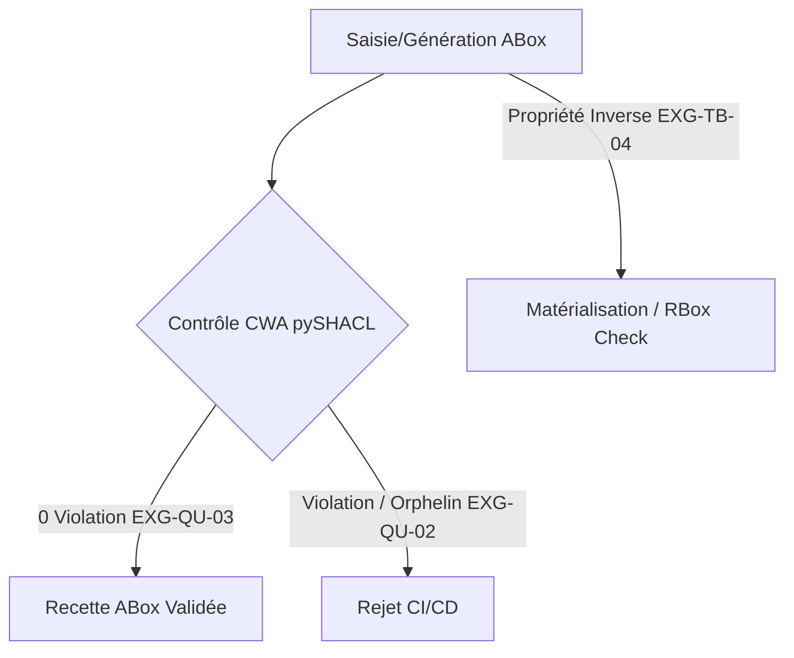

# 📜 Règles d'Intégrité & Recette ABox

## 📖 1. Résumé Exécutif & Glossaire

### 1.1 Objectif
La présente spécification définit les **règles formelles d'intégrité et de validation génériques de l'ABox** au sein du DKG Framework.  
Elle est **strictement agnostique du domaine d'application** et fixe les critères d'intégrité référentielle, le typage strict des littéraux, la cohérence des relations inverses et le sas de recette qualité sous CWA.

### 1.2 Glossaire Métier & Technique
| Acronyme / Concept | Définition | Contexte DKG |
| :--- | :--- | :--- |
| **DKG** | Dynamic Knowledge Graph | Graphe de connaissances dynamique. |
| **ABox** | Assertional Box | Composante décrivant les individus, données factuelles et instances. |
| **TBox** | Terminological Box | Schéma et concepts ontologiques. |
| **SHACL** | Shapes Constraint Language | Langage W3C de validation de contraintes structurelles. |
| **CWA** | Closed World Assumption | Hypothèse du monde clos. |

## 🏗️ 2. Périmètre & Rôle de la Spécification

- **Positionnement dans l'Architecture** : Document de niveau **Niveau 1 — Socle Transversal**. Il régit les conditions de recette qualité de toute ABox produite dans le projet.
- **Gouvernance & Validation** : Validé par le Lead Data/Ontologie. Il impose une tolérance zéro aux erreurs de structure RDF et aux pointeurs orphelins.

## 📐 3. Spécifications Formelles & Règles Métier

### 3.1 Intégrité Référentielle Inter-Instances

- **Intégrité Référentielle Stricte [`EXG-QU-02`]** : Toute relation binaire `owl:ObjectProperty` instanciée dans l'ABox entre un individu $A$ et un individu $B$ doit pointer vers un individu $B$ obligatoirement déclaré et typé dans le graphe RDF. Aucun lien vers une URI orpheline non instanciée n'est toléré.
    

### 3.2 Typage & Restriction des Littéraux (Datatype Properties)

- **Validation des Littéraux & Datatypes [`EXG-QU-02`]** : Tout littéral d'instance doit porter un typage XML Schema explicite (`xsd:string`, `xsd:integer`, `xsd:decimal`, `xsd:dateTime`). La validation SHACL associée doit vérifier les critères de cardinalité (`sh:minCount`, `sh:maxCount`), les plages de valeurs (`sh:minInclusive`, `sh:maxInclusive`) et les motifs d'expressions régulières (`sh:pattern`).
    

### 3.3 Cohérence RBox & Inverses Factuels

- **Matérialisation des Relations Inverses [`EXG-TB-04`]** : Pour toute assertion d'instance $A \xrightarrow{R} B$ où la propriété $R$ possède un inverse déclaré $R^{-1}$ via `owl:inverseOf` dans la RBox, l'assertion réciproque $B \xrightarrow{R^{-1}} A$ doit être formellement matérialisée dans l'ABox ou dérivable sans ambiguïté par le moteur de raisonnement.
    

### 3.4 Sanity Check & Tolérance de Recette

- **Sanity Check Zero Violation [`EXG-QU-03`]** : L'ABox est soumise à un contrôle automatisé `pySHACL` exécuté sous _Closed World Assumption_ (CWA). Le statut d'acceptation de l'ABox exige **$0$ violation** de sévérité `sh:Violation`.
    

## 📊 4. Matrice d'Exigences & Critères d'Acceptation (EXG-)

|**Identifiant**|**Domaine**|**Intitulé de l'Exigence**|**Description & Critères d'Acceptation**|**Mode de Test / Asset**|
|---|---|---|---|---|
|**EXG-QU-02**|`QU`|Intégrité & Datatypes CWA|Interdiction de pointer vers une instance orpheline ; contrôle strict des typages `xsd` et plages.|pySHACL CWA|
|**EXG-QU-03**|`QU`|Sanity Check Zero Violation|0 violation `sh:Violation` détectée lors du contrôle automatisé pySHACL.|Pytest / SHACL|
|**EXG-TB-04**|`TB`|Matérialisation des Inverses|Conformité et existence des paires de relations inverses d'instances.|SPARQL / Reasoner|

## 🛡️ 5. Outillage, CI/CD & Traçabilité Pytest

- **Scripts de Génération / Exécution** : `03-Application/validate_abox.py`
    
- **Suites de Tests Associées** : `tests/test_phase2_quality.py`
    
- **Artefacts Produits** : `DKG_ABox_Master.ttl` validé et snapshots d'immuabilité.
    

## 📚 6. Documents Liés & Références

- **[SPC-FWK-P1-GOUVERNANCE_01]** : Gouvernance du Cadre Spécifications & Exigences DKG.
    
- **[SPC-FWK-P1-T-RBOX_SHACL_01]** : Spécification du Framework TBox, RBox & SHACL.
    
- **[W3C SHACL Core Language]** : https://www.w3.org/TR/shacl/#core-components:w
