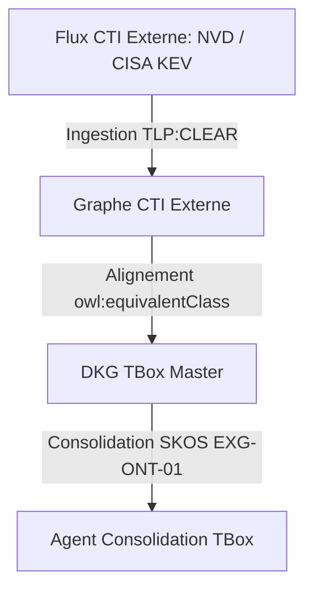

# 📜 Framework CTI Externe & Alignment Sémantique

## 📖 1. Résumé Exécutif & Glossaire

### 1.1 Objectif
Cette spécification encadre le cadre d'ingestion des référentiels CTI ouverts (NVD, MITRE ATT&CK, CISA KEV) et définit le mécanisme d'alignement sémantique (RBox/TBox) entre le socle interne DKG et les ontologies externes (STIX 2.1, UCO, EU AI Act). Elle intègre l'agent automatisé de consolidation TBox/SKOS.

### 1.2 Glossaire Métier & Technique
| Acronyme / Concept | Définition | Contexte DKG |
| :--- | :--- | :--- |
| **CTI** | Cyber Threat Intelligence | Flux de renseignement sur les menaces (`TLP:CLEAR`). |
| **CISA KEV** | Known Exploited Vulnerabilities | Catalogue CISA des vulnérabilités exploitées dans le sauvage. |
| **STIX / UCO** | Structured Threat Info / Unified Cybersecurity Ont. | Ontologies standards du domaine Cyber raccordées au socle `dkg:`. |
| **TBox Alignment** | Alignement des Terminologies | Alignement sémantique par `owl:equivalentClass` et `rdfs:subClassOf`. |

## 🏗️ 2. Périmètre & Rôle de la Spécification

- **Positionnement dans l'Architecture** : Document de niveau **Niveau 1 — Socle Transversal**. Définit les types et propriétés réutilisables par l'ensemble des cas d'usage CTI.
- **Gouvernance & Validation** : Validé conjointement par l'Architecte Ontologue et le Lead DevSecOps.



## 📐 3. Spécifications Formelles & Règles Métier

### 3.1 Alignement RBox & Propriétés de Relations (`TLP:AMBER`)

Afin d'éviter tout conflit de domaine lors du raccordement d'infrastructures physiques à des composants logiciels, le domaine de `dkg:hasVulnerability` est élargi à la classe abstraite `dkg:InfrastructureElement`.


```sparql
@prefix dkg: [http://dkg.cybersec.org/tbox#](http://dkg.cybersec.org/tbox#) .
@prefix owl: [http://www.w3.org/2002/07/owl#](http://www.w3.org/2002/07/owl#) .
@prefix rdfs: [http://www.w3.org/2000/01/rdf-schema#](http://www.w3.org/2000/01/rdf-schema#) .

dkg:InfrastructureElement a owl:Class ;
    rdfs:label "Élément d'Infrastructure"@fr .

dkg:Host rdfs:subClassOf dkg:InfrastructureElement .
dkg:SoftwareComponent rdfs:subClassOf dkg:InfrastructureElement .

# Propriété RBox Cross-TLP
dkg:hasVulnerability a owl:ObjectProperty ;
    rdfs:domain dkg:InfrastructureElement ;
    rdfs:range dkg:Vulnerability ;
    owl:inverseOf dkg:isVulnerabilityOf .
```


### 3.2 Alignement Ontologique & Couche Lexicale SKOS [`EXG-ONT-01`]

L'agent de consolidation fusionne les concepts externes et injecte la couche d'acronymes métiers pour garantir la traçabilité lexicale (`skos:altLabel`).

```sparql
@prefix dkg: [http://dkg.cybersec.org/tbox#](http://dkg.cybersec.org/tbox#) .
@prefix owl: [http://www.w3.org/2002/07/owl#](http://www.w3.org/2002/07/owl#) .
@prefix skos: [http://www.w3.org/2004/02/skos/core#](http://www.w3.org/2004/02/skos/core#) .
@prefix stx: [http://purl.org/cyber/stix#](http://purl.org/cyber/stix#) .
@prefix uco: [http://purl.org/cyber/uco#](http://purl.org/cyber/uco#) .

# Alignements inter-ontologies
dkg:Vulnerability owl:equivalentClass stx:Vulnerability , uco:Vulnerability .
dkg:ThreatPattern owl:equivalentClass stx:AttackPattern .

# Enrichissement lexical pour la résolution d'acronymes
dkg:ThreatActor a owl:Class ;
    skos:prefLabel "Threat Actor"@en , "Agent de Menace"@fr ;
    skos:altLabel "APT" , "GTM" , "Attacker" ;
    skos:definition "Entité ou groupe réalisant des actions malveillantes."@fr .
```

### 3.3 Typage Strict & Ségrégation TLP [`EXG-CT-01`, `EXG-SE-01`]

- Toute instance de vulnérabilité ingérée depuis une source CTI externe doit impérativement porter un score CVSS (`xsd:float`) et l'indicateur CISA KEV (`xsd:boolean`).
    
- Les données publiques CTI sont strictement restreintes au graphe étiqueté `TLP:CLEAR`.
    

## 📊 4. Matrice d'Exigences & Critères d'Acceptation (EXG-)

|**Identifiant**|**Domaine**|**Intitulé de l'Exigence**|**Description & Critères d'Acceptation**|**Mode de Test / Asset**|
|---|---|---|---|---|
|**EXG-CT-01**|`CT`|Typage CTI Externe|Toute vulnérabilité CTI doit posséder un score CVSS (`xsd:float`) et un drapeau CISA KEV (`xsd:boolean`).|Pytest / pySHACL|
|**EXG-ONT-01**|`TB`|Alignment TBox & SKOS|L'agent de fin de Vague 2 doit consolider les équivalences classes/propriétés et valider 100% des acronymes sous `skos:altLabel`.|SPARQL / Pytest (`test_00`)|
|**EXG-SE-01**|`SE`|Ségrégation TLP|Les données CTI publiques sont restreintes au graphe `TLP:CLEAR`.|Pytest (`test_02`)|

## 🛡️ 5. Outillage, CI/CD & Traçabilité Pytest

- **Scripts de Génération / Exécution** : `03-Application/consolidate_tbox_agent.py`
    
- **Suites de Tests Associées** : `tests/test_00_governance_and_tbox.py`
    
- **Artefacts Produits** : `02-Donnees/Master_Transversal/DKG_TBox_Master.ttl`
    

## 📚 6. Documents Liés & Références

- **[SPC-FWK-P1-GOUVERNANCE_01]** : Gouvernance du Cadre Spécifications & Exigences DKG.
    
- **[SPC-TEC-P3-NER_01]** : Pipeline NER & Normalisation CTI Non-Structurée.