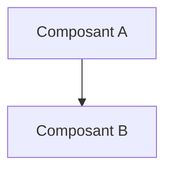

# 📜 04 Reasoning Rules RBox Inference


## 📖 1. Résumé Executif & Glossaire

### 1.1 Objectif
[Décrire en 2-3 phrases le but de cette spécification et sa valeur pour le projet]

### 1.2 Glossaire Métier & Technique
| Acronyme / Concept | Définition | Contexte DKG |
| :--- | :--- | :--- |
| **Exemple** | Définition courte | Application dans le graphe |

## 🏗️ 2. Spécification & Modélisation


## 📐 3. Spécifications Formelles

<!-- SECTION A ADAPTER SELON LE NIVEAU DE SPECIFICATION -->

### Option A : Si Niveau METIER (SOC / Fonctionnel)
#### 3.1 Scenario Métier & Kill Chain
[Diagramme Mermaid / Schéma ASCII de l'attaque ou du cas d'usage]

#### 3.2 Modélisation Conceptuelle & Traçabilité TLP
[Description des entités métier et requêtes SPARQL d'analyse]

---

### Option B : Si Niveau TECHNIQUE ou SOCLE (Dev / Ontologie)
#### 3.1 Axiomes, Structures RDF & Inférences
[Snippets Turtle, règles SWRL/SHACL, schémas TBox/RBox]

#### 3.2 Directives d'Implémentation Code & Scripts
[Modules Python associés, fonctions de génération]

---

## 📊 4. Matrice d'Exigences & Critères d'Acceptation (`EXG-`)

| Identifiant | Domaine | Intitulé de l'Exigence | Description & Critères d'Acceptation | Mode de Test / Asset |
| :--- | :---: | :--- | :--- | :--- |
| **EXG-XX-01** | `XX` | Nom de l'exigence | Critère formel vérifiable. | Pytest / SPARQL / SHACL |

---

## 🛡️ 5. Outillage, CI/CD & Traçabilité Pytest

* **Scripts de Génération / Exécution** : `03-Application/[script].py`
* **Suite de Test Associée** : `tests/test_[exigence].py`
* **Artefacts Produits** : `[Fichier_Maître.ttl]`

---

## 📚 6. Documents Liés & Références

* **[SPEC-PARENTE]** : [Lien vers la spec de niveau supérieur ou dépendante]
## 📖 1. Résumé Exécutif & Glossaire 
### 1.1 Objectif 
Cette spécification définit le cadre formel du moteur de raisonnement (Vague 2 / Phase 5). Elle encadre les règles d'inférence sémantique (SPARQL CONSTRUCT / SWRL), l'extension de la TBox/RBox pour la matérialisation des risques, et impose le strict respect de l'isolation TLP lors de la génération des faits déduits. 
### 1.2 Glossaire Métier & Technique
| Acronyme / Concept | Définition | Contexte DKG | 
| :--- | :--- | :--- | 
| **Reasoning Engine** | Moteur d'Inférence Sémantique | Composant calculant les faits dérivés à partir des règles logiques. | 
| **HighRiskAsset** | Actif à Haut Risque | Concept TBox dérivé désignant un actif exposé à une menace critique. | 
| **Cascade Propagation**| Propagation en Cascade | Inférence matérialisant un chemin d'attaque indirect vers un actif critique. | 

--- 
## 🎯 2. Périmètre & Rôle de la Spécification 
* **Positionnement dans l'Architecture** : Niveau 1 (Socle Transversal). Définit les métriques, axiomes et règles d'inférence universelles. 
* **Gouvernance & Validation** : Validé par l'Architecte Sémantique et le Responsable SecOps. 
 --- 
## 📐 3. Spécifications Formelles 
### 3.1 Extension TBox / RBox pour l'Inférence (`TLP:AMBER`) 
```turtle 
@prefix dkg: [http://dkg.cybersec.org/tbox#](http://dkg.cybersec.org/tbox#) . 
@prefix owl: [http://www.w3.org/2002/07/owl#](http://www.w3.org/2002/07/owl#) . 
@prefix rdfs: [http://www.w3.org/2000/01/rdf-schema#](http://www.w3.org/2000/01/rdf-schema#) . 
# Classes Dérivées 
dkg:HighRiskAsset a owl:Class ; 
	rdfs:subClassOf dkg:InfrastructureElement ; 
	rdfs:label "Actif à Haut Risque"@fr , "High Risk Asset"@en . 
	
# Propriétés Déduites (RBox) 
dkg:exposesToCascade a owl:ObjectProperty ; 
	rdfs:domain dkg:InfrastructureElement ; 
	rdfs:range dkg:InfrastructureElement ; 
	rdfs:label "expose en cascade"@fr . 
	
dkg:targetsAsset a owl:ObjectProperty ; 
	rdfs:domain dkg:ThreatCampaign ; 
	rdfs:range dkg:InfrastructureElement .
```
### 3.2 Déduction de Surface d'Attaque & Propagation (`SPARQL CONSTRUCT`)

#### Règle R-01 : Qualification d'un Actif à Haut Risque (CISA KEV)
```sparql
PREFIX dkg: [http://dkg.cybersec.org/tbox#](http://dkg.cybersec.org/tbox#)
PREFIX dkg-cti: [http://dkg.cybersec.org/cti#](http://dkg.cybersec.org/cti/#)

CONSTRUCT {
    ?asset a dkg:HighRiskAsset ;
           dkg:hasRiskReason "Exposed vulnerability listed in CISA KEV" .
}
WHERE {
    ?asset dkg:hasVulnerability ?cve .
    ?cve dkg:isCisaKev true .
}
```

#### Règle R-02 : Inférence du Chemin Cascade (Silent Cascade)
```sparql
PREFIX dkg: [http://dkg.cybersec.org/tbox#](http://dkg.cybersec.org/tbox#)

CONSTRUCT {
    ?pivot dkg:exposesToCascade ?target .
}
WHERE {
    ?pivot a dkg:HighRiskAsset ;
           dkg:connectsTo+ ?target .
    ?target dkg:criticalityLevel "CRITICAL" .
}
```
### 3.3 Régles de Ségrégation TLP & Héritage (`EXG-SE-01`)

Tout triplet déduit croisant une entité `TLP:CLEAR` (CTI) et une entité `TLP:RED` (Infrastructure Interne) hérite automatiquement de la classification **`TLP:RED`** et doit être écrit dans `DKG_ABox_Infered.ttl` sous contrôle strict d'accès.

## 📊 4. Matrice d'Exigences & Critères d'Acceptation (`EXG-`)

|**Identifiant**|**Domaine**|**Intitulé de l'Exigence**|**Description & Critères d'Acceptation**|**Mode de Test / Asset**|
|---|---|---|---|---|
|**EXG-INF-01**|`IN`|Inférence HighRiskAsset|Tout actif possédant une vulnérabilité CISA KEV doit recevoir la classe `dkg:HighRiskAsset`.|Pytest / SPARQL|
|**EXG-INF-02**|`IN`|Matérialisation Cascade|La relation `dkg:exposesToCascade` doit être créée si un hôte pivot mène à un actif `CRITICAL`.|Pytest (`test_phase3`)|
|**EXG-SE-01**|`SE`|Ségrégation TLP Inférencée|Les déductions croisées ne doivent jamais être écrites dans la ABox CTI (`TLP:CLEAR`).|Audit Graphe / Pytest|
|**EXG-HW-01**|`HW`|Raisonnement Local Économe|L'exécution des règles d'inférence doit s'effectuer en $< 5$s sur PC 16 Go RAM.|Benchmark / Pytest|

## 🛡️ 5. Outillage, CI/CD & Traçabilité Pytest
- **Scripts de Génération / Exécution** : `03-Application/Phase5/reasoning_engine.py`
- **Suite de Test Associée** : `03-Application/Tests/test_phase5_inference.py`
- **Artefacts Produits** : `02-Donnees/Snapshots_Phases/Phase5/DKG_ABox_Infered.ttl`

## 📚 6. Documents Liés & Références
- **[SPEC-SOCLE-00]** : Gouvernance du Cadre Spécifications & Exigences DKG.
- **[SPEC-METIER-UC02]** : Scénario d'Attaque Silent Cascade.
- **[SPEC-TECH-UC02]** : Instanciation & Raisonnement (Propagation Silent Cascade).
