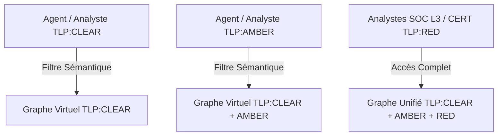

# 📜 Matrice d'Habilitations & Isolation TLP

## 📖 1. Résumé Exécutif & Glossaire

### 1.1 Objectif
Définit la politique transversale d'isolation sémantique et de ségrégation d'accès au Knowledge Graph DKG-CyberSec selon le protocole TLP (Traffic Light Protocol).

### 1.2 Glossaire Métier & Technique
| Acronyme / Concept | Définition | Contexte DKG |
| :--- | :--- | :--- |
| **CWA** | Closed World Assumption | Hypothèse du Monde Clos pour la validation SHACL. |
| **DKG** | Dynamic Knowledge Graph | Graphe de connaissances cyber global. |
| **TLP** | Traffic Light Protocol | Niveaux d'habilitation d'accès aux graphes (CLEAR, AMBER, RED). |

## 🏗️ 2. Périmètre & Rôle de la Spécification

- **Positionnement dans l'Architecture** : Document de niveau **Niveau 1 — Socle Transversal**. Spécifie la politique globale de sécurité du graphe.
- **Gouvernance & Validation** : Validé par le Responsable SecOps et l'Architecte Ontologue.

## 📐 3. Spécifications Formelles & Règles Métier

### 3.1 Axiomes & Matrice d'Accès aux Calques RDF [`EXG-SE-01`, `EXG-SE-02`]

|**Jeton TLP Client**|**Calques RDF Autorisés**|**Fichiers SSOT Inclus**|
|---|---|---|
|**TLP:CLEAR**|CTI Externe|`ABOX_CTI_PATH`, `ABOX_CTI_U_PATH`|
|**TLP:AMBER**|CTI + TBox / SKOS|Calque CLEAR + `TBOX_MASTER_PATH`, `RULES_MASTER_PATH`|
|**TLP:RED**|Graphe Unifié Intégral|Calque AMBER + `ABOX_MASTER_PATH`, `ABOX_INFERED_PATH`|

### 3.2 Directives d'Implémentation & Audit [`EXG-SE-03`]

- **Moteur d'isolation** : `03-Application/Phase6/api_gateway.py` (Classe `SecurityEngine`).
    
- **Journal d'audit** : Horodatage UTC strict enregistré dans `PATH_P6_GATEWAY_LOG`.
    

## 📊 4. Matrice d'Exigences & Critères d'Acceptation (EXG-)

|**Identifiant**|**Domaine**|**Intitulé de l'Exigence**|**Description & Critères d'Acceptation**|**Mode de Test / Asset**|
|---|---|---|---|---|
|**EXG-SE-01**|`SE`|Étanchéité TLP:CLEAR|0 résultat RED renvoyé sur une requête CLEAR.|PyTest (`test_tlp_isolation_clear`)|
|**EXG-SE-02**|`SE`|Accès Intégral TLP:RED|Accès complet aux instances RED et inférées.|PyTest (`test_tlp_access_red`)|
|**EXG-SE-03**|`SE`|Audit Traçabilité|Traçabilité de chaque appel dans le fichier de log.|Audit Log (`api_gateway_audit.log`)|

## 🛡️ 5. Outillage, CI/CD & Traçabilité Pytest

- **Scripts de Génération / Exécution** : `03-Application/Phase6/generate_phase6_gateway.py`
    
- **Suites de Tests Associées** : `03-Application/Test/test_phase6_gateway.py`
    
- **Artefacts Produits** : `02-Donnees/Snapshots_Phases/Phase6_API_Gateway/execution_results.json`
    

## 📚 6. Documents Liés & Références

- **[SPC-FWK-P1-GOUVERNANCE_01]** : Gouvernance du Cadre Spécifications & Exigences DKG.
    
- **[SPC-TEC-P6-GATEWAY_01]** : Spécification technique d'implémentation de la Gateway SPARQL.