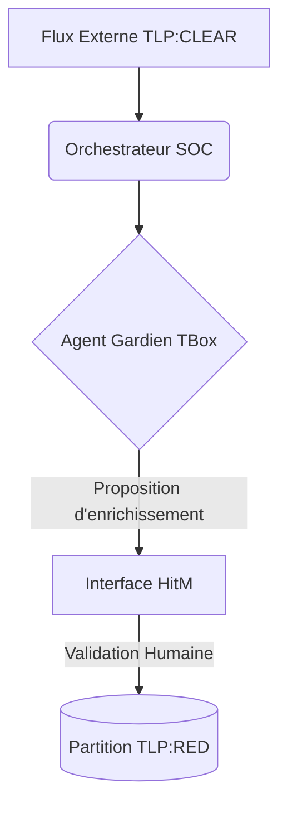

# 📜 Gouvernance et Orchestration Multi-Agents SOC (HitM)

## 📖 1. Résumé Exécutif & Glossaire

### 1.1 Objectif
Cette spécification pose le cadre de gouvernance de la **Phase 8**. Elle régit le comportement de l'Agent Orchestrateur SOC et de l'Agent Gardien, en imposant une barrière de validation humaine obligatoire pour garantir la souveraineté et la sécurité des données dans notre architecture locale (*Air-Gapped*).

### 1.2 Glossaire Métier & Technique
| Acronyme / Concept | Définition             | Contexte DKG                                                                   |
| :----------------- | :--------------------- | :----------------------------------------------------------------------------- |
| **HitM**           | Human-in-the-Middle    | Point de contrôle bloquant nécessitant une validation humaine.                 |
| **TLP**            | Traffic Light Protocol | Matrice de classification et de cloisonnement des données (CLEAR, AMBER, RED). |

## 🏗️ 2. Périmètre & Rôle de la Spécification
* **Positionnement dans l'Architecture :** Cadre transversal de gouvernance pour l'orchestration des agents de sécurité.
* **Gouvernance & Validation :** Validé par l'Architecte Sémantique et IA SOC.

## 📐 3. Spécifications Formelles & Règles
### 3.1 Axiomes & Règles de Décision

    Règle d'Autorité : L'orchestrateur ne possède aucun droit d'écriture unilatéral sur les actifs du foyer. Ses propositions prennent la forme de tampons de deltas (delta_buffer.ttl).

    Validation SHACL Amont : Tout delta proposé par un agent doit être syntaxiquement validé par les contraintes SHACL avant d'être soumis à l'interface HitM.

### 3.2 Directives d'Implémentation

    Utilisation exclusive des objets de configuration définis dans config.py (section AGENT_CONFIG).

## 📊 4. Matrice des Exigences & Critères d'Acceptation (EXG-)

| Identifiant | UID              | Domaine | Core/Non-Core | Intitulé de l'Exigence         | Description & Critères d'Acceptation                                 | Mode de Test / Asset       |
| ----------- | ---------------- | ------- | ------------- | ------------------------------ | -------------------------------------------------------------------- | -------------------------- |
| EXG-P8-01   | EXG-FWK-P8-soc_1 | `OR`    | Core          | Validation Humaine Obligatoire | Approbation explicite obligatoire avant écriture TBox/ABox critique. | PyTest / Mock HitM Gateway |
| EXG-P8-02   | EXG-FWK-P8-soc_2 | `SE`    | Core          | Étanchéité TLP Stricte         | Interdiction de fuite TLP:CLEAR vers TLP:RED.                        | SHACL / Tests d'isolation  |

🛡️ 5. Outillage, CI/CD & Traçabilité Pytest

    Scripts de Génération / Exécution : 03-Application/soc_orchestrator.py

    Suites de Tests Associées : tests/test_soc_governance.py

    Critères d'Acceptation : Validation par test unitaire bloquant en cas d'absence de signature HitM.

    Artefacts Produits : audit_governance_report.json

📚 6. Documents Liés & Références

    SPC-FWK-P1-soc_architecture_base_01 (Socle transversal de la Vague 1)