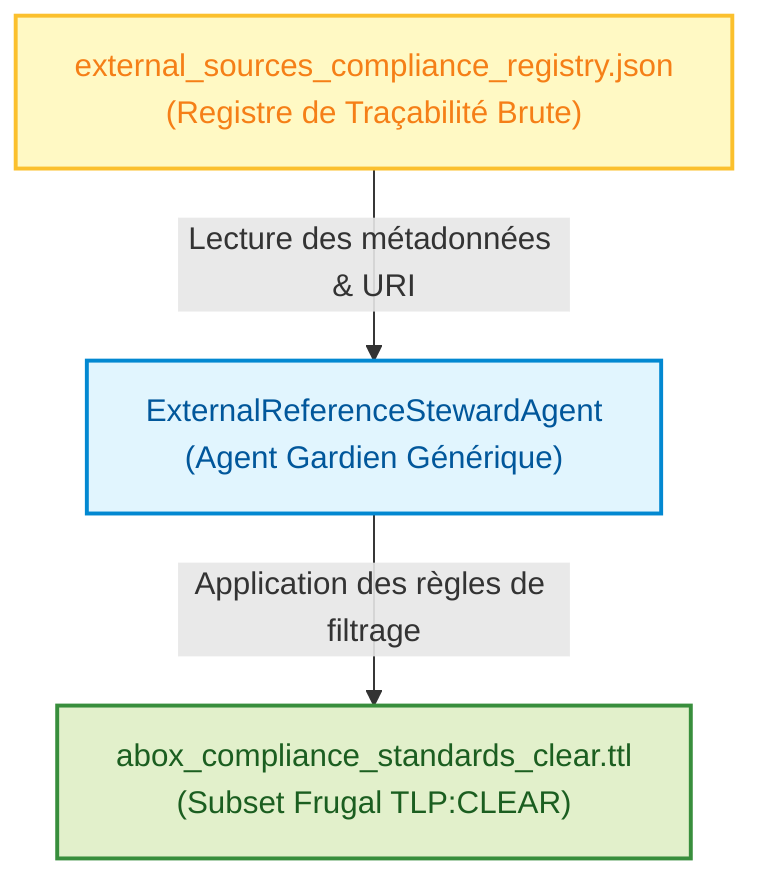

# 📜 Agent Gardien des Références Externes (External Reference Steward)

## 📖 1. Résumé Exécutif & Glossaire

### 1.1 Objectif
Cette spécification définit le socle générique de l'**Agent Gardien des Références Externes** (`ExternalReferenceStewardAgent`). Son rôle est de superviser, filtrer et valider l'intégration des référentiels normatifs mondiaux et des flux publics externes (ex: RGPD, DPV, CTI) en respectant strictement le manifeste **Green-by-Design** (postes 16 Go RAM, Air-Gapped strict).

### 1.2 Glossaire Métier & Technique
| Acronyme / Concept | Définition | Contexte DKG |
| :--- | :--- | :--- |
| **DKG** | Dynamic Knowledge Graph | Graphe de connaissances dynamique du projet. |
| **DPV** | Data Privacy Vocabulary | Vocabulaire W3C de référence pour la protection des données et la conformité. |
| **CWA** | Closed World Assumption | Hypothèse du monde clos utilisée pour la validation SHACL rigoureuse. |
| **TLP** | Traffic Light Protocol | Protocole de ségrégation des données (`CLEAR`, `AMBER`, `RED`). |

## 🏗️ 2. Périmètre & Rôle de la Spécification
- **Positionnement dans l'Architecture** : Socle Transversal (`TRANSVERSAL/`) réutilisable pour toutes les phases nécessitant l'ingestion de sources publiques distantes (Phase 8 RGPD, Vagues futures GraphRAG).
- **Gouvernance & Validation** : Validé par l'Architecte Sémantique et IA SOC.

## 📐 3. Spécifications Formelles & Règles

### 3.1 Axiomes, Structures RDF ou Scénario Métier

- **Principe du Subset Minimal :** Interdiction stricte de charger l'intégralité d'une ontologie externe lourde en mémoire. L'agent extrait uniquement les concepts cibles nécessaires (ex: _Article 32 du RGPD_).
    
- **Isolation TLP :** Le référentiel public supervisé et généré par l'agent est obligatoirement étiqueté en **`TLP:CLEAR`**. Aucune fuite vers les graphes internes (`TLP:RED` / `AMBER`) n'est tolérée.
    

### 3.2 Directives d'Implémentation Code & Scripts

- Utilisation exclusive des objets et chemins centralisés dans `03-Application/config.py` (conformité SSOT `EXG-OR-05`).
    
- Modélisation et validation des configurations par des objets Pydantic V2 avec immutabilité (`frozen=True`, `EXG-TE-01`).
    

## 📊 4. Matrice des Exigences & Critères d'Acceptation (EXG-)

| **Identifiant**  | UID              | **Domaine** | **Intitulé de l'Exigence**            | **Description & Critères d'Acceptation**                                                            | **Mode de Test / Asset** |
| ---------------- | ---------------- | ----------- | ------------------------------------- | --------------------------------------------------------------------------------------------------- | ------------------------ |
| **EXG-P8-01**    | EXG-FWK-P8-age_1 | `SE`        | Traçabilité & Filtrage Frugal Externe | Conservation du registre d'origine et extraction d'un sous-ensemble minimal sans surcharge mémoire. | Pytest / SPARQL / SHACL  |
| **EXG-GREEN-01** | EXG-FWK-P8-age_2 | `TEC`       | Sobriété et Local-First               | Exécution fluide en moins de 1s sur poste hôte standard 16 Go RAM Air-Gapped.                       | Benchmark / Pytest       |

## 🛡️ 5. Outillage, CI/CD & Traçabilité Pytest

- **Scripts de Génération / Exécution** : `03-Application/Phase8/compliance_steward_agent.py`
    
- **Suites de Tests Associées** : `03-Application/Test/test_phase8_compliance.py`
    
- **Critères d'Acceptation** : Validation syntaxique RDFlib, absence de violation sous pySHACL (`sh:Violation` = 0).
    
- **Artefacts Produits** : `02-Donnees/Master_Transversal/abox_compliance_standards_clear.ttl`
    

## 📚 6. Documents Liés & Références

- **SPEC-SOCLE-01** : Socle TBox Master & Règles W3C.
    
- **SPEC-METIER-UC08** : Compliance & Preuve Réglementaire Frugale (RGPD).