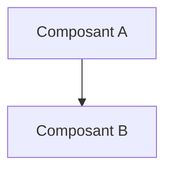

# 📜 UC01 Cartographie Infrastructures

## 📖 1. Résumé Executif & Glossaire

### 1.1 Objectif
- **Objectif métier :** Définir du point de vue du SOC la modélisation de l'infrastructure interne (hôtes, sous-réseaux, dépendances, niveaux de criticité `CRITICAL`/`MEDIUM`, exposition Internet) sous marquage **`TLP:RED`** / **`TLP:AMBER`**, avant toute injection CTI externe.
- 
### 1.2 Glossaire Métier & Technique
| Acronyme / Concept | Définition | Contexte DKG |
| :--- | :--- | :--- |
| **Exemple** | Définition courte | Application dans le graphe |

## 🏗️ 2. Spécification & Modélisation

## 📐 3. Spécifications Formelles

<!-- SECTION A ADAPTER SELON LE NIVEAU DE SPECIFICATION -->

### Option A : Si Niveau METIER (SOC / Fonctionnel)
#### 3.1 Scenario Métier & Kill Chain
[Diagramme Mermaid / Schéma ASCII de l'attaque ou du cas d'usage]

#### 3.2 Modélisation Conceptuelle & Traçabilité TLP
[Description des entités métier et requêtes SPARQL d'analyse]

---

### Option B : Si Niveau TECHNIQUE ou SOCLE (Dev / Ontologie)
#### 3.1 Axiomes, Structures RDF & Inférences
[Snippets Turtle, règles SWRL/SHACL, schémas TBox/RBox]

#### 3.2 Directives d'Implémentation Code & Scripts
[Modules Python associés, fonctions de génération]

---

## 📊 4. Matrice d'Exigences & Critères d'Acceptation (`EXG-`)

| Identifiant | Domaine | Intitulé de l'Exigence | Description & Critères d'Acceptation | Mode de Test / Asset |
| :--- | :---: | :--- | :--- | :--- |
| **EXG-XX-01** | `XX` | Nom de l'exigence | Critère formel vérifiable. | Pytest / SPARQL / SHACL |

---

## 🛡️ 5. Outillage, CI/CD & Traçabilité Pytest

* **Scripts de Génération / Exécution** : `03-Application/[script].py`
* **Suite de Test Associée** : `tests/test_[exigence].py`
* **Artefacts Produits** : `[Fichier_Maître.ttl]`

---

## 📚 6. Documents Liés & Références

* **[SPEC-PARENTE]** : [Lien vers la spec de niveau supérieur ou dépendante]

    
