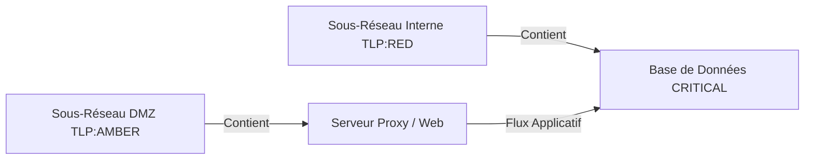

# 📜 Cartographie des Infrastructures Internes

## 📖 1. Résumé Exécutif & Glossaire

### 1.1 Objectif
Définir du point de vue du SOC la modélisation de l'infrastructure interne (hôtes, sous-réseaux, dépendances applicatives, niveaux de criticité `CRITICAL`/`MEDIUM`, exposition Internet) sous marquage **`TLP:RED`** / **`TLP:AMBER`**, avant toute injection de données de menaces CTI externes.

### 1.2 Glossaire Métier & Technique
| Acronyme / Concept | Définition | Contexte DKG |
| :--- | :--- | :--- |
| **SOC** | Security Operations Center | Équipe opérationnelle supervisant la sécurité du SI. |
| **DMZ** | Demilitarized Zone | Sous-réseau exposé aux flux externes/Internet. |
| **TLP** | Traffic Light Protocol | Classification de la sensibilité de la cartographie SI (`TLP:RED`/`TLP:AMBER`). |

## 🏗️ 2. Périmètre & Rôle de la Spécification

- **Positionnement dans l'Architecture** : Document de niveau **Niveau 2 — Cas d'Usage Métier**.
- **Gouvernance & Validation** : Validé par le Responsable SOC. Il fixe la représentation métier des actifs à protéger.

## 📐 3. Spécifications Formelles & Scénario Métier

### 3.1 Scénario Métier & Topologie SI

- **Structure des Zones Réseau** : La cartographie doit modéliser la séparation entre zones exposées (DMZ) et zones de stockage sensibles (LAN interne).
    
- **Classification de Criticité** : Chaque hôte reçoit un niveau de criticité métier (`dkg:criticalityLevel`) permettant de prioriser le traitement des alertes.
    

### 3.2 Traçabilité & Marquage Sécurité

- **Marquage TLP Obligatoire [`EXG-SE-01`]** : L'ensemble de la cartographie d'infrastructure est classifié sous marquage de sécurité `TLP:RED` ou `TLP:AMBER`. Aucune donnée de topologie interne ne doit être diffusée sans tag TLP explicite.
    

## 📊 4. Matrice d'Exigences & Critères d'Acceptation (EXG-)

|**Identifiant**|**Domaine**|**Intitulé de l'Exigence**|**Description & Critères d'Acceptation**|**Mode de Test / Asset**|
|---|---|---|---|---|
|**EXG-SE-01**|`SE`|Marquage TLP Obligatoire|Tag TLP présent sur tout document ou graphe Turtle d'infrastructure.|Linter / Pytest|

## 🛡️ 5. Outillage, CI/CD & Traçabilité Pytest

- **Scripts de Génération / Exécution** : `03-Application/generate_phase2_abox.py`
    
- **Suites de Tests Associées** : `tests/test_02_security_and_tlp.py`
    
- **Artefacts Produits** : `DKG_ABox_Master.ttl` (Graphe Cartographie TLP:RED/AMBER)
    

## 📚 6. Documents Liés & Références

- **[SPC-FWK-P1-GOUVERNANCE_01]** : Governance & Marquage TLP.
    
- **[SPC-TEC-P2-ABOX_01]** : Spécification Technique d'Instanciation ABox Cyber.