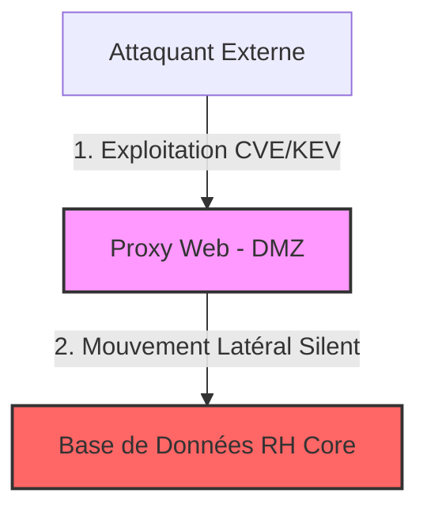

# 📜 Scénario Métier - Silent Cascade

## 📖 1. Résumé Exécutif & Glossaire

### 1.1 Objectif
Décrire le scénario d'attaque par rebond à faible bruit (*Silent Cascade*).  
Ce cas d'usage démontre l'intérêt métier du DKG pour détecter des chemins d'attaque invisibles aux SIEM traditionnels, en croisant la CTI externe (`TLP:CLEAR`) et la topologie interne (`TLP:RED`).

### 1.2 Glossaire Métier & Technique
| Acronyme / Concept | Définition | Contexte DKG |
| :--- | :--- | :--- |
| **Silent Cascade** | Attaque par rebond silencieuse | Exploitation d'un hôte DMZ pour atteindre une BDD critique interne non exposée. |
| **Pivot Asset** | Hôte d'infrastructure compromis | Serveur Proxy exposé servant de passerelle. |
| **HighRiskAsset** | Actif à Haut Risque | Concept dérivé désignant un hôte vulnérable connecté au cœur de réseau. |

## 🏗️ 2. Périmètre & Rôle de la Spécification

- **Positionnement dans l'Architecture** : Document de niveau **Niveau 2 — Cas d'Usage Métier**. Fournit la vision fonctionnelle aux analystes du SOC.
- **Gouvernance & Validation** : Validé par le Responsable du SOC / CTI.



## 📐 3. Spécifications Formelles & Détection Métier

### 3.1 Scénario Métier & Kill Chain

Le scénario _Silent Cascade_ modélise une compromission initiale d'un équipement en bordure (Proxy Web) portant une vulnérabilité reconnue comme activement exploitée (CISA KEV). L'attaquant bifurque ensuite en silence vers une base de données interne classée `CRITICAL`.

### 3.2 Requête Détection Métier SPARQL [`EXG-IN-01`]

Les analystes SOC exécutent la requête suivante pour identifier les chemins de vulnérabilité potentiels avant exploitation :

```sparql
PREFIX dkg: [http://dkg.cybersec.org/tbox#](http://dkg.cybersec.org/tbox#)

SELECT ?exposedHost ?vulnerability ?criticalTarget WHERE {
    # 1. Hôte exposé à Internet
    ?exposedHost dkg:isExposedToInternet true ;
                 dkg:hasVulnerability  ?vulnerability ;
                 dkg:connectsTo+ ?criticalTarget .

    # 2. Vulnérabilité critique exploitée (KEV)
    ?vulnerability dkg:isCisaKev true .

    # 3. Cible finale critique
    ?criticalTarget dkg:criticalityLevel "CRITICAL" .
}
```
### 3.3 Étanchéité & Sécurité TLP [`EXG-SE-01`]

L'exécution des requêtes de corrélation CTI / Topologie ne doit en aucun cas exporter ou faire fuiter la structure ou le nommage des actifs internes `TLP:RED` vers des environnements ou logs non sécurisés.

## 📊 4. Matrice d'Exigences & Critères d'Acceptation (EXG-)

|**Identifiant**|**Domaine**|**Intitulé de l'Exigence**|**Description & Critères d'Acceptation**|**Mode de Test / Asset**|
|---|---|---|---|---|
|**EXG-IN-01**|`IN`|Détection de Cascade|Le DKG doit corréler en moins de 1s l'existence d'un chemin reliant un hôte DMZ KEV à une BDD critique.|Requête SPARQL / Pytest|
|**EXG-SE-01**|`SE`|Étanchéité TLP|L'analyse CTI ne doit jamais révéler publiquement la topologie de l'actif critique (`TLP:RED`).|Audit Graphe / Pytest|

## 🛡️ 5. Outillage, CI/CD & Traçabilité Pytest

- **Scripts de Génération / Exécution** : `03-Application/query_silent_cascade.py`
    
- **Suites de Tests Associées** : `tests/test_uc02_silent_cascade.py`
    
- **Artefacts Produits** : Rapport d'alerte SOC (`Rapport_SilentCascade.json`).
    

## 📚 6. Documents Liés & Références

- **[SPC-FWK-P3-CTI_01]** : Framework CTI Externe & Alignment Sémantique TBox.
    
- **[SPC-TEC-P3-SILENT_01]** : Instanciation & Raisonnement (Propagation Silent Cascade).