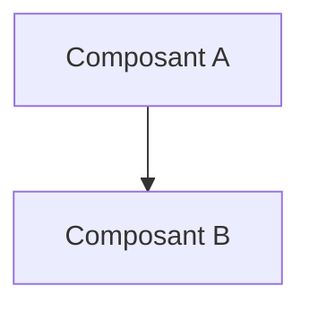

# 📜 UC02 Scenario Silent Cascade


## 📖 1. Résumé Executif & Glossaire

### 1.1 Objectif
[Décrire en 2-3 phrases le but de cette spécification et sa valeur pour le projet]

### 1.2 Glossaire Métier & Technique
| Acronyme / Concept | Définition | Contexte DKG |
| :--- | :--- | :--- |
| **Exemple** | Définition courte | Application dans le graphe |

## 🏗️ 2. Spécification & Modélisation


## 📐 3. Spécifications Formelles

<!-- SECTION A ADAPTER SELON LE NIVEAU DE SPECIFICATION -->

### Option A : Si Niveau METIER (SOC / Fonctionnel)
#### 3.1 Scenario Métier & Kill Chain
[Diagramme Mermaid / Schéma ASCII de l'attaque ou du cas d'usage]

#### 3.2 Modélisation Conceptuelle & Traçabilité TLP
[Description des entités métier et requêtes SPARQL d'analyse]

---

### Option B : Si Niveau TECHNIQUE ou SOCLE (Dev / Ontologie)
#### 3.1 Axiomes, Structures RDF & Inférences
[Snippets Turtle, règles SWRL/SHACL, schémas TBox/RBox]

#### 3.2 Directives d'Implémentation Code & Scripts
[Modules Python associés, fonctions de génération]

---

## 📊 4. Matrice d'Exigences & Critères d'Acceptation (`EXG-`)

| Identifiant | Domaine | Intitulé de l'Exigence | Description & Critères d'Acceptation | Mode de Test / Asset |
| :--- | :---: | :--- | :--- | :--- |
| **EXG-XX-01** | `XX` | Nom de l'exigence | Critère formel vérifiable. | Pytest / SPARQL / SHACL |

---

## 🛡️ 5. Outillage, CI/CD & Traçabilité Pytest

* **Scripts de Génération / Exécution** : `03-Application/[script].py`
* **Suite de Test Associée** : `tests/test_[exigence].py`
* **Artefacts Produits** : `[Fichier_Maître.ttl]`

---

## 📚 6. Documents Liés & Références

* **[SPEC-PARENTE]** : [Lien vers la spec de niveau supérieur ou dépendante]
## 📖 1. Résumé Exécutif & Glossaire 
### 1.1 Objectif 
Décrire le scénario d'attaque par rebond à faible bruit (*Silent Cascade*). 
Ce cas d'usage démontre l'intérêt métier du DKG pour détecter des chemins d'attaque invisibles aux SIEM traditionnels, en croisant la CTI externe (`TLP:CLEAR`) et la topologie interne (`TLP:RED`). 
### 1.2 Glossaire Métier & Technique 
| Acronyme / Concept | Définition | Contexte DKG |
| :--- | :--- | :--- |
| **Silent Cascade** | Attaque par rebond silencieuse | Exploitation d'un hôte DMZ pour atteindre une BDD critique interne non exposée. | 
| **Pivot Asset** | Hôte d'infrastucture compromis | Serveur Proxy exposé servant de passerelle. | 
| **HighRiskAsset** | Actif à Haut Risque | Concept dérivé désignant un hôte vulnérable connecté au cœur de réseau. | 

--- 
## 🎯 2. Périmètre & Rôle de la Spécification 
* **Positionnement dans l'Architecture** : Niveau 2 (Cas d'Usage Métier). Fournit la vision fonctionnelle aux analystes du SOC.
* **Gouvernance & Validation** : Validé par le Responsable du SOC / CTI. 
--- 
## 📐 3. Spécifications Formelles 
### 3.1 Scenario Métier & Kill Chain

[Attaquant Externe] 
│ 
▼
(1. Exploitation CVE / KEV : Proxy Web)
[Serveur DMZ : Proxy Web] ── (TLP:CLEAR + TLP:RED) 
│ 
▼ 
(2. Mouvement Latéral Silent) 
[Base de Données RH Core] ── (TLP:RED - Criticality: CRITICAL)


### 3.2 Requête Détection Métier (SPARQL) 
Les analystes SOC exécutent la requête suivante pour identifier les chemins de vulnérabilité potentiels avant exploitation : 

```sparql 
PREFIX dkg: [http://dkg.cybersec.org/tbox#](http://dkg.cybersec.org/tbox#) 
SELECT ?exposedHost ?vulnerability ?criticalTarget WHERE { 
	# 1. Hôte exposé à Internet 
	?exposedHost dkg:isExposedToInternet true ; 
				 dkg:hasVulnerability  ?vulnerability ; 
				 dkg:connectsTo+ ?criticalTarget . 

	# 2. Vulnérabilité critique exploitée (KEV) 
	?vulnerability dkg:isCisaKev true . 

	# 3. Cible finale critique 
	?criticalTarget dkg:criticalityLevel "CRITICAL" . 
 }

```

## 📊 4. Matrice d'Exigences & Critères d'Acceptation (EXG-)

|**Identifiant**|**Domaine**|**Intitulé de l'Exigence**|**Description & Critères d'Acceptation**|**Mode de Test / Asset**|
|---|---|---|---|---|
|**EXG-IN-01**|`IN`|Détection de Cascade|Le DKG doit corréler en moins de 1s l'existence d'un chemin reliant un hôte DMZ KEV à une BDD critique.|Requête SPARQL / Pytest|
|**EXG-SE-01**|`SE`|Étanchéité TLP|L'analyse CTI ne doit jamais révéler publiquement la topologie de l'actif critique (`TLP:RED`).|Audit Graphe / Pytest|

## 🛡️ 5. Outillage, CI/CD & Traçabilité Pytest

- Scripts de Génération / Exécution : 03-Application/query_silent_cascade.py
- Suite de Test Associée : tests/test_uc02_silent_cascade.py
- Artefacts Produits : Rapport d'alerte SOC (Rapport_SilentCascade.json).

## 📚 6. Documents Liés & Références
[SPEC-SOCLE-03] : Framework CTI Externe & Alignment Sémantique TBox.

[SPEC-TECH-UC03] : Instanciation & Raisonnement (Propagation Silent Cascade).