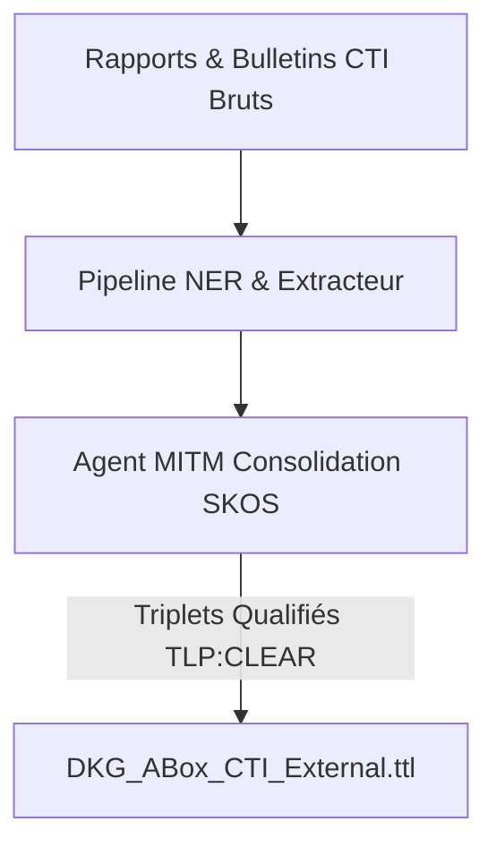

# 📜 Ingestion & Traitement Threat Intelligence (CTI)

## 📖 1. Résumé Exécutif & Glossaire

### 1.1 Objectif
Cette spécification définit le cadre fonctionnel pour l'ingestion, la qualification et la normalisation des flux de renseignement sur les menaces (CTI) ouverts (NVD, CISA KEV, bulletins d'alerte). Elle permet au SOC de transformer des données non structurées (rapports textuels, blogs CTI) en faits RDF structurés directement exploitables par le DKG.

### 1.2 Glossaire Métier & Technique
| Acronyme / Concept | Définition | Contexte DKG |
| :--- | :--- | :--- |
| **CTI** | Cyber Threat Intelligence | Renseignement sur les menaces, vulnérabilités et acteurs d'attaque. |
| **Bulletin CTI Non-Structuré** | Rapport textuel d'analyse | Texte brut décrivant une campagne d'attaque sans formatage RDF initial. |
| **Normalisation SKOS** | Alignement terminologique | Résolution d'acronymes ou alias (*"Cozy Bear"*, *"APT29"*) vers une URI canonique. |

## 🏗️ 2. Périmètre & Rôle de la Spécification

- **Positionnement dans l'Architecture** : Document de niveau **Niveau 2 — Cas d'Usage Métier**. Spécifie les besoins fonctionnels des équipes CTI/SOC pour l'ingestion externe.
- **Gouvernance & Validation** : Validé par le Responsable CTI et le Lead Architecte Sémantique.

## 📐 3. Spécifications Formelles & Workflow Métier

### 3.1 Scenario Métier & Workflow Ingestion CTI

1. **Réception du flux** : L'analyste CTI ou un job automatisé soumet un rapport au format texte/PDF.
    
2. **Extraction & Extraction d'Entités** : Utilisation du pipeline NER local pour repérer les acteurs, campagnes, vulnérabilités et TTPs.
    
3. **Réconciliation & Alerte** : L'Agent MITM calcule la similarité sémantique et rattache les entités aux concepts SKOS existants.
    
4. **Publication DKG** : Injection des triplets validés dans le graphe master `TLP:CLEAR`.
    

### 3.2 Contrôle de Qualité Métier [`EXG-CT-02`, `EXG-SE-02`]

- Tout bulletin ingéré subit une validation de champ minimum (score CVSS, identifiant CVE ou identifiant ThreatActor).
    
- La ségrégation `TLP:CLEAR` est appliquée par défaut à toutes les données extraites de sources externes ouvertes.
    

## 📊 4. Matrice d'Exigences & Critères d'Acceptation (EXG-)

|**Identifiant**|**Domaine**|**Intitulé de l'Exigence**|**Description & Critères d'Acceptation**|**Mode de Test / Asset**|
|---|---|---|---|---|
|**EXG-CT-02**|`CT`|Ingestion Flux CTI Multi-Sources|Le système doit ingérer et qualifier automatiquement les bulletins CTI non structurés en faits RDF structurés.|Pytest / Audit Ingestion|
|**EXG-SE-02**|`SE`|Marquage TLP Ingestion|Toute donnée CTI ingérée depuis une source publique doit porter la balise `TLP:CLEAR`.|Pytest / Validation Graphe|

## 🛡️ 5. Outillage, CI/CD & Traçabilité Pytest

- **Scripts de Génération / Exécution** : `03-Application/Phase5/cti_ingestion_workflow.py`
    
- **Suites de Tests Associées** : `tests/test_phase5_cti_ingestion.py`
    
- **Artefacts Produits** : `02-Donnees/Master_Transversal/DKG_ABox_CTI_External.ttl`
    

## 📚 6. Documents Liés & Références

- **[SPC-FWK-P1-GOUVERNANCE_01]** : Gouvernance du Cadre Spécifications & Exigences DKG.
    
- **[SPC-TEC-P5-NER_01]** : Pipeline NER & Extraction d'Entités CTI.
    
- **[SPC-TEC-P5-CONSO_01]** : Agent MITM & Consolidation SKOS.