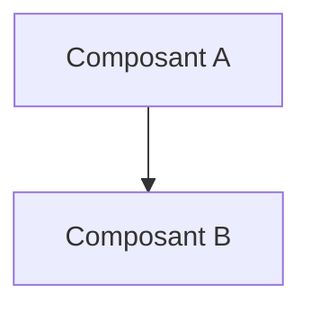

# 📜 UC03 Ingestion Traitement Intelligence sur les Menaces(CTI)

## 📖 1. Résumé Executif & Glossaire

### 1.1 Objectif
[Décrire en 2-3 phrases le but de cette spécification et sa valeur pour le projet]

### 1.2 Glossaire Métier & Technique
| Acronyme / Concept | Définition | Contexte DKG |
| :--- | :--- | :--- |
| **Exemple** | Définition courte | Application dans le graphe |

## 🏗️ 2. Spécification & Modélisation

## 📐 3. Spécifications Formelles

<!-- SECTION A ADAPTER SELON LE NIVEAU DE SPECIFICATION -->

### Option A : Si Niveau METIER (SOC / Fonctionnel)
#### 3.1 Scenario Métier & Kill Chain
[Diagramme Mermaid / Schéma ASCII de l'attaque ou du cas d'usage]

#### 3.2 Modélisation Conceptuelle & Traçabilité TLP
[Description des entités métier et requêtes SPARQL d'analyse]

---

### Option B : Si Niveau TECHNIQUE ou SOCLE (Dev / Ontologie)
#### 3.1 Axiomes, Structures RDF & Inférences
[Snippets Turtle, règles SWRL/SHACL, schémas TBox/RBox]

#### 3.2 Directives d'Implémentation Code & Scripts
[Modules Python associés, fonctions de génération]

---

## 📊 4. Matrice d'Exigences & Critères d'Acceptation (`EXG-`)

| Identifiant | Domaine | Intitulé de l'Exigence | Description & Critères d'Acceptation | Mode de Test / Asset |
| :--- | :---: | :--- | :--- | :--- |
| **EXG-XX-01** | `XX` | Nom de l'exigence | Critère formel vérifiable. | Pytest / SPARQL / SHACL |

---

## 🛡️ 5. Outillage, CI/CD & Traçabilité Pytest

* **Scripts de Génération / Exécution** : `03-Application/[script].py`
* **Suite de Test Associée** : `tests/test_[exigence].py`
* **Artefacts Produits** : `[Fichier_Maître.ttl]`

---

## 📚 6. Documents Liés & Références

* **[SPEC-PARENTE]** : [Lien vers la spec de niveau supérieur ou dépendante]
## 📖 1. Résumé Exécutif & Glossaire

### 1.1 Objectif
Cette spécification définit le cadre fonctionnel pour l'ingestion, la qualification et la normalisation des flux de renseignement sur les menaces (CTI) ouverts (NVD, CISA KEV, bulletins d'alerte)[cite: 10, 11]. Elle permet au SOC de transformer des données non structurées (rapports textuels, blogs CTI) en faits RDF structurés directement exploitables par le DKG[cite: 11].

### 1.2 Glossaire Métier & Technique
| Acronyme / Concept | Définition | Contexte DKG |
| :--- | :--- | :--- |
| **CTI** | Cyber Threat Intelligence | Renseignement sur les menaces, vulnérabilités et acteurs d'attaque[cite: 10]. |
| **Bulletin CTI Non-Structuré** | Rapport textuel d'analyse | Texte brut décrivant une campagne d'attaque sans formatage RDF initial[cite: 11]. |
| **Normalisation SKOS** | Alignement terminologique | Résolution d'acronymes ou alias (*"Cozy Bear"*, *"APT29"*) vers une URI canonique[cite: 10, 11]. |

---

## 🎯 2. Périmètre & Rôle de la Spécification

* **Positionnement dans l'Architecture** : Niveau 2 (Cas d'Usage Métier). Spécifie les besoins fonctionnels des équipes CTI/SOC pour l'ingestion externe[cite: 10, 14].
* **Gouvernance & Validation** : Validé par le Responsable CTI et le Lead Architecte Sémantique[cite: 10, 14].

---

## 📐 3. Spécifications Formelles

### 3.1 Scenario Métier & Workflow Ingestion CTI