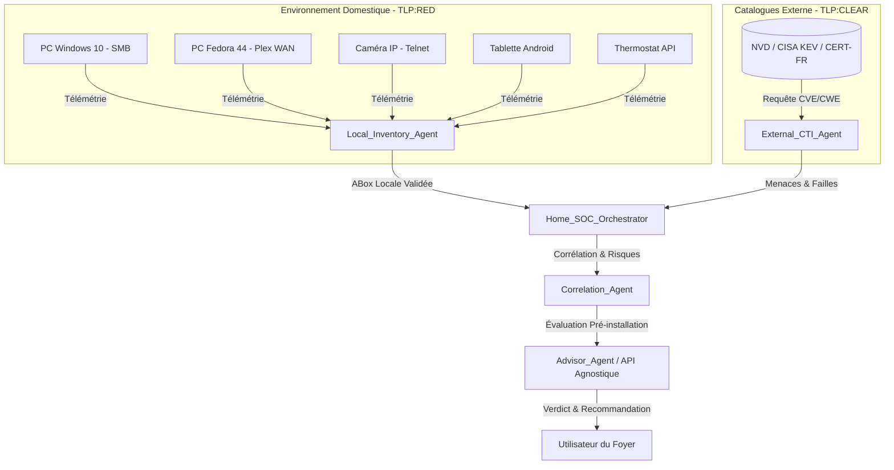

# 📜 Assistant SOC du Foyer et Analyse de Risque Résidentiel

## 📖 1. Résumé Exécutif & Glossaire

### 1.1 Objectif
Cette spécification définit le cadre métier permettant à un particulier d'auditer et de sécuriser son réseau domestique hétérogène (5 actifs)[cite: 5] à l'aide d'un assistant agentique, tout en bénéficiant d'un **Agent Conseil proactif** capable de statuer sur l'installation de nouveaux logiciels en amont.

### 1.2 Glossaire Métier & Technique
| Acronyme / Concept | Définition | Contexte DKG |
| :--- | :--- | :--- |
| **Actif Résidentiel** | Équipement connecté au réseau local (PC, IoT, tablette, thermostat)[cite: 5]. | Entité ABox de niveau TLP:RED. |
| **Agent Conseil** | Module décisionnel d'aide à l'installation logicielle. | Évalue le dépôt, la CTI et propose des alternatives. |
| **Chemin de Compromission** | Séquence logique reliant une vulnérabilité externe à un point d'entrée faible[cite: 5]. | Corrélation multi-agents (Local + CTI). |

## 🏗️ 2. Spécification & Modélisation

## 📐 3. Spécifications Formelles & Règles Métier

### 3.1 Scénario de Vie & Règle de l'Agent Conseil

Avant toute installation de logiciel sur un actif du foyer, l'Agent Conseil exécute la séquence métier suivante :

1. **Consultation de l'Actif Cible :** Vérification du niveau de patch et du rôle de la machine (LAN vs WAN).
    
2. **Vérification du Dépôt source :** Analyse de la réputation de l'URL ou du miroir de téléchargement.
    
3. **Croisement CTI Live :** Interrogation des bases structurées et non structurées (chargées via le fichier de configuration externe).
    
4. **Verdict Métier :**
    
    - _BLOQUER_ si une faille critique (ex: CISA KEV) est liée au logiciel ou si le dépôt n'est pas sûr.
        
    - _AUTORISER_ si le risque est maîtrisé.
        
    - _SUGGÉRER_ un équivalent logiciel plus sécurisé si une alternative existe.
        

## 📊 4. Matrice d'Exigences & Critères d'Acceptation (EXG-)

|**Identifiant**|**Domaine**|**Intitulé de l'Exigence**|**Description & Critères d'Acceptation**|**Mode de Test / Asset**|
|---|---|---|---|---|
|**EXG-P7-01**|`MET`|Cartographie Résidentielle|Ingestion et validation des 5 actifs du foyer[cite: 5].|PyTest / Schéma Pydantic V2|
|**EXG-P7-02**|`MET`|Analyse d'Exposition WAN|Détection des services exposés couplée aux flux TLP:CLEAR[cite: 5].|PyTest / Validation SPARQL|
|**EXG-P7-03**|`MET`|Restitution & Agent Conseil|Génération du rapport de risque et arbitrage de pré-installation.|Validation Markdown / Test API|

## 🛡️ 5. Outillage & Traçabilité

- **Scripts d'Orchestration :** `03-Application/home_soc_orchestrator.py`
    
- **Artefacts :** `DKG_ABox_Residential.ttl`