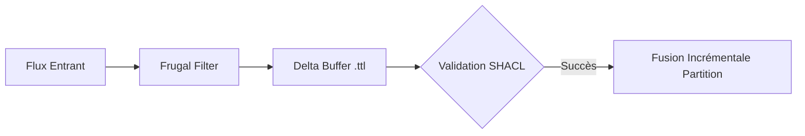

# 📜 Méthodologie de Partitionnement et Mise à Niveau Incrémentale

## 📖 1. Résumé Exécutif & Glossaire

### 1.1 Objectif
Formaliser la méthode de découpage et de traitement incrémental des données pour éviter l'asphyxie de la machine locale, garantissant le respect strict des critères *Green Dev*.

### 1.2 Glossaire Métier & Technique
| Acronyme / Concept | Définition | Contexte DKG |
| :--- | :--- | :--- |
| **Delta** | Fichier de modification incrémental | Contient uniquement les nouveaux triplets à fusionner. |
| **Partition** | Sous-graphe thématique isolé | Fichiers Turtle séparés par domaine ou criticité TLP. |

## 🏗️ 2. Périmètre & Rôle de la Spécification
* **Positionnement dans l'Architecture :** Processus méthodologique d'optimisation des flux de données et de la RAM.
* **Gouvernance & Validation :** Validé par l'Architecte Sémantique.

📐 3. Spécifications Formelles & Règles
3.1 Règles de Partitionnement

    Séparation physique des fichiers de données (external_clear.ttl, internal_red.ttl, delta_buffer.ttl).

    Plafond strict défini dans config.py : MAX_TRIPLES_IN_MEMORY = 50000.

📊 4. Matrice des Exigences & Critères d'Acceptation (EXG-)
Identifiant	Domaine	Intitulé de l'Exigence	Description & Critères d'Acceptation	Mode de Test / Asset
EXG-P8-03	MET	Interdiction Monolithique	Respect du plafond RAM et chargement par partitions.	Profiling RAM PyTest
EXG-P8-04	MET	Validation Incrémentale	Fusion par deltas validés par contraintes SHACL.	SPARQL / SHACL validation
🛡️ 5. Outillage, CI/CD & Traçabilité Pytest

    Scripts de Génération / Exécution : 03-Application/incremental_engine.py

    Suites de Tests Associées : tests/test_incremental_load.py

    Critères d'Acceptation : Mesure de la RAM inférieure à la limite nominale pendant l'ingestion.

📚 6. Documents Liés & Références

    SPC-FWK-P8-soc_orchestration_governance_01